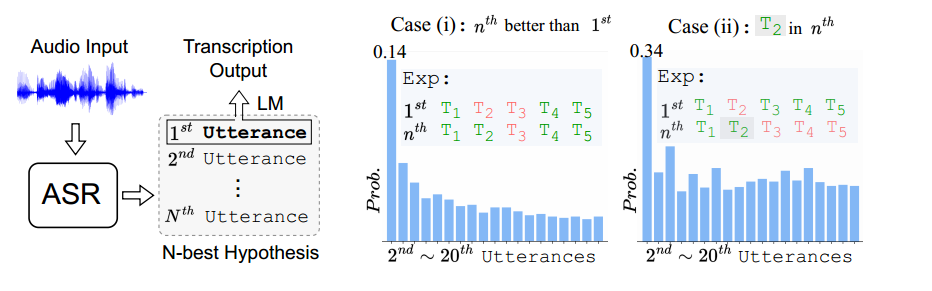
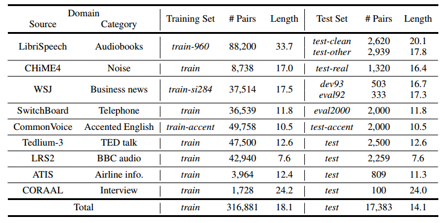
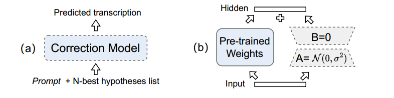
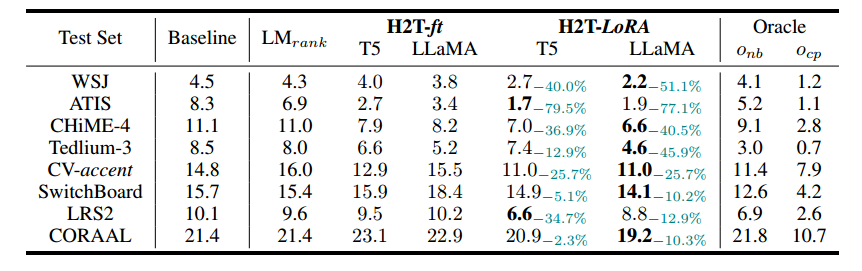
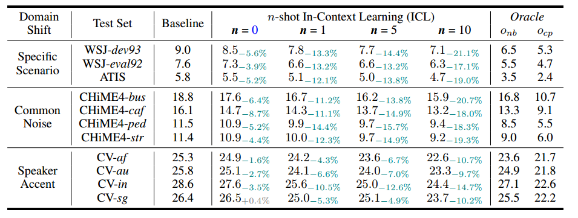
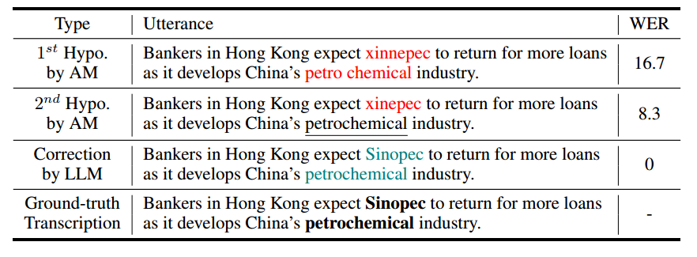

# HyPoradise：大型语言模型进行生成式语音识别的开放基准

论文链接：https://arxiv.org/abs/2309.15701

代码：https://github.com/Hypotheses-Paradise/Hypo2Trans

深度神经网络的进展使得自动语音识别（ASR）系统能够在几个公开的干净语音数据集上达到与人类的语音识别性能相当。然而，即使是最先进的ASR系统在面对不利条件时也会经历性能下降，因为**经过良好训练的声学模型对语音领域的变化敏感，例如背景噪音**。直观地说，人类通过依赖他们的语言知识来解决这个问题：通常情况下，模糊的口头词汇的含义是通过上下文线索来推断的，从而减少了对听觉系统的依赖。受到这一观察的启发，我们引入了第一个开源的基准，**利用外部大型语言模型（LLMs）进行ASR错误校正**，其中N个最佳解码假设为真实转录预测提供了有用的元素。这种方法与传统的语言模型重新评分策略不同，**传统策略只能选择一个候选假设作为输出转录**。提出的基准包含了一个新颖的数据集，HyPoradise（HP），涵盖了流行的语音领域中超过334,000对N个最佳假设和相应的准确转录。在基于不同数量的带标签的假设-转录对的LLMs的基础上，我们检查了三种类型的错误校正技术，这些技术获得了显著的词错误率（WER）降低。实验证据表明，所提出的技术通过超越传统的重新排名方法的上限，实现了一项突破。更令人惊讶的是，具有合理提示和生成能力的LLM甚至可以校正N个最佳列表中缺失的标记。我们公开发布了我们的结果，提供了可重现流水线的预训练模型，从而为ASR错误校正与LLM的新评估范式提供了新的评估方法。

## 引言

自动语音识别（ASR）在现代社会中变得日益重要，因为它能够高效准确地转录口语语言。这种能力有助于获取信息，并增强了在**教育、医疗保健和商业**等各个领域的沟通 [7, 50, 36]。受到深度学习的最新进展的推动，通过端到端训练技术 [28, 27, 9, 22, 30, 100, 15] 在几个ASR任务上取得了显著的成功。然而，**在实际条件下应用ASR的一个主要挑战在于如何有效地处理由不同因素引起的语音变化**，例如背景噪音 [11]、说话者口音 [85] 和说话风格 [82, 2]。这些不利因素在语音信号中是常见且不可避免的，它们明显影响了识别结果的准确性 [55]。

人类在面对上述声学环境的变化时表现出卓越的稳健性，因为人类识别系统不仅仅依赖声学线索——我们通常根据**语音上下文**和我们**内在的语言知识**来推测模糊或扭曲的口语术语。类似地，当前的ASR系统通常在解码过程中采用独立的语言模型（LM）进行重新评分 [83, 46, 43, 25]。如图1所示，给定由ASR引擎生成的具有波束搜索解码的N个最佳假设，训练过的语言模型（LM）可以用于对每个话语进行重新评分，并选择具有最高可能性的话语（称为第1个话语）作为ASR的输出；而其他句子（第2个至第N个话语）将被丢弃。**然而，广泛认为 [68]，N个最佳列表包含有用的信息 [87, 37, 56]，因为每个假设都是输入语音的独立文本表示**。因此，**被丢弃的句子也可能携带了正确的标记，以便准确地预测真实的转录**。为了验证这种观点，我们对LibriSpeech数据集 [66] 进行了实验，计算了在LM重新评分期间观察到的两种情况的概率：

（i）被丢弃的话语包含具有更低词错误率（WER）的更好候选项的概率，

（ii）其他被丢弃的假设可以为第1个话语中的错误标记提供正确答案。

左侧部分的统计结果如图1所示。以第2个被丢弃的话语为例，它有14%的概率比第1个话语具有更低的WER。此外，对于第1个话语中的错误标记，有34%的概率可以在第2个话语中找到正确的标记。

 图1：左侧显示了使用带有波束搜索解码的普通ASR引擎生成N个最佳假设的流程。右侧计算了LibriSpeech数据集的测试集中的情况（i）和情况（ii）的概率。它指示了第2个到第20个话语中丢弃的信息。绿色和红色的“Exp”中的Ti分别表示与地面实况相比的正确和错误标记。

为了更好地挖掘N个最佳假设中的信息，我们提出了第一个公开可用的 ASR 生成式错误校正基准，直接预测真实的转录，而不是从N个最佳假设列表中选择候选项。为了提出这个基准，我们引入了一个名为HyPoradise（HP）的新颖数据集，其中包括最先进的ASR系统提供的各种开源N个最佳假设以及它们的真实转录。考虑到实际应用，HP数据集涵盖了各种具有挑战性的语音领域，包括带有背景噪音、特定上下文和说话者口音的场景。此外，在资源可用性方面，**我们定义了三种设置来模拟ASR系统在现实场景中的部署**：

（i）**零样本学习**：在这种设置中，仅测试集的假设可用于推理。这对应于将经过良好训练的ASR模型应用于没有任何训练数据的新场景。 

（ii）**少样本学习**：提供了一些领域内带有真实转录的假设进行训练。这种设置旨在解决带有一些手动注释的特定领域ASR任务。 

（iii）**微调**：提供了足够的训练集来学习假设和转录之间的映射关系。

为了利用前面提到的三种情景，我们提出了多种使用大型语言模型（LLMs）的错误校正技术，这些模型在最近的研究中显示出了在语言生成和推理方面的卓越能力。对于零样本和少样本设置，我们设计了一种无需任何参数调整的上下文内学习方法，它根据**任务提示和领域内演示直接执行错误校正**。在微调情景中，我们开发了两种序列到序列训练解决方案，H2T-ft和H2T-LoRA，这些解决方案将预训练的LLMs适应特定的转录领域。实验结果表明，在不同资源设置下，所有学习策略都有助于减少WER，为减轻语音变化的负面影响提供了潜在的解决方案。此外，合理的提示设计下，LLMs可以纠正那些仅在N个最佳列表中出现的错误标记。我们将在 Github 上以MIT许可证发布HP数据集、可重现的流水线和预训练模型。

我们的贡献可以概括如下：

- 我们提出了第一个开放且可重复的基准，用于评估**如何使用LLMs来提高ASR结果**，其中新数据集HyPoradise包含了来自大多数常见语音领域中各种ASR语料库的超过334,000个假设-转录对。

- 我们在不同资源设置下开发了三种基于LLMs的ASR错误校正技术，以**直接从N个最佳假设中预测真实的转录**。在微调设置中的实验结果表明，我们的新方法可以超越传统重新排序方法的性能上限（例如，来自n-best列表的oracle WER）。

- 我们引入了ASR的生成性错误校正评估范式。**声学模型生成了假设列表中的词片元，随后LLMs利用语言知识和上下文信息来预测准确的转录**。

## 相关工作

### ASR 重评分和错误校正

为了提高ASR结果的语言可接受性，LM重新评分已被广泛采用，并为ASR系统实现了稳定的性能提升。通常情况下，外部LM是单独训练的，并用于重新评分由ASR解码生成的N个最佳假设列表。已经提出了各种各样的LM集成方法，如浅层融合、深度思考、组件融合和冷融合。一些作者使用预训练的LM模型来替代可训练的LM，每个假设的对数似然估计是使用单向模型（例如GPT-2）或伪对数似然估计是使用双向模型（如BERT和RoBERTa）来计算的。在ASR中，LM也广泛用于不同语言的错误校正任务，仅利用ASR模型生成的1个最佳假设。此外，最近的一些工作利用解码后的候选列表进行错误校正。尽管语法错误校正（GEC）已经得到积极探索，但由于口语语言的任意性，ASR错误校正与GER有所不同，这需要语音和自然语言处理社区的共同努力。

### 大型语言模型

近年来，学术界和工业界对基于Transformer的大型语言模型（LLM）表现出了极大的兴趣[84, 70, 75, 107]，这些模型通过学习大规模文本数据，能够捕捉语言模式和语义关系，已在各种自然语言处理（NLP）任务中获得了令人瞩目的成就[5, 65, 95]。

#### 上下文学习

在上下文学习中，针对特定任务描述或成对的上下文信息，大型语言模型 (LLM) 展现出在下游自然语言处理 (NLP) 任务中出色的适应能力，而无需进行参数调整 [63, 64, 100]。这种任务特定推理的能力通常被称为上下文学习 (ICL) [99]，利用LLMs生成更具连贯性和与特定领域或任务相关性更高的文本 [44, 16, 49, 73, 8, 108]。最近，**任务激活提示**（TAP） [100] 是其中最相关的工作之一，它通过注入面向任务的上下文的输入-输出对（例如，从广泛领域启动问题提示以完善前面的上下文，如图2所示），旨在增强冻结预训练LLMs在二次ASR中的零样本和少样本尝试的能力。我们还通过示例进一步评估了基于TAP的零样本和少样本尝试方法。

### LoRA

基于低秩逼近的神经适配器。由于内存限制，通常不可行对给定的下游任务调整所有LLM参数。**许多研究人员试图通过仅调整少数参数或利用新任务的外部可训练模块来缓解这个问题** [58, 33]。一项开创性的工作 [1] 显示，学习的过度参数化模型实际上存在于低固有维度，因此，提出了一种间接调整一些密集层的低秩适配（LoRA）方法 [38]，通过优化密集层的秩分解矩阵来实现。由于其计算效率，LoRA适配已迅速成为调整LLMs的新范式，在各种下游任务中都非常有用 [105, 24, 42, 92]。

## 假设生成和数据集创建

在本节中，我们介绍了 HyPoradise 数据集的生成过程。3.1部分介绍了用于生成N-best假设的ASR系统，然后我们在3.2中介绍了选择的语音领域。最后，我们在3.2中提供了统计信息和生成的 HP 数据。

### ASR 系统

我们使用两种最先进的ASR模型，分别是 **WavLM** 和 **Whisper**，用于生成N-best假设。除了它们在性能和受欢迎程度上表现出色外，这两个模型还在ASR的部署中具有代表性，原因如下：

1.  WavLM 是 LibriSpeech上经过训练的ASR模型，但受到领域不匹配的问题；
2. Whisper 是通用的 ASR 模型，但缺乏领域特定性。

以下是关于这两个ASR模型的更多详细信息：

#### WavLM

我们使用 ESPnet 工具包以及 HuggingFace 的预训练模型来部署基于 WavLM 的 ASR 系统。WavLM的架构包括两个部分：前端和ASR模型（总共433百万个参数）。前端由24个基于Transformer的编码器层组成，使用LibriLight（60,000小时的数据）、Gigaspeech（10,000小时的数据）和VoxPopuli（24,000小时的数据）的组合进行预训练。前端特征输入 ASR 后端进行微调。后端由12个基于 Conformer 的编码器层和6个基于 Transformer 的解码器层组成。微调过程是在960小时的LibriSpeech数据上进行的。此外，WavLM的解码流程包括一个外部LM重新评分选项，其中外部LM采用Transformer架构，具有16个编码器层，是使用LibriSpeech 960小时数据的文本和来自Web的额外LM训练数据进行训练的。

#### Whisper

我们使用OpenAI开发的 Whisper-Large 模型来生成假设，而不进行领域内语言模型的重新评分。所用的配置包括一个包含1,550百万个参数的编码器-解码器Transformer架构，该模型经过训练，使用了从Web上收集的680,000小时的多语言弱标记语音数据。

利用这两个预训练的ASR模型，我们在解码过程中使用了波束搜索算法，为每个输入波形生成了句子假设的N-best列表。对于 WavLM 和 Whisper，我们将默认的波束大小设置为60。在去除可重复的话语后，我们选择具有最高概率的前 5 个话语作为 N-best 列表，因为它们包含足够的元素来准确预测转录。随后的实验通过使用 5-best 假设列表计算准确的上限 WER 来确认这一观点。为了构建 HP 数据集，我们在多个热门的 ASR 数据集上执行了这种解码策略（请参阅第3.2节），生成了由 5-best 假设列表和一个地面真实转录组成的配对数据。我们还发布了用于将新的 ASR 语料库集成到 HP 中的预处理和生成代码。相关资源的所有链接都在附录中提供。

### 选定的语音语料库

在选择语料库时，我们的目标是涵盖ASR任务的常见场景，例如嘈杂的背景和说话者口音。因此，我们收集和修改以下具有明显领域特征的语料库，以构成HP数据集。

#### LibriSpeech

LibriSpeech是一个公开的有声书朗读语音语料库，包括1,000小时的语音数据，包含多种不同的说话者、性别和口音。为了生成HP训练数据，我们排除了train-960分割中一些WER结果为0的简单情况，剩下88,200个训练语音。我们使用整个test-clean和test-other分割来生成HP测试数据。

#### CHiME-4

CHiME-4是一个用于远场语音识别的数据集。它包括在四个嘈杂的环境中的真实和模拟噪音录音，即公共汽车、咖啡馆、行人区域和街口。我们使用其包含8,738个语音的训练部分和包含1,320个语音的测试部分来生成HP的训练和测试数据。测试部分中的四种不同噪声也在表3中进行了单独评估。

#### WSJ

《华尔街日报》（WSJ）是一个广泛使用的语音识别基准测试。它包括在受控环境中的发言，重点关注商业新闻和金融数据。我们使用它的train-si284部分（包含37,514个语音）来生成HP的训练集。dev93部分（包含503个语音）和eval92部分（包含333个语音）用于构建测试集。

#### SwitchBoard

SwitchBoard语料库是从成对发言者的对话中收集的电话语音数据集。它侧重于北美英语，涉及来自大约200名发言者的超过2.4k个对话。我们从其训练部分随机选择36,539个样本来生成HP的训练集，并从eval2000部分中选择2,000个语音来生成HP的测试集。

#### CommonVoice

CommonVoice 5.1是一个用于语音识别的免费数据集。它包含来自60多种语言的多样化发言者的语音录音。为了生成HP数据集，我们从其带有口音标签的train-en分支中随机选择了51,758个样本，其中训练集包含49,758个样本，测试集包含2,000个样本。

#### Tedlium-3

Tedlium-3是一个包含来自多种语言的TED演讲的语音录音的数据集。它包含多样化的背景噪音、说话口音、演讲主题等。考虑到其较大的规模，我们从其训练集中随机选择了50,000个样本用于生成HP数据集，其中训练集包含47,500个样本，测试集包含2,500个样本。

#### LRS2

Lip Reading Sentences 2（LRS2）是一个大规模的公开可用的带标签的视听数据集，包括来自BBC节目的224小时的视频剪辑。我们从其训练集中随机选择了42,940个样本作为训练集，其余的2,259个样本用于测试集。

#### ATIS

Airline Travel Information System (ATIS)是一个包含有关航班时间、价格和可用性等航空旅行信息的口头查询的数据集。它包含大约5,000至5,400个话语，录制自大约500至550位发言者。

#### CORAAL

The Corpus of Regional African American Language (CORAAL)是第一个公开的AAL数据语料库。它包括来自150多次社会语言学访谈的音频录音以及时间对齐的正字法转录。为生成HP数据集，我们选择1,728个样本作为训练集，以及100个样本作为测试集。

### HyPoradise（HP）数据集统计

在执行了第3.2节介绍的选择的语音数据集上的束搜索解码后，我们收集了超过334,000对假设列表和转录，形成了HP数据集，包括训练集和测试集。HP数据集的统计信息如表1所示，显示了各种领域和拆分中的对数和平均长度。我们将发布我们生成的数据集，并呼吁提供更多的假设-转录对，以支持可持续的社区努力。

 表1：各领域的HP数据集统计，包括假设-转录对的数量和平均话语长度。

## 从假设到转录的ASR错误更正

我们在此介绍了一种假设到转录（H2T）的训练方案，利用收集到的HP数据集来增强LLM集成的ASR性能。在有限的标记数据的情况下，我们使用上下文学习[100]来形成任务特定的提示和领域内示范：**LLM中的语言知识是在没有参数调整的情况下被利用的**。此外，当有足够多的标记数据可用时，我们提出了两种可训练的方法，即微调（ft）和H2T-LoRA，用来学习假设到转录的映射。

### 假设到转录（H2T）训练

除了上下文学习，我们引入了两种可调参数的方法，以序列到序列的方式学习从假设到转录的映射：H2T-ft 和 H2T-LoRA。

#### H2T-ft

H2T-ft 表示对每个 HP 领域的标记数据微调神经模型的所有参数。具体来说，**我们引入了与N-best T5相似的方法**，该方法利用其他假设来改进最佳假设如图3所示。为了约束解码空间，我们添加了一个新的项 $L_{ft} = \sum_{i=1}^{N} \alpha_i \log P(x^{(i)} | x, \theta)$ ，其中 $x^{(i)}$ 是 N-best 列表中的第 $i$ 个假设。该项旨在鼓励校正模型优先考虑来自 N-best 假设列表的标记，以防止在庞大的解码空间中进行任意修改。$\alpha_i$ 是第 $i$ 个假设的超参数，其值随着由声学模型排名的顺序递减。

图3: (a) H2T-ft 的结构；(b) H2T-LoRA 中的重新参数化。实线框表示在微调过程中模块被固定，而虚线框表示可训练的。蓝色表示权重已在另一个数据集上进行了预训练。

#### H2T-LoRA

H2T-LoRA 避免了**微调预训练模型的全部参数**，而是插入了一个具有少量额外可训练参数的神经模块，以逼近完整的参数更新，从而实现了 H2T 映射的高效学习，而不会影响 LLM 的预训练参数。 H2T-LoRA 将可训练的低秩分解矩阵引入 LLM 现有的层中，使该模型能够适应新数据，同时保持原始 LLM 的不变，以保留以前的知识。具体来说，LoRA 对每个模型层进行了重新参数化，表达为通过注入低秩分解矩阵进行的矩阵乘法（图3（b））。因此，由LLM生成的表示不会因任务特定调整而变形，而适配器模块获得了从 N-best 假设中预测真实转录的能力。

由于高效的训练，我们可以在 H2T-LoRA 方法中使用大规模语言模型，预期该模型能理解任务描述并捕获 N-best 列表中的相关性。与在 H2T-ft 中添加额外的训练目标不同，我们通过在任务描述中添加要求来限制H2T-LoRA的解码空间。

## 实验结果

### 语言模型配置

#### T5

T5 (0.75B∼3B)：T5系列是一组编码-解码模型，它们在多任务混合的无监督和监督任务上进行了预训练，每个任务都转换成了文本到文本的格式。T5可以通过在输入前面添加与每个任务对应的不同前缀，例如用于机器翻译或文本摘要，直接应用于各种任务。在本文中，我们选择了T5-large (0.75B) 作为**H2T-ft方法**中的修正模型。

#### LLaMA

LLaMA (7B∼65B)：由Meta AI提出，LLaMA [84] 是一组基础语言模型，包括7B、13B、30B和65B参数规模。它专门在公开可用的数据集上进行了训练，在自然语言处理基准测试中表现出卓越的效能。在H2T-LoRA方法中，我们选择了LLaMA-13B作为**LoRA适配**的一个最佳设置，经过消融实验的验证。

#### GPT-3.5

GPT-3.5 (175B)：由OpenAI提出，GPT-3.5-turbo是最先进的大型语言模型之一，驱动着广受欢迎的ChatGPT。它是从GPT-3 [5] 优化而来，用于聊天目的，但也非常适合传统的文本补全任务。我们在任务激活的上下文学习中使用GPT-3.5-turbo，通过设计的任务提示进行**零样本学习和少样本学习实验**。

### 训练和评估

对于少样本设置，任务激活的上下文学习提示 [100] 中包含了具体的任务提示以及LLM的响应，详见附录（第20页）。对于微调设置，H2T-ft和H2T-LoRA的详细配置也在附录中解释。此外，我们发布了一些预训练的校正模型，以便感兴趣的读者可以重现我们的结果。

我们将**词错误率（WER）作为所有方法的评估指标报告**。此外，我们还报告了两个用于比较的理论最优的WER，分别是：1) 基于n-best的最佳候选项的理论最优值 $o_{nb}$ ：N-best假设列表中的“最佳候选项”的WER，和2) 组合式最优值 $o_{cp}$：使用N-best假设列表中的“所有标记”可以实现的WER。$o_{nb}$ 可以视为基于重排序的方法的性能上限，而 $o_{cp}$ 表示使用列表中出现的元素进行校正的上限。

### H2T-ft 和 H2T-LoRA 的结果

首先，我们报告了在微调设置中的 H2T-ft 和 H2T-LoRA 的 WER 结果，其中 HP 的训练集可用于学习 H2T 映射。我们使用Whisper作为假设生成的声学模型，并使用在域内的训练集转录数据训练了一个普通语言模型 LMrank，然后根据困惑度对假设进行重新排序。从表 2 中，我们观察到：

（1） 校正技术在特定场景下实现了显著的性能提升，其中 H2T-LoRA 分别在 ATIS 和 WSJ 上减少了 77.1% 和 55.1% 的相对 WER。

（2） CHiME-4 和 CV-accent 上的 WER 性能表明，提出的校正方法提高了在背景噪声和说话口音方面的鲁棒性。此外，H2T-LoRA 在这两个数据集上都超越了基于重排序的方法的上限，即 $o_{nb}$。

（3）一般来说，H2T-LoRA 通常产生比 H2T-ft 更好的 WER 结果，因为**低秩适配器允许 LLMs 保留预训练的知识并避免过拟合问题**。

表2：微调设置中H2T-ft和H2T-LoRA的WER（%）结果。 "onb"和"ocp"分别表示在5.2中定义的n-best oracle和compositional oracle

#### 局限性和失败研究

我们注意到存在于我们的校正技术中的过度拟合现象，尤其是在 H2T-ft 中，其中所有参数都是可调的。此外，话语长度的均值和方差可能会影响 WER 结果，因为 H2T-ft 在 CORAAL（长篇演讲）和 SwitchBoard（长度方差很大）上的结果都未能增强 ASR 性能。在 LibriSpeech 上，当 WER 较低（由 WavLM 为 1.8%）时，使用我们提出的框架来校正识别错误的空间较小。实验结果和代表性的失败案例可在附录表 6 和表 7 中找到。鉴于存在进一步性能改进的充足空间，**我们的提议因此是评估当前和未来LLMs对ASR的贡献的适当基准**。

### 文本间学习结果

我们在实际场景中进行了上下文学习实验，当一个训练有素的 ASR 系统遇到领域不匹配时。为此，我们选择了 WavLM 作为领域内声学模型，GPT-3.5 作为用于校正的 LLM。我们主要考虑了应用的常见领域转变：特定情景、常见背景噪声和说话口音，其中 5 个最佳假设被选为上下文输入。从表 3 中，我们可以观察到：

（1）在没有领域内数据的情况下，LLM 可以从基于假设列表的 ASR 结果中获益。这种性能提升主要依赖于 LLM 的语言知识和流水线中的任务激活描述（例如，任务提示链）。 

（2）一些领域内对可以有效增强 WER 的性能提升。从推理过程的最终输出中，我们发现 LLM 试图总结演示中的规则，然后将其应用于给定的测试示例。 

（3）借助广泛的知识库，LLM 甚至可以校正与上下文信息相关的假设列表中的缺失标记。

表3：零样本和少样本设置下，任务激活的ICL [100] 的跨领域WER结果。 "onb" 和 "ocp" 分别表示在5.2中定义的 n-best oracle 和 组合oracle

为了阐明第三个观察，我们在表 4 中对 WSJ-dev93 进行了案例研究。根据地面真实的转录，第一个假设中包括两个错误（显示为红色），其中“石化”由于发言者的发言风格而被错误地识别为两个标记。LLM纠正了这个错误，因为在第二个假设中可以找到“石化”。但是，由于ASR训练中看不到“中石化”，导致它在假设中被识别为奇怪的标记（“xinnepec”或“xinepec”）。在这种情况下，LLM表现出类似于人类的校正——它成功地根据“xinnepec”的发音以及“中国石化”的上下文推断出正确的标记。实际上，中石化是一家与石化相关的中国公司。

表4：ICL的案例研究。这句话来自WSJ-dev93数据集

### 额外讨论

#### 口语意图检测

我们对口头意图检测（SID）这一下游任务的纠错效果进行了检验。为此，我们复现了一个基于BERT的SID模型，并分别提供了由H2T-LoRA更正的1-best话语和更正的话语以进行比较。 ATIS数据集的消融结果报告在附录中，结果显示我们的纠错技术在检测准确性方面也有益于SID任务。（3）基于N-best假设的LLM纠错可以有效增强下游SIT结果，其准确度与使用真实转录（97.4%对97.9%）相当。

#### 零样本提示结果

最后，我们在CHiME-4上进行了零样本设置的初始提示评估。考虑到任务的难度，我们使用 T5 和 LLaMA 对假设进行了修正。为了进行比较，我们还提供了使用远小于 GPT-2（1.5B）的更小的模型，该模型使用域内转录进行预训练的 5-gram 语言模型基线进行校正。我们使用LLaMA 13B执行这些零样本错误校正任务。从Whisper提取的测试集表明，零样本方法在CHiME-4（11.5±0.5%）和CV-accent（14.9%±1.5%）上没有改进的结果。我们还注意到这种零样本流水线在表2中讨论的其他测试集上表现不太稳定，我们认为这是一个失败案例，根据WER的绝对值超过10%的标准差。对于基于T5的错误更正，我们注意到该方法在使用0.75B进行零样本错误更正时也未能成功。

#### 未来工作

我们发现LLMs在预训练期间可能感知声学信息，因为它们倾向于使用发音相似的标记进行错误更正。因此，我们未来的第一个工作是在 HP 数据集中包括更多的声学信息，例如由ASR引擎提供的标记级置信度。此外，考虑到每个领域的数据量不同，除了低秩适应之外，还应该讨论更加参数有效的 LLMs 调整方法，例如模型重编程、提示和跨模态适应。

## 结论

为了探讨语音和语言的协同学习的好处，本研究引入了一个新的ASR基准，**利用LLMs进行从N-best假设中进行转录预测**。我们的基准包含一个新的HP数据集，其中包括来自9个不同的公共ASR语料库的超过33.4万个假设-转录对。在少样本设置中，**我们证明LLMs与上下文学习可以作为一种即插即用的后端**，有效减轻ASR的领域转变。在微调设置中，我们提出的基于LLMs的错误更正技术在WER性能上优于基于重新排序的方法的上限，为在一些具有挑战性的条件下应用ASR提供了新的范式，如背景噪音和说话者口音。我们相信我们的基准和研究结果为LLMs增强的ASR提供了新的独特见解。

