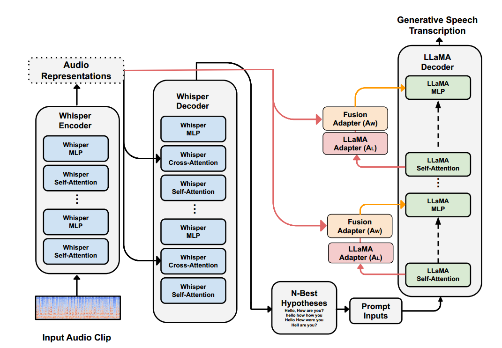
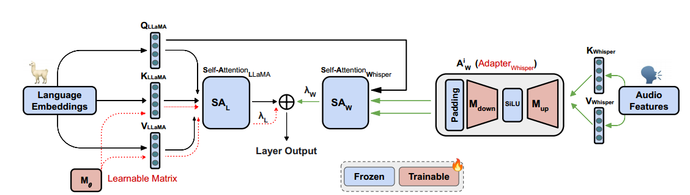
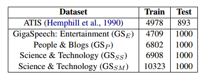
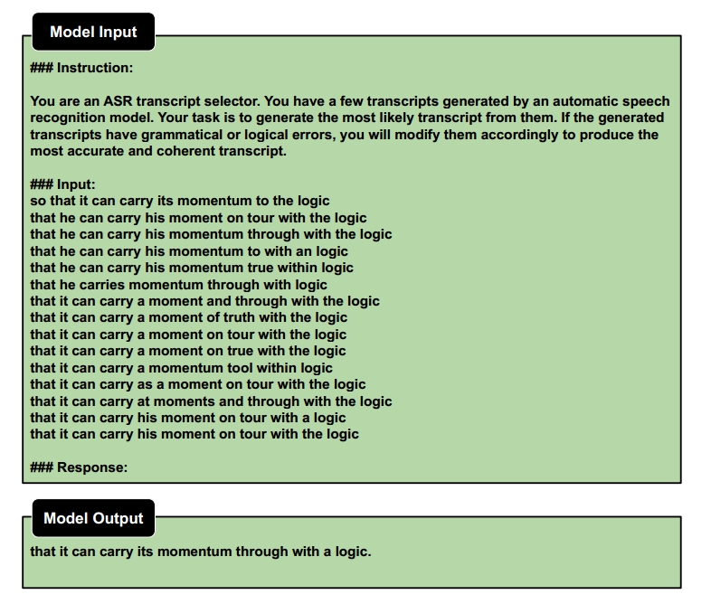
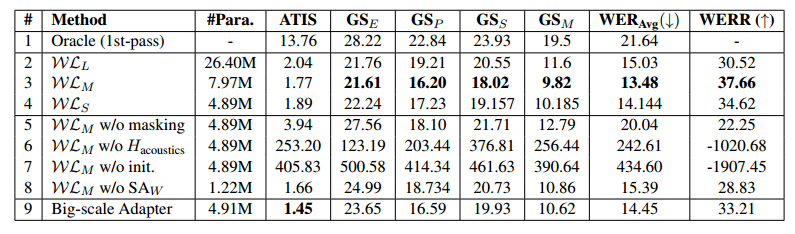

# Whispering LLaMA：一种用于语音识别的跨模态生成式错误校正框架

论文链接：https://arxiv.org/abs/2310.06434v2

代码链接：https://github.com/Srijith-rkr/Whispering-LLaMA

我们引入了一种新的跨模态融合技术，专为自动语音识别（ASR）中的生成式错误更正而设计。我们的方法利用声学信息和外部语言表示来生成准确的语音转录上下文，标志着在n-best假设领域内产生性错误更正的新范式。与现有的基于排名的重排序方法不同，我们的方法灵活使用不同的初始化技术和参数高效的算法，以提高从经过预训练的语音和文本模型导出的ASR性能。通过在不同的ASR数据集上进行评估，我们评估了我们的融合技术的稳定性和可重复性，表明相对于n-best假设，它的改进的字错误率（WERR）性能提高了37.66%。

## 引言

端到端（E2E）训练的语音模型在自动语音识别（ASR）任务中表现出最先进的性能。多种方法（Xia等，2017；Guo等，2019；Hu等，2021b；Yang等，2021a；Salazar等，2020）广泛采用了两遍的重新评分范式，以**利用语言模型进一步增强这些模型的能力**。在两遍的范式中，第一遍ASR系统使用E2E声学模型“生成”了n个最佳假设，而第二遍通过纳入语言模型（LM）“重新排序”这些假设。

这种两遍的重新排序方法在单遍的端到端（E2E）ASR系统（Amodei等，2016；Chan等，2016）上具有一些显著的优势。首先，随后的**大型语言模型通常能够更全面地捕捉语言结构的理解**（Stooke等，2023；Tur和De Mori，2011），超越了ASR模型的预训练数据中所包含的音频的知识，从而**提高了对未知词汇的性能**。此外，调整两遍的范式以适应领域转变（Li等，2023；Liu等，2021；Yu等，2023）要容易得多，因为只需要对新数据集上的语言模型进行微调。这**减轻了对口头转录语料库的需求**，这对于资源匮乏或濒危的口头语言尤其有益。

最近，在大型语言模型中，如ChatGPT（OpenAI，2023a）和GPT-4（OpenAI，2023b）的会话能力的新出现，进一步激发了利用大型预训练模型的表征能力来处理涉及多样数据模态的更复杂任务的兴趣（Yang等，2021b；Chang等，2023）。此外，这个新的研究方向还引入了一系列与考虑其他输入模态的信息相关的独特挑战，例如**声学和视觉条件**（Peng等，2023；Zhang等，2023），这可以丰富超出仅文本输入的上下文。

识别语音信号是一项需要同时考虑**声学信息**（Hu等，2021a；Hung等，2023）（例如，说话环境）和**语言信息**（Meng等，2023；Chen等，2023b，c）（例如，上下文和领域）的任务。**有效地将声学建模中的表示学习与语言建模相融合或整合**，以增强其性能，代表着一个明显复杂的研究领域，值得进一步探讨。在本文中，我们提出了一个基于标记级别的融合框架，将两个基础（大规模预训练）模型合并到一个识别错误修正范式中，旨在增强ASR系统的性能。

## ASR 后处理相关工作

基于 Transformer 的语言模型（Shin等，2019；Salazar等，2020）采用了对语言模型中各个标记的负对数似然求和的方法来重新评分 n 个最佳输出，从而实现了两遍的范式。最近的研究关注决策方法（Hu等，2020；Prabhavalkar等，2018）和基于音频注意力的重新评分方法（Futami等，2021；Gandhe和Rastrow，2020；Tanaka等，2021），以**改进ASR-LM重新评分并纳入声学特征**。最近的关于解码提示（Yang等，2023a）和基于编码器-解码器的错误校正方法（Chen等，2023a；Ma等，2023）已经证明**使用外部语言模型有助于降低转录错误率**。与此同时，如何将大型声学模型的表示融合到另一个语言模型中仍在研究之中。

## 方法

我们在第 3.1 节讨论了**模型架构**和**提出的特征组合**背后的直觉。**交叉模态融合机制**和**权重初始化**分别在第3.2节和第3.3节中进行了解释。

### ASR 生成误差校正

我们的方法结合了两个预训练模型，Whisper（Radford等，2022）和LLaMA（Touvron等，2023），**以便促进生成式错误校正**（Yang等，2023a；Chen等，2023a）。首先，我们使用Whisper，这是一个基于多任务编码器-解码器的Transformer（Vaswani等，2017）语音模型，经过训练使用了68万小时的多语言数据，用于对音频表征进行编码，并生成 n 个最佳假设的转录。其次，我们利用LLaMA，一个基于解码器的大型语言Transformer模型，通过使用 n 个最佳假设通过提示（附录中有图5进行说明）和我们提出的框架提供的音频表示来生成经过错误校正的转录。

Whisper利用Transformer模型的编码器从音频输入中提取特征，然后通过多头交叉注意力将这些特征传递到解码器，实现自回归文本标记预测（Wang等，2023；Irie等，2022）。编码的特征通过交叉注意力从音频输入提取信息，而解码器的自注意力则使用键值缓存机制关注先前的标记。

我们将音频特征和 Whisper 线性层融合到 LLaMa 模型中，以将音频信息注入其中，Whisper线性层生成了解码器的交叉注意力机制中的键值对。LLaMA中固有的自注意力模块与添加的交叉注意力模块使其类似于 Whisper 解码器。附录中的图2提供了所提方法的概述。

图2：Whispering-LLaMa模型 - 描述在第3.2节中的提出的适应流程的概览。

### 跨模态融合机制

我们在图 1 中介绍我们的机制。为了高效微调大型模型，我们在每一层的冻结 LLaMA 模型的自注意力模块（$SA^{i}_{L}$）之后，**引入了两个残差适配器**（Houlsby等，2019；Radhakrishnan等，2023；Chen等，2023d；Yang等，2023b）模块（$A^{i}_{L}$ 和 $A^{i}_{W}$）。

- 第一个变量 $A^{i}_{L}$ 代表第 $i$ 层中用于微调 LLaMA 模型的适配器，使用了缩放的点积注意力机制。
- 第二个变量 $A^{i}_{W}$ 指的是第 $i$ 层中的另一个适配器，用于通过遵循自编码器机制将 Whisper 特征与 LLaMA 模型相融合。

图1：展示了在第3.2节描述的具有可训练标记（ML）和融合机制的自注意力层内提出的生成式ASR错误校正的示意图。有关详细的模型示例，请参考图2

在每个 $A^{i}_{L}$ 中，我们引入一个可学习的矩阵 ${\color{red}M^{i}_{\theta}}  \in \mathbb{R}^{N_{\theta} \times N_{L}}$。其中，$N_{\theta}$ 表示适配器嵌入的维度，而 $N_{L}$ 表示LLaMA嵌入的维度。从预训练的 LLM 中提取的语言嵌入特征在每一层中由 $\color{blue} H^{i}_{L}$ 表示。

我们重新利用冻结的 LLaMA 自注意力模块 $SA^{i}_{L}$ 中的 LLaMA 线性层 $K^{i}_{llama}$ 和 $L^{i}_{llama}$，将 $M^{i}_{\theta}$ 转换为键值对，从而减少可训练参数的数量。同时，我们重新使用冻结的 LLaMA 自注意力模块 $SA^{i}_{L}$ 中的查询张量来计算 $A^{i}_{L}$，如下所示；其中 $S$ 代表 Softmax：

$$
S \left(\frac {Q^{i}_{llama}({\color{blue}H^{i}_{L}}) \cdot K^{i}_{llama}({\color{red}M^{i}_{\theta})}^T} {\sqrt{d_{k}} } \right) V^{i}_{llama} ({\color{red}M^{i}_{\theta}})
$$

为了将 Whisper 解码器交叉注意力模块中的音频表示和键值张量整合到 LLaMA 模型中，我们在 LLaMA 模型的每一层引入了两个额外的线性冻结变换（$K^{i}_{whisper}$ 和 $V^{i}_{whisper}$）。这些变换使用 Whisper 解码器的交叉注意力模块的相应权重进行初始化。通过将音频表示应用于这些额外的线性变换，我们生成了与 Whisper 生成的键值对相对应的键值对。

然后，我们利用第二个适配器模块 $A^{i}_{W}$，以添加可训练组件来学习跨模态表示。我们应用可学习的投影矩阵 ${\color{red}M^{i}_{down}} \in \mathbb{R}^{N_W \times \frac{N_W}{r}}$ 来降维获得的键和值对。其中，$N_W$ 表示Whisper编码的音频表示的大小（$x$）。然后，我们应用SiLU激活函数（Elfwing等，2018），然后是可学习的上投影 ${\color{red}M^{i}_{up}} \in \mathbb{R}^{\frac{N_W}{r} \times N_W}$，以计算可训练的输出：

$$
{\color{red}A^{i}_{W}(x)} \leftarrow \text{SiLU} \left( x \circ {\color{red}M^{i}_{down}} \right) \circ {\color{red}M^{i}_{up}}
$$

使用这个设置，我们在每一层转换键值对，将来自 Whisper 冻结预训练编码器的隐藏表示（$\color{blue}H_{audio}$）与 LLaMA 解码器的输出进行合并：

$$
{\color{red}K^{i}_{whisper}} \leftarrow {\color{red}A^{i}_{W}}(K_{i}^{whisper}({\color{blue}H_{audio}})) \\

{\color{red} \hat V^{i}_{whisper}} \leftarrow {\color{red}A^{i}_{W}} (V_{i}^{whisper}({\color{blue}H_{audio}}))
$$

一旦获得了相应的 Whisper 键值对，我们将应用第3.3节中描述的填充机制，以调整 ${\hat K^i_{whisper}}$ 和 ${\hat V^i_{whisper}}$ 的形状，使其与 $Q^{i}_{llama}$ 匹配，以便进行多头自注意力（MHA）计算，并保留 Whisper 键值嵌入的潜在结构。我们通过使用来自冻结的 LLaMA 模型的查询（$Q^{i}_{llama}$）进行 MHA 计算，以获得其可适应的自注意力头（$SA^{i}_{W}$）：

$$
S \left(\frac {Q^{i}_{llama}({\color{blue}H^{i}_{L}}) \cdot \left({\color{red} \hat{K}^{i}_{whisper}}\right)^T}  {\sqrt{d_k}} \right) \cdot \color{red}{\hat{V}^{i}_{whisper}}
$$

然后，我们利用一个门控融合机制，Whispering-LLaMA（WL），将所有模块融合在一起，如下所示：

$$
SA_{i}^{WL} \leftarrow SA_{i}^{L} + \lambda_{L} \cdot A_{i}^{L} + \lambda_{W} \cdot SA_{i}^{W}
$$

其中 $\lambda_L$ 和 $\lambda_W$ 是可学习标量。

### 权重初始化

Whisper 和 LLaMA 模型的隐藏维度是不同的，因此需要调整 Whisper 张量的形状以匹配 LLaMA 模型的形状，同时**保留 Whisper 模型中固有的潜在结构和信息**。张量的形状采用 [B, NH, T, HS] 的格式，分别表示批大小、头数、上下文长度和头大小。在注意力机制期间，最后两个维度会发生变化。

因此，为了保留 Whisper 的潜在结构，我们初始化一个形状为 $\mathbb R^{NH_{llama} \times T_{whisper} \times HS_{llama}}$ 的零矩阵，并将最后两个维度的主对角线填充为1。然后，我们将 $K^{i}$ 和 $V^{i}$ 放在填充模板的左上角。此外，我们将投影矩阵 $M^{i}_{down}$ 和 $M^{i}_{up}$ 初始化为第二个适配器模块 $A^{i}_{W}$ 上的单位矩阵。**除非按照这种初始化策略来保留 Whisper 的潜在表示，否则提出的框架会遇到显著的损失并无法收敛**。

## 实验设置

### 模型

在我们的实验中，我们采用了 LLaMA-7B 模型架构。由于我们指导语言模型使用生成的假设（如4.3.1所示）执行生成式错误校正，因此我们使用了Alpaca（Taori等人，2023）初始化我们的模型权重，Alpaca 是从 LLaMa-7B 微调而来的模型，利用了52,000次遵循指令的演示以实现指令遵循能力。为了从输入音频剪辑中提取音频表示，我们采用了 Whisper-Large V2，这是一个拥有 1.55B 参数的模型，经过对 620,000 小时音频数据的训练。此外，我们使用 WhisperTiny，一个拥有 70M 参数的模型，用于生成我们的转录，如后文第4.2节所述。我们将我们的模型命名为Whispering LLaMA（WL），并使用我们提出的框架训练了三个变种，其中 $N_{\theta} = 10$，$r = 8$、$16$、$32$，分别命名为WLL（大）、WLM（中）、WLS（小）。

我们为WLL设计了两个独立的 $A_W$ 适配器模块，分别用于键和值。WLM 和 WLS 在第3.2节中使用了相同的 $A_W$ 适配器以减少可训练参数。

### 数据集

我们通过利用两个数据集来精心策划我们自己的转录：**航空旅行信息系统（ATIS）**（Hemphill等人，1990）和 **GigaSpeech**（Chen等人，2021）。ATIS 包含个体查询航班信息的音频记录。GigaSpeech 包含来自有关各种主题的有声书、播客和 YouTube 视频的音频。ATIS代表了一个在语义上正确、领域特定的数据集，而 GigaSpeech 代表了更多嘈杂、真实世界的评估环境。我们在 GigaSpeech 中选择领域特定的子集，重点关注三个特定类别：娱乐、人物与博客，以及科学与技术。为了探索数据点数量对性能的影响，我们进一步将科学与技术类别分为两个子集。表 1 提供了每个数据集的训练数据点的详细信息。我们选择了Whisper-Tiny来生成n-best假设的基线，以建立一个更贴近处理次优假设的实际环境的强大评估环境。通过使用Whisper-Tiny，**我们模拟了一个具有质量较低假设的弱声学模型**。**将更高质量的假设从Whisper-Large提供给语言模型会使语言模型适应的生成错误校正任务更加容易**，而不是探索模型在实际环境中的性能，这是我们方法的预期使用场景。但是，我们强调，在附录E中，当以Whisper-Large假设作为起点时，我们的方法仍然有效。

表1：提供了数据集示例统计信息以及别名。GigaSpeech（Chen等人，2021）的科学与技术类别分为两个子集：GSSS（小）和GSSM（中），以评估与数据规模相关的性能差异

对于每个音频剪辑，我们使用top-k值为200和在[0.7, 0.8]范围内随机选择的温度，生成200个假设。随后，我们过滤掉冗余的句子，并选择其具有最高对数概率的前15个。

### 训练管道

我们模型的输入包括从WhisperLarge模型提取的**编码音频表示**，以及Whisper-Tiny**生成的最佳15个转录**。我们使用Alpaca模型附录图5中显示的提示模板。我们使用Adam优化器（Kingma和Ba，2014），尝试学习率为 $1×10^-2$ 、$1×10^-3 $ 和 $5×10^-4$，选择最佳值。模型经过25个时期的训练，使用提前停止以防止过拟合。训练在两个Nvidia A100 GPU上进行，以实现高效的并行处理。我们使用有效的批处理大小为 32，并应用权重衰减 $1×10^-2$。

####  ASR 的 LLM 提示案例

我们使用Alpaca（Taori等人，2023）的提示模板，如附录中的图5所示，生成n-best假设。该模板包含了由指令标签指定的指令部分，为模型提供指导。模型所需的基本上下文数据位于输入标签下。提示以响应标签结束，指示模型在提供的输入上下文中执行指定的指令。与采用最新的任务激活提示（TAP）方法（Yang等人，2023a）不同，我们选择将LLM提供给其特定任务的数据（例如，在我们的情况下是语音识别）。我们的替代方法便于进行第二遍错误校正，从而减轻了TAP基于广泛上下文窗口的生成式ASR错误校正中观察到的延迟问题。

### 性能研究

我们的实验结果已在表 2 中报告。WLM模型取得了最佳性能，相对字错误率（WERR）为37.66%，如B.2中所定义。WLL和WLM之间的比较表明，为键值对使用单独的适配器模块不会导致性能改进。有关更多数据集特定的分析，请参见附录B。在拥有更多领域内数据的Gigaspeech上，模型表现出更好的性能。

表2：实验结果以不进行文本规范化的WER形式呈现。我们提出的框架的性能报告在第2至第4行。Oracle指的是在与地面真相相比，具有最低字错误率的n-best假设中的候选者。第5至第9行表示在性能最佳的模型WLM上进行的不同消融实验。WERR是相对于B.2中所示的Oracle性能来测量的。

### 消融研究

我们经验性地发现，在交叉熵损失函数中除了地面真相之外**掩码提示**明显改善了性能。我们将这种改善归因于模型通过避免因n-best假设中的错误句子而惩罚模型而实现的对准确语义的增强容量。第5行代表了没有掩盖的WLM的性能。我们进一步研究了提出的框架是否利用了Whisper生成的音频表示，通过将其替换为从正态分布生成的随机张量作为输入（第6行）。此外，我们探讨了我们的权重初始化机制的重要性，通过将其替换为随机初始化（第7行）。这两项消融研究验证了我们的直觉，表明该方法有效地利用了声学特征，并强调了初始化机制在保持声学嵌入的潜在结构方面的重要性。有关更多见解，请参阅附录D。我们还移除了Whisper适配器（SAW）模块，仅使用适配器进行文本特征基线性能（第8行）。由于可训练参数数量之间的差异很大，我们使用了更高的适配器上下文维度 $N'_\theta = 4N_\theta$ 来训练另一个模型（第9行）。

## 结论

我们提出了一个新颖的框架，以利用LLM的外部知识来提高ASR系统的转录准确性。我们的框架提供了一种参数高效的方法，将大型基础语音和语言模型集成到一起，以实现竞争性的WERR改进。此外，我们进行了大量的消融实验来验证我们的直觉，并向研究社区开放了我们的代码和预训练权重。

## 限制

使用LLaMA等大型模型是直观的，因为它们由于其互联网规模的预训练，提供了对语言结构的全面理解。然而，在实际场景中部署这些系统并进行研究是具有挑战性的，因为它们需要大量的计算资源。在我们的方法中，我们的目标是通过复用多个模型组件，并使用适配器进行模型融合，使我们的框架具有高效的参数化。然而，将音频表示合并到训练管线中将训练时间延长了394.76%。这突显了对齐问题的重要性。此外，我们的解决方案显示，为了实现最佳性能，需要更大量的数据，尽管只有7.97M的适配基础模型的参数数量。在我们的实验中，我们遇到了与数据过度拟合相关的问题。为了减轻这个问题，我们使用降低的学习率进行训练，并在整个训练过程中监控字错误率（WER）性能，并选择性能最佳的模型检查点来实施提前停止。