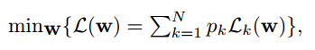
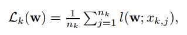

# 联邦学习遇上自然语言处理：一项调查

英文名：Federated Learning Meets Natural Language Processing: A Survey

论文链接：https://arxiv.org/abs/2107.12603v1

联邦学习旨在从多个分散的边缘设备（例如移动设备）或服务器上学习机器学习模型，而无需牺牲本地数据隐私。最近的自然语言处理技术依赖于深度学习和大型预训练语言模型。然而，大型深度神经网络和语言模型通常是通过大量数据在服务器端进行训练的。由于文本数据广泛来自最终用户，因此在这项工作中，我们研究了最近使用联邦学习作为学习框架的自然语言处理模型和技术。我们的调查讨论了联邦自然语言处理中的主要挑战，包括算法挑战、系统挑战以及隐私问题。我们还对现有的联邦自然语言处理评估方法和工具进行了批判性审查。最后，我们突出了当前的研究差距和未来方向。

**关键词**：联邦学习；自然语言处理；语言建模；隐私

## 引言

现代机器学习算法在训练深度神经模型（如文本和图像等高维数据）时依赖于大量数据。大多数数据自然来自端用户，这些用户分布在不同的端设备上。在保护用户隐私的前提下，有必要训练性能良好的机器学习模型。联邦学习（FL）已成为一种新的机器学习范式，用于在多个分散的边缘设备或服务器上训练模型，而无需交换本地数据样本。联邦学习这个术语首次由[40]于2016年提出：“我们将我们的方法称为联邦学习，因为学习任务是由参与的设备（我们称之为客户端）的一个松散联合解决的，这些设备由中央服务器协调。”

在现实世界的场景中，一些组织，如不同的医院，保存着机密数据，然而这些医院希望训练一个用于共同使用的疾病分类模型，却难以要求它们将自己的数据上传到云端。即使在同一家医院，不同部门通常会在本地保存患者的信息。另一个例子是人们通过智能手机创建了大量的文本数据，这些数据是当今大型语言模型的构建基础。然而，已经显示出大多数语言模型存在伦理问题，因为它们可能以意想不到的方式泄露用户的个人信息。

最近在联邦学习领域的努力已经涉及到跨学科的领域：不仅需要机器学习，还需要分布式优化、统计学、网络安全、通信、系统、密码学等技术。与此同时，数据的格式也从结构化到非结构化，不仅限于表格、时间序列和图像等形式。在大多数联邦学习研究中，谷歌通过Gboard移动键盘、Pixel手机和Android Messages等产品在自然语言处理领域引领了联邦学习的应用。谷歌已经在语言建模任务上推出了多个应用，而苹果则在Siri的唤醒词检测中使用联邦学习，doc.ai正在开发用于生物医学研究的跨设备联邦学习解决方案，而Snips已经推出了用于热词检测的跨设备联邦学习。

在本论文中，我们对自然语言处理（NLP）领域现有的联邦学习（FL）算法进行了调查。从语言建模开始，我们将回顾当前在各种NLP任务上使用的联邦学习算法，包括分类、推荐、语音识别、健康文本挖掘等。我们将调查组织如下：在第2节中，我们讨论了基本的联邦学习概念、框架、针对非独立同分布数据的优化以及隐私问题。第3节回顾了NLP中的联邦学习。第4节讨论了常见的评估方面和工具。第5节强调了当前的研究挑战和一些未来的方向。第6节总结了论文。

## 联邦学习

在本节中，我们首先回顾联邦学习的基础知识，包括问题设置、非独立同分布数据分布、框架、优化算法和隐私保护。然后，我们将联邦学习扩展到其他分布式机器学习范式，并讨论它们之间的区别。

**问题表述**：在这项工作中，我们考虑以下分布式优化过程：

在这个问题中，$N$代表用户设备的总数量，$p_k$代表第$k$个设备的权重，满足$p_k ≥ 0$且$∑_{k=1}^{N} p_k = 1$。假设第$k$个设备具有$n_k$个训练数据，表示为$x_k = (x_{k,1}, x_{k,2}, ..., x_{k,n_k})$。本地训练目标$L_k(.)$定义如下：

其中，*l*(⋅;⋅) 是用户指定的损失函数。

**非独立同分布数据和学习策略**：典型的集中式监督学习算法具有IID假设，即训练和测试数据是独立同分布的。在分布式设置中，如联邦学习，非独立同分布数据构成了一个挑战，因为不同的数据分布导致了不同设备或位置之间显著的不均衡。设备/位置之间的非独立同分布数据包括许多不同的形式。在设备/位置之间可能存在**特征**（概率$P(x)$）、**标签**（概率$P(y)$）或特征与标签之间的关系（例如，不同的$P(y|x)$或$P(x|y)$）的偏斜分布。在先前的研究中，将这种情况分为了联邦学习中的水平、垂直和混合数据分区。在本次综述中，我们专注于**标签的偏斜分布**，即对于不同的数据分区$P_i$和$P_j$，$P_{P_i}(y)$不等于$P_{P_j}(y)$。

先前的研究表明，带有批量归一化的深度神经网络（DNN）模型在非独立同分布（Non-IID）数据上性能下降[25]。对于在高度偏斜的非独立同分布数据上训练的神经网络，每个客户设备仅训练一个类别的数据，联邦学习的准确性显著降低，最多降低55%[69]。

处理非独立同分布（Non-IID）数据的常见技巧包括：

1. **数据增强（Data Augmentation）**：创建一个通用的数据集，可以在全局范围内共享。这个数据集可以来自公开可用的代理数据源[69]，或者是原始数据的提炼[61]。
2. **调度客户端参与训练**：使用不同的策略来调度客户端设备的参与，例如FedFMC、FedCD、对相似设备进行聚类、多中心、分层聚类等，以减轻非独立同分布数据对模型性能的影响。
3. **增加模型数量，但增加通信成本**
4. **可以采用模型集成方法，类似于调度策略**
5. **服务器端正则化**：例如，使用FedAwS，服务器在每一轮后引入几何正则化，以鼓励类别在嵌入空间中分散排列。
6. **个性化联邦学习/持续本地训练**：基于元学习（MAML）等技术，对客户端进行个性化训练，以适应不同数据分布。

这些技巧可以根据具体的问题和数据分布选择和组合，以改善非独立同分布数据对联邦学习性能的影响。

**优化**：尽管在独立同分布（IID）设置中，各种研究对每个客户端的优化函数做出了假设，但我们在假设随机梯度的方差不超过$\sigma^2$的情况下，回顾了H-平滑凸函数的基本收敛结果。在标准的联邦学习设置中，给定以下符号：$N$是客户端的总数，$M$是每轮参与的客户端数量，$T$是总通信轮数，$K$是每轮的本地随机梯度下降（SGD）步数。联邦平均可以在以下两种设置中进行：一种是在每轮的本地更新中保持$x$不变，并在当前$x$处计算总共$KM$个梯度，以运行加速的小批量SGD，此时收敛速度的上界为$O( H T^2 + \mu \sqrt{TKM} )$。另一种是忽略除1个活跃客户端外的所有其他$M$个客户端，这允许顺序SGD运行$KT$步，这种方法的上界为$O( H (TK)^2 + \mu \sqrt{TK} )$。在非独立同分布（non-IID）设置中，对于客户端之间的梯度、每个客户端上的本地函数以及其他参与约束，关键假设已经给出。关于非独立同分布设置的不同收敛速度的详细讨论可以在[30]中找到。

**框架**：关于联邦学习的框架，通常有三种基本类型：中心化、分散化和异构化。

1. **中心化框架**：在中心化的联邦学习设置中，使用一个中央服务器来协调算法的不同步骤，并在学习过程中协调所有参与的节点。服务器负责在训练过程开始时选择节点，并汇总接收到的模型更新。由于所有选择的节点都必须向单个实体发送更新，因此服务器可能成为系统的瓶颈。大多数自然语言处理（NLP）应用，如键盘单词预测，都使用中心化设置。
2. **分布式框架**：在分布式的联邦学习设置中，节点能够协调自己以获取全局模型。这种设置可以防止单点故障，因为模型更新仅在相互连接的节点之间交换，无需中央服务器的协调。然而，具体的网络拓扑结构可能会影响学习过程的性能。大多数基于区块链的联邦学习属于分布式设置。
3. **异构化框架**：越来越多的应用领域涉及到大量的异构客户端，例如移动电话和物联网（IoT）设备。大多数现有的联邦学习策略假设本地模型共享相同的全局模型架构。最近，开发了一种名为HeteroFL的新型联邦学习框架，以解决具有非常不同的计算和通信能力的异构客户端。HeteroFL技术可以使异构的本地模型在计算复杂性动态变化的情况下进行训练，同时仍然生成单一的全局推理模型。

**隐私**：在大多数联邦学习（FL）设置中，隐私保护是为了确保用户的信息在学习过程中不被泄露。从物理上讲，本地数据不允许离开终端用户的设备。然而，仍然有可能通过模型权重或梯度来重构原始数据。因此，在FL中，我们考虑了三个方面的隐私保护：用户个人信息、本地数据和机器学习模型。以智能手机键盘下一个单词预测为例，用户的个人信息包括他们的位置、姓名、性别以及隐藏信息，如键盘输入模式。本地数据包括手机中的消息、照片和视频，而机器学习模型可以是一个语言模型，用于根据一些先前的单词来预测下一个单词。**用户的个人信息通常与本地数据相关**，例如，通过聊天消息可以推断出一个人的年龄。隐私保护的挑战在于如何在**联邦学习中确保用户的个人信息和本地数据不会被泄露**，同时保持模型的高性能。各种技术，如差分隐私、加密技术和模型聚合方法，都被用于解决这些问题，以确保用户的隐私得到充分的保护。

保护用户数据隐私的常见技术包括：差分隐私 [10]、安全多方计算 [15]、同态加密 [43] 和受信任执行环境 [11]。验证性技术使各方能够证明他们已经忠实地执行了计算的各个部分。验证性技术包括零知识证明（ZKPs）[13]和受信任执行环境（TEEs）[11]。至于模型攻击，可以在联邦学习设置中利用对抗性学习技术。

## NLP中的联邦学习

### 语言建模

本节讨论了语言建模（LM）和联邦学习（FL）在自然语言处理领域的应用：

- 语言建模（LM）是一种模型，用于为单词序列提供概率，通常通过无监督的分布估计来实现。
- LM在自然语言处理（NLP）任务中广泛应用，包括机器翻译、文本分类、关系提取和问答等。
- 在联邦学习中，大多数LM部署在虚拟移动键盘上，如Google键盘（Gboard），因此与Google有关的作者在该领域的研究较多。
- 联邦NLP的重点是改进移动键盘建议，使其更可靠和弹性，包括下一个单词的预测、表情符号的预测和查询建议。
- 由于移动设备的资源限制，需要在客户端上部署轻量级LM模型以实现快速推理。
- 研究中提到了多种LM模型变体，包括LSTMs、CIFG、GRU和GPT2等，用于不同的任务和性能优化。
- 联邦优化算法，如FedAvg和FedAtt，用于在服务器和客户端之间聚合模型参数。
- 隐私保护技术，如差分隐私（DP），也在联邦学习中得到了考虑，但仍需要权衡数据效用和隐私保护。

语言建模（LM）指的是通过无监督的分布估计为单词序列提供概率的模型。作为自然语言处理系统的重要组成部分，LM在各种NLP任务中得到应用，包括机器翻译、文本分类、关系提取、问答等。在联邦学习（FL）中，大多数LM都部署在虚拟移动键盘上，即Google键盘（Gboard）。因此，最近的文献主要由Google, LLC的作者撰写。在联邦NLP中，语言建模的最新工作主要致力于解决移动行业中的单词级LM问题。这就是移动键盘建议，这是联邦NLP应用的一个典型代表。为了改进移动键盘建议，联邦NLP模型旨在更加可靠和弹性。现有模型在打字或表达领域（例如表情符号）提供了质量改进，如下一个单词的预测、表情符号的预测、查询建议等。

考虑到移动设备的特点，分布式计算方法受到计算资源和低延迟要求的限制。移动设备具有有限的RAM和CPU预算，而我们期望键盘在20毫秒内对输入事件提供快速可见的响应。因此，部署在客户端的模型应该能够进行快速的推理。

大多数研究[67, 20, 47, 5, 29, 52, 58]考虑LSTMs [24]的变体作为客户端模型。鉴于每台设备的计算预算有限，我们期望神经语言模型的参数空间尽可能小，而不会降低模型性能。CIFG [17]是一个有望降低LM复杂性和推理时间延迟的候选方法。它使用单一门控来管理输入和循环单元的自连接。通过这种方式，参数数量减少了25% [17]。[20]利用CIFG进行下一个单词的预测，并通过去除窥视孔连接简化了CIFG模型。为了进一步优化模型的大小和训练时间，他们将输入嵌入和CIFG输出投影矩阵相互关联。[47]将预训练的CIFG网络应用为表情符号预测模型。特别是，预训练过程包括所有层，但不包括输出投影层，使用语言学习任务。为了提高性能，作者允许输入和输出之间的嵌入共享。LM的预训练在表情符号模型中表现出快速的收敛性。[5]使用字符级RNN [63]，针对联邦学习（FL）设置中的词汇外（OOV）学习任务。具体来说，他们使用带有窥视孔连接和投影层的CIFG。投影层减小了输出的维度并加速了训练。他们使用多层LSTMs来增强模型的表示能力，该模型学习单词出现的概率。GRU [8]是LSTM的另一个简化变体。[29]将GRU作为移动键盘下一个单词预测的神经语言模型。与CIFG类似，它在参数空间上降低了模型复杂性，而不会损害模型性能。为了减小可训练参数的数量，他们还在嵌入层和输出层应用了权重和偏差的共享。

[67]提出了另一种用于键盘查询建议的LM，以减轻训练LSTMs的负担。具体来说，他们在服务器上训练一个LSTM模型来生成建议候选项，而仅对触发模型进行联邦训练，该模型决定候选项的发生。触发模型使用逻辑回归来推断用户点击的概率，与RNN模型相比，大大减少了计算预算。[6]还指出，直接使用RNN不是解码的合适方式，因为它具有大的参数大小，进一步导致推理速度慢。因此，他们建议利用从联邦RNN派生的n-gram LM来进行解码。特别是，他们通过引入基于SampleApprox [57]的近似算法来克服大内存占用问题，并通过将RNN模型近似为n-gram模型来增强模型性能。尽管如此，他们仍然使用CIFG和group-LSTM（GLSTM）[32]进行近似。而GPT2 [46]是具有15亿参数的最新基于变换器的LM之一。考虑到其在集中式语言建模任务上的性能，[52]使用GPT2作为LM。他们提出了一个降低GPT2词嵌入维度的降维算法，将其降至所需的值（100和300）。

对于联邦优化，现有的联邦优化算法在服务器端的客户端模型聚合方面存在差异。在联邦语言建模中，大多数现有的工作[67, 20, 6, 47, 5, 52, 58]使用FedAvg作为联邦优化算法。另一种优化策略称为FedAtt，在语言模型中也已经显示出其可行性和有效性[29]。

在FedAvg中，由本地计算的梯度在服务器上进行聚合，以构建新的全局模型。每个客户端通过本地存储的数据进行训练，并通过一步或多步随机梯度下降（SGD）计算与当前全局模型的平均梯度。然后，它将模型更新与服务器通信。服务器对客户端更新进行加权聚合，以构建新的全局模型。一旦积累完成，客户端更新立即在服务器上被丢弃。[20]使用FedAvg从头开始在服务器上训练全局模型。具体来说，初始全局模型要么是随机初始化的，要么是在代理数据上进行了预训练。然而，它增加了客户端的联邦训练轮次。因此，在联邦学习中会导致高通信和计算成本。他们还在服务器端使用SGD作为优化器进行训练。他们发现Adam和AdaGrad对收敛没有带来实质性的改进。**[52]引入了一种新颖的联邦训练方法，称为中央预训练与联邦微调**。为了解决[20]中的缺点，服务器在初始时使用中心化和公共数据对模型进行预训练，作为全局模型。然后，每个客户端获取预训练权重作为初始权重，并以联邦方式在本地数据上进行训练。但这种改进仅限于大型网络，例如GPT2。他们还提出了一个用于联邦训练的预训练词嵌入层，只能提高大型词嵌入网络（即GPT2）的准确性。然而，与预训练模型的结合会损害性能。他们使用Adam作为训练的优化器。[5]在FedAvg中使用动量和自适应L2范数剪辑，导致更快的收敛。作者认为，在梯度上应用动量和自适应剪辑有助于提高模型收敛和性能的鲁棒性。[58]还使用剪辑作为FedAvg中的正则化手段，通过设置用户更新的上限来约束每个客户端的贡献（即剪辑）。此外，[47]发现使用带有Nesterov加速梯度的动量明显优于使用SGD作为服务器优化器，无论是在收敛速度还是模型性能方面。[6]将Nesterov动量同时用作本地和服务器优化器。

[29]首次将**注意机制引**入了客户端模型的联邦聚合中。这种优化算法被称为Attentive Federated Aggregation（FedAtt）。它是一种应用在NN模型的训练参数上的逐层软注意机制。直观地说，联邦优化算法通过为快速本地适应提供每个客户端模型的良好泛化来学习优化全局模型。因此，它减少了本地训练轮次并节省了计算预算，进一步加速了学习过程。FedAtt中的泛化是由每个客户端与服务器之间的相似性以及每个客户端的相对重要性决定的。为了实现良好的泛化，他们最小化了每个客户端模型和参数空间上全局模型之间的加权总距离。他们引入了注意权重作为客户端模型的权重。特别是，每个客户端模型的关注权重是从NN的每一层中派生出的非参数化注意分数。与预训练的FedAvg不同，FedAtt通过迭代更新参数来找到在每个联邦训练轮次上具有良好泛化性的全局模型。因此，它进一步减少了联邦通信预算。对于本地训练，客户端优化器是动量。而对于全局参数更新，他们使用SGD。

现有的联邦语言建模工作主要集中在优化模型聚合过程，而不是专注于隐私保护方法。将隐私保护技术添加到联邦优化过程中被视为一种奖励，而不是隐私保证的重要手段。在联邦语言模型中，常用的隐私保护技术是差分隐私（DP）[9]。DP算法旨在表征底层概率分布，同时不泄露个人可识别数据。总的来说，**它在聚合数据中注入校准的噪声，而不影响结果**。大多数DP方法用于用户级隐私保证。在联邦学习中，我们将用户级DP定义为一种隐私保证，旨在在有或没有任何一个客户端数据的情况下保护训练过的模型。DP通常在模型聚合之前用于客户端侧[62]。[29]通过引入均值为0和标准差σ的白噪声来在FedAtt优化中集成了一个随机机制。他们还引入了一个幅度系数β ∈ (0, 1]来控制随机化在联邦学习中的影响。然而，它的DP保证水平尚未揭示。因此，它未能展示数据效用和隐私保护之间的权衡，用于其隐私保护对策的实施。[58]在FedAvg中引入了高斯机制，以应对语言模型中数据的基于用户的异质性。特别是，在剪辑后，它通过添加带有噪声乘数1的高斯噪声来执行DP保证。他们认为，高水平的DP保证显著减少了由训练数据的异质性引起的非预期记忆。

### 语音识别

语音识别是将音频中的语音识别并转换成文本的任务。像亚马逊的Alexa或苹果的Siri这样的语音助手使用设备上的处理来检测唤醒词（例如“嘿Siri”），这是智能手机上典型的语音识别用法。只有在检测到唤醒词后，才会在云端运行进一步的信息检索或问题回答等处理。语音识别的方法包括动态时间规整[42]、隐马尔可夫模型[45]以及现代的端到端深度神经模型[16]。最近，wav2vec[3]在潜在空间中对语音输入进行了掩码处理，并解决了一个在潜在表示的量化上定义的对比任务，这种方法证明了在有限标记数据的情况下进行语音识别的可行性。

设备上的唤醒词检测器面临两个主要挑战：首先，它应该以最小的内存占用和计算成本运行。其次，唤醒词检测器应该在任何使用环境中表现一致，并对背景噪音表现出强大的鲁棒性。[68]对资源受限的微控制器上的关键词识别进行了神经网络架构评估和探索，他们表明可以优化这些神经网络架构，使其适应微控制器的内存和计算约束，而不会牺牲准确性。[34]研究了在众包语音数据上使用联邦学习来学习资源受限的唤醒词检测器。

他们表明，使用每坐标平均值的修订联邦平均算法，基于Adam而不是标准全局平均，可以在100轮通信中达到95%的召回率的目标停止标准，其客户端的相关上行通信成本为8MB。他们还开源了Hey Snips唤醒词数据集1。[65]提出了一种分布式特征提取方法，用于解决语音识别的隐私保护问题，该方法建立在量子卷积神经网络（QCNN）之上，包括用于特征提取的量子电路编码器和基于循环神经网络（RNN）的端到端声学模型（AM）。所提出的分布式框架利用了量子学习进展来保护模型并避免隐私泄露攻击。[19]引入了一种语音识别框架，通过该框架可以改变非独立同分布度的程度，从而说明了模型质量与联邦训练的计算成本之间的权衡。他们还表明，超参数优化和适当使用变分噪声足以补偿非独立同分布分布的质量影响，同时降低成本。

