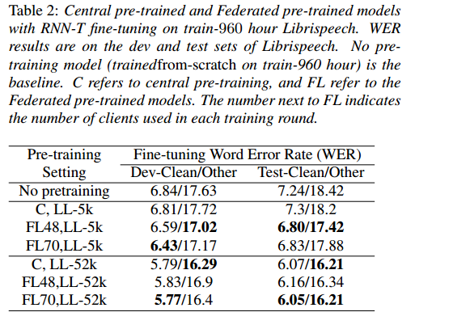
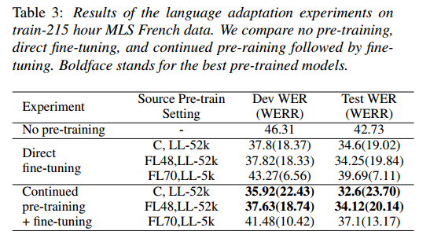

# 面向自动语音识别的联邦表示学习

英文名：Federated Representation Learning for Automatic Speech Recognition

论文链接：https://arxiv.org/abs/2308.02013

联邦学习（FL）是一种保护隐私的范例，允许边缘设备协作学习而无需共享数据。像Alexa和Siri这样的边缘设备是潜在的未标记音频数据源，可以用来学习强大的音频表征。在这项工作中，我们将自监督学习（SSL）和FL结合起来，以学习符合数据隐私约束的自动语音识别（ASR）表示。我们使用未标记的语音数据集Libri-Light中的说话者和章节信息来模拟非IID（非独立同分布）的说话者分隔数据分布，并使用FedSGD框架对LSTM编码器进行预训练。我们展示了在FL中预训练的ASR编码器表现与中央预训练模型一样好，并与无预训练相比，可以提高12-15%（WER）。我们进一步将联邦预训练模型调整到一种新的语言，法语，并展示相比无预训练的情况，可以提高20%（WER）。

## 引言

本节讨论了联邦学习（Federated Learning，FL）和自监督学习（Self-Supervised Learning，SSL）在自动语音识别（ASR）领域的应用。以下是总结：

1. 联邦学习（FL）是一种允许在多个设备上协作训练模型的方法，同时保护用户数据隐私的技术。
2. 客户设备，如智能手机和语音助手（如 Alexa 和 Siri），包含大量语音数据，但这些数据通常缺乏可靠的转录文本。
3. 为了克服无标签数据的挑战，研究者使用自监督学习（SSL）来学习语音表示，然后使用有限的已转录数据进行微调。
4. 本文提出的策略是两阶段的：首先，在无标签语音数据上使用FL算法对编码器进行预训练，然后在已转录数据上进行微调。
5. 通过模拟非独立同分布的数据，作者创建了speakersiloed数据集，用于在多个客户端上使用FL进行预训练。
6. 研究表明，联邦预训练模型在性能上与中心预训练模型相似，同时还展示了FL预训练模型在适应外语（法语）上的有效性。

总之，这篇文本介绍了如何结合FL和SSL来改进语音识别模型，特别是在处理无标签语音数据和保护用户隐私方面取得了显著进展。

## 相关工作

文献中已经有一些尝试将联邦学习（FL）应用于与语音相关的任务。其中一些应用包括：自动语音识别（ASR）[10, 11, 12, 13, 14]、关键词检测[15, 16]、情感识别[17, 18, 16]和说话人验证[19]。值得注意的是，在将FL与自监督学习（SSL）结合的方面，目前仅有两项相关工作，分别是用于声学事件检测的"Federated self-supervised learning (FSSL)"[20]以及另一项研究[21]，该研究突出了在客户端由于硬件限制而结合FL和SSL所涉及的挑战。在后者中，研究人员使用FL在Common-Voice意大利数据[22]上对wav2vec 2.0 [4]模型进行了训练，并进行了自动语音识别（ASR）的微调。

在本文中，我们研究了如何利用Libri-Light 50K+小时的音频数据来生成声学表示，并取得了以下贡献：

• 据我们所知，我们是首次在大规模ASR领域集成FL的研究，该方法产生了与常规预训练相比具有竞争力的ASR性能。

• 我们成功将单语言联邦预训练模型适应到资源受限的目标语言（法语），从而将相对词错误率（WER）提高了20%。

## 方法论

### 生成说话人隔离数据

在联邦设置中训练模型的一个挑战是参与设备之间**数据分布的多样性**。在语音助手的背景下，客户设备上的数据通常属于一个说话者，并具有特定的语言和声学特征。尝试使用像Libri-Light这样的开源数据集来模仿类似的设置是具有挑战性的。以前的研究尝试在联邦设置中集成开源音频数据，通常是基于说话者信息来拆分数据集[21, 11, 23]，但并未考虑数据的时间概念。

Libri-Light数据包含在每个话语的唯一标识符中嵌入的说话者ID和章节ID信息。在这里，我们通过将章节ID视为时间单位并按照以下方式创建非相同和独立分布的分区，额外地引入了时间概念：

1. 针对语音语料库，首先按照说话者ID将其进行隔离。这意味着将所有的语音数据根据说话者的身份进行分组或隔离，以便每个说话者的数据都被单独处理。
2. 针对每个隔离的说话者数据，根据章节信息对话语进行排序。这里，章节信息被视为一个代表时间分布的代理变量。通过按照章节信息对话语进行排序，可以创建一个时间上有序的数据集，从而更好地模拟语音数据的时间分布。

举例来说，假设有三个客户端，分别是C1、C2、C3，在一轮联邦预训练中，每个客户端都包含了仅包含一个说话者话语的批次数据。比如，C1包含来自说话者S1-Chapter1的话语，C2包含来自说话者S2-Chapter1的话语，以此类推。由于Libri-Light的说话者与话语的比例不均匀，通过使用章节信息来引入时间概念，可以确保一轮中的不同客户端包含来自不同说话者的数据，更接近模拟真实生活中联邦训练语音模型的情况。

**这种方式确保了数据的多样性和时间分布，使得联邦学习更贴近实际情景，有助于训练出更鲁棒的语音模型。**

这种以说话者为隔离的数据被用于联邦预训练实验。此外，在预训练过程中，我们确保在训练期间生成的批次数据来自同一说话者。联邦预训练与中心化预训练之间的另一个非常重要的区别是，在联邦学习中，我们只对数据进行一次处理，而在中心化预训练中可以进行多次处理。这个严格的限制是为了模拟在经过一定的时间阈值后，客户端上的数据不再可用的情况。

**这种方式强调了联邦学习中的数据隐私和分布性的挑战，以及与中心化训练不同的处理方式，从而更好地模拟了实际情况中的数据可用性限制。**

### 预训练

我们将传统的中心化预训练与提出的联邦预训练进行比较。

1. 中心化预训练（Central Pre-training）：我们的基准模型是使用标准的中心化Contrastive Predictive Coding (CPC)框架进行训练，具体细节见附录A.1。在这种方法中，数据被收集并在云端进行随机排序，消除了说话者特定的数据分布，并运行多个周期以学习表示。
2. 联邦预训练（Federated Pre-training）：在这里，我们使用与中心化预训练相同的超参数（与FL无关的）和网络架构来进行预训练。每个参与联邦预训练的客户端根据本地数据更新模型并将权重更新发送回中央服务器。中央服务器累积和聚合权重，并将更新后的模型广播给下一轮参与的客户端（见算法1）。未标记的客户端数据仅在训练过程中使用一次，因为无限保留数据在资源有限的设备上是不可行的。

这两种方法的比较突出了联邦预训练与传统中心化预训练之间的差异，尤其是在数据处理和分布、数据隐私和数据使用方面的不同之处。以下是对联邦预训练算法的介绍：

> 输入（Input）：
>
> - K：每轮参与的客户端数量
> - B：每个客户端批次（batch）的大小
> - E：本地更新步骤的数量
> - C：每个客户端每个更新步骤的批次数量
> - E=1，C=1 用于FedSGD
> - 数据生成器 Dk 在第 k 个客户端上
>
> 服务器（Server）：
>
> - 随机初始化模型的权重 w0
>
> 算法过程：
>
> 1. 对于每一轮 t = 0, 1, 2, ... 进行如下操作：
>    - 服务器（Server）将当前权重 wt 发送给随机选择的 K 个客户端。
> 2. 对于每个客户端 k ∈ [1, K] 进行如下操作：
>    - 客户端 Dk 生成大小为 B 的 C 个批次的话语数据。
>    - 在这 C 个批次上对模型进行 E 步的本地更新。
>    - 将更新后的权重 wt k 发送回服务器。
> 3. 服务器（Server）汇总权重并更新其模型：
>    - wt+1 更新为 wt k 的累积平均值，其中 k 从 1 到 K，n 代表批次的数量。
>
> 这个算法描述了联邦预训练过程，其中多个客户端在每轮中使用本地数据更新模型，然后将更新的权重发送回中央服务器，服务器根据这些权重进行模型的聚合和更新。这个过程允许在保护数据隐私的同时进行模型的联合训练。

### 微调

为了评估预训练模型的性能，无论是中心化的还是联邦的，我们都会使用预训练模型来初始化RNN-T编码器。在我们的设置中，RNN-T编码器的架构与CPC模型相同。预测网络和联合网络是随机初始化的。所有层都会使用已转录的音频数据进行中心化微调。

## 实验

### 数据集

我们使用Libri-Light (LL) 数据集[8]进行预训练。LL 数据集包含三个部分：small、medium 和 large，我们考虑了包含来自 6845 名说话者的 52,000 小时无标签语音数据的 large 部分。在中心化预训练实验中，我们使用了所有 52,000 小时的数据，而在联邦预训练中，同样的数据以非相同分布的方式排列，即根据说话者进行隔离。我们进一步研究了在联邦预训练中使用的数据量对结果的影响，为此，我们使用了 5,000 小时的数据（LL-5K），这是从LL中随机选择的子集。在微调预训练模型时，我们使用了Librispeech [24]的 960 小时训练分区的数据。微调后的模型在Librispeech的开发集和测试集上进行评估。除此之外，我们还在资源受限的语言适应实验中使用了来自Multilingual Librispeech (MLS) 数据集 [25] 的法语数据。表1总结了这些数据集。

### 训练细节

在中心化和联邦预训练中，CPC（RNN-T编码器）模型都包括以下组成部分：

- 3层的512单元前馈型特征编码器，使用ReLU激活函数。
- 6层的1024单元单向LSTM上下文编码器。
- RNN-T模型包括1024单元的2层预测网络和一个单层的密集联合网络。

输入数据的构建方式在预训练和微调模型中都相同，都是从通过25毫秒窗口和10毫秒帧移获得的256维STFT特征中构建而成的，通过连接三个连续帧来获得最终的768维特征。所有的预训练实验都是随机初始化的，预训练模型的权重用于初始化ASR微调阶段的RNN-T编码器，而预测和联合网络则是随机初始化的。

ASR模型使用了一个由2500个句子片段（Sentence-Piece）组成的词汇表。在训练模型时，使用了48个V100 GPU。在预训练阶段，中心化训练运行了130,000步，批次大小为[64, 32, 1]。在联邦学习中，根据每轮训练涉及的客户端数量，我们变化物理GPU的数量，大致每两个客户端共享一个GPU，并允许每个客户端的最大批次大小为8。FedSGD模型在22,000轮或一次整个数据集的情况下进行训练。在每个客户端上，使用单位学习率的SGD，服务器端采用Adam优化器，学习率为1e-5。在Librispeech上的微调运行了100,000步。

## 结果

### 联邦与中心预训练

我们展示了预训练（FL/中心化）音频表示的有效性。RNN-T模型在Librispeech的960小时训练数据上进行了微调，使用了预训练的编码器。表2显示了微调模型在开发集和测试集上的词错误率（WER）。

我们将微调模型与从头开始训练的RNN-T模型进行了比较，后者的编码器是随机初始化的，没有进行任何预训练。我们还研究了使用LL-5k和LL-52k数据集进行预训练对结果的影响。

我们发现所有的预训练模型（FL/中心化）都表现比从头开始训练的模型更好。平均而言，预训练模型在开发集和测试集上的相对WER改善（WERR）分别为11.3%和14.22%。我们观察到在更大的数据集（LL-52k，见表2）上进行的预训练在FL和中心化预训练的两种情况下都更好，类似于[4, 5, 6]中的情况，其中中心化预训练模型在更多数据的情况下表现出更好的ASR性能。我们可以确认上述观察结果适用于FL预训练以生成音频表示。

关于FL与中心化预训练的主要观察包括：i) FL预训练模型的性能与中心化模型相似；ii) 实际上，当在少量数据（LL-5k）上进行预训练时，FL预训练模型的性能优于中心化模型，开发集和测试集上的平均WERR分别为4.76%和5.56%；iii) 尽管在FL设置中数据只经过一次处理，而在中心化预训练中数据经过多次处理，但FL模型的表现优越/相等。我们将FL模型的性能归因于结合FL和SSL的混合方法，该方法产生了强大的保护隐私的语音表示，对下游ASR任务有用。最后，在预训练期间，我们尝试了48和70个客户端。在这两种设置之间，模型性能差异微乎其微。然而，客户端数量对语音模型性能的影响可以在将来进行更深入的探讨。

### 自监督学习表征适配

自监督学习的表征对于标记数据短缺的任务是有益的。已经证明，多语言和单语言预训练模型的适应性[27, 28, 29]对于语音领域中的其他语言具有显著的适应性。我们探讨了从我们的方法（FL+SSL）中学到的语音表征在适应**法语语音**方面的有效性。我们使用了来自Multilingual Librispeech [25]的法语数据，其中包含1070小时的训练数据。数据被随机分为两组：215小时（train-215）和855小时（train-855）。我们进行了两组实验：直接微调和继续预训练后进行微调。在直接微调中，使用来自Libri-Light的预训练模型直接对train-215数据进行微调。在另一种设置中，我们继续使用train-815未标记数据对LL预训练模型进行预训练，然后再使用train-215数据进行微调。

表3显示了在MLS法语开发集和测试集上的结果。

总体而言，**预训练模型的表现优于从头开始训练的模型。持续预训练的结果比直接微调实验更好**，因为模型首先适应了语言，然后再适应ASR任务。另一个观察是，预训练数据的数量在目标语言ASR性能中起着关键作用，这在微调实验（直接和连续）中都有体现，可以看到LL-5k和LL-52k预训练模型在性能上存在显著差异。FL预训练模型在适应到另一种语言时与中心化训练的模型竞争力相当。

## 结论

我们通过实验证明了在SSL风格下进行的FL预训练模型在下游ASR任务中与中心化预训练表现类似。我们在大规模的无标签单语音频语料库Libri-Light上采用了Contrastive Predictive Coding (CPC)框架和FedSGD进行了预训练。FedSGD预训练模型还适应了一种新语言，持续在特定领域的语言上进行预训练可以提高性能。总之，我们建议将传统的中心化音频表示预训练扩展到基于FL的预训练，其有效性与中心化情况一样。

在未来，我们计划将这项工作扩展到更广泛的语音语料库，如多语言音频数据集和更接近实际的联邦语音语料库，探索更多基于自注意力的最新SSL框架，并描述不同FL设置的影响，例如参与训练轮次的客户端数量以及各种FL算法的影响。