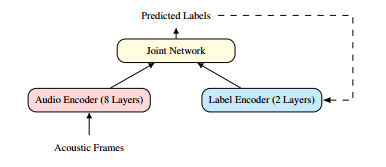
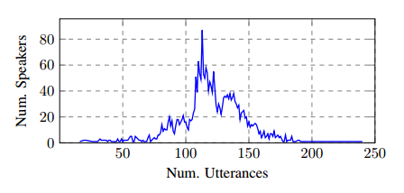

# 使用联邦学习训练语音识别模型：一个质量/成本框架

论文链接：https://arxiv.org/abs/2010.15965

我们提出使用联邦学习，一种分散的设备上学习范例，来训练语音识别模型。通过按用户进行每轮的训练，联邦学习必须承担处理非独立同分布（non-IID）数据分布的成本，这些数据分布预计会对训练模型的质量产生负面影响。我们提出了一个框架，通过这个框架，可以改变非独立同分布程度，从而展示模型质量与联邦训练的计算成本之间的权衡关系，我们通过一种新颖的度量来捕捉这种关系。最后，我们证明，通过超参数优化和适当使用变分噪声，可以弥补非独立同分布对模型质量的影响，同时减少成本。

## 引言

移动设备的普及率不断增加，这些设备具备高度的计算能力[1]，再加上序列到序列神经网络[2, 3]的进步，使得开发基于设备的自动语音识别（ASR）系统[4]成为可能。例如，具有最先进质量[5]的神经ASR模型已经在**设备上部署**，相对于基于服务器的模型，还带来了额外的延迟和可靠性优势[6]。

在设备上的ASR环境中考虑用户隐私，我们探讨了使用联邦学习（FL）[7, 8]在设备上训练语音模型的可行性。FL是一种**分布式的训练**方法，不需要将原始用户数据发送到中央服务器。相反，用户数据存储在设备上的训练缓存中，可以在其中进行训练迭代。FL的优化通过同步的训练轮次进行，其中一组客户端（设备）向中央模型提供更新。FL已成功部署在大型生产系统中，用于执行表情符号预测[9]、下一个单词预测[10]和查询建议[11]。

在用于执行基于用户的模型训练时，FL相对于集中式训练具有固有的差异，因为在FL下的训练数据是**非独立同分布**的。在标准的中央小批量训练中，通常假设数据是独立同分布（IID），因为样本是以均匀概率从训练集中抽取的。然而，在FL下，样本是从客户端分布中抽取的，这些分布可能相似但不相同（非IID）。在多个领域中已经证明，在非IID数据上进行训练通常不是最优的[12, 13, 14]，这仍然是联邦学习中的一个未解决问题[15, 16]。

在本研究中，我们研究了在ASR训练环境中说话者分离（非IID）数据的影响，并提出以下贡献： 

- 我们提供了一个**心智模型（mental model）**，用于推理IID和非IID训练之间的差异。
- 我们引入了一个**通用的FL成本函数**，用于衡量模型质量的计算成本。
- 我们展示了使用FL训练的ASR模型可以达到与服务器训练模型**相同的质量水平**。

## 方法论

### 联邦平均算法

联邦学习中常见的优化算法是**联邦平均**（FedAvg）[7]。在算法1中概述，FedAvg 包括两个层次的优化：首先在K个参与客户端上进行本地优化，然后通过服务器步骤来更新全局模型。在本研究的所有实验中，我们都采用了 FedAvg 算法。

>**Algorithm 1: FedAvg**
>
>1. 初始化 $w_0$
>2. 对于每一轮 $r = 1, 2, \ldots$ do
>   3. 随机选择 $K$ 个客户端子集（$M$ 个客户端中的子集）
>   4. 对于每个并行处理的客户端 $k \in K$ do
>      5. $w^r_k = \text{ClientUpdate}(k, w^r)$
>      6. $\Delta w^r_k = w^r - w^r_k$
>   5. 结束
>3. $w^r = \sum(\frac{n_k}{n})\Delta w^r_k$ （加权平均）
>4. $w^{r+1} = w^r - \eta w^r$ （服务器更新）
>5. 结束

### 理解非独立同分布数据

多项研究表明，使用**非独立同分布数据训练神经模型时会出现明显的质量下降**。缓解这一问题的策略包括考虑客户端模型漂移[14]、使用自适应优化器[17]、调整本地优化超参数[12, 7]，以及使用客户端数据偏斜估计来加权客户端更新[16, 18, 19]。

在这项工作中，我们基于这样的观察展开研究，即在**增加计算预算的情况下，可以修改非独立同分布的分布以逼近独立同分布分布**。具体来说，在联邦训练的一轮中，会随机从一个训练群体中选择一组客户端。如果在客户端优化中，抽取了一个本地样本并使用学习率为1来计算SGD更新，那么在服务器更新步骤中会汇总原始梯度。由于在联邦训练轮次中客户端的选择是随机的，因此在这个例子中，服务器步骤会有效地汇总独立同分布的贡献。然而，**以这种方式训练可能会导致需要更多轮次才能收敛，从而增加训练时间和服务器-客户端通信**。

因此，我们指出，根据所需的**质量和性能权衡**，可以牺牲计算成本来改变特定实验中的非独立同分布程度，并且可以根据需要调整实验设置。

### 联邦模型质量的开销

我们通过一个我们称之为“**联邦模型质量成本**”（Cost of Federated Model Quality，**CFMQ**）的度量来捕捉联邦计算的成本。

据我们所知，这是第一次尝试制定一个**通用的成本函数**，可用于任何联邦优化。除了非独立同分布和独立同分布的考虑外，这个成本函数还有助于比较收敛时间、本地优化、客户端参与以及通信负载对质量的影响。因此，当与质量度量一起使用时，CFMQ为比较实验提供了一种有用的方式。

设 $\mu$ 为客户端执行的平均本地优化步骤数量。设 $e$ 为本地迭代轮数，$N$ 为一轮中的总样本数，$b$ 为批量大小，$K$ 为参与的客户端数量。由此可得：
$$
\mu = \frac{eN}{bK}
$$
让 $P$ 代表以字节为单位的往返通信负载，$R$ 代表轮次的数量，$ν$ 代表在一步骤中的峰值内存消耗。方程2统一了通信成本和本地计算成本，因为这两者是联邦优化中受限制的两个方面[11]。在我们的研究中，我们假设服务器资源/内存非常充足。

因此，**我们将成本 $CFMQ$ 表述如下**：
$$
\text{CFMQ} = RK(P+\alpha \mu v)
$$
α 是添加到 CFMQ 中的平衡项，可以通过调整它来修改两个成本组成部分的重要性。

## 模型和数据

### 模型架构

我们在本文中使用了图1所示的**RNN-T架构**[5]。该模型具有122M个可训练参数，用于预测给定声学数据x的标签y的概率P(y|x)。它包括一个LSTM音频编码器，一个LSTM标签编码器，一个完全连接层将编码器的输出串联在一起，以及一个输出softmax层。输入的声学帧是128维的对数梅尔滤波器能量，输出的标签属于一个包含4096个词片段的集合。

图1 RNN-T 模型架构

### Librispeech 语料库

我们使用了Librispeech [20] 语料库，其中包含来自2338位发言人的960小时转录的训练语音，以及来自146位发言人的21小时评估音频，分为4个集合：*Dev、DevOther、Test 和 TestOther*，使用词错误率（WER）作为报告指标。标有“Other”的集合意在更难识别。数据在男性和女性发言人方面保持平衡。

我们在这个语料库上运行了联邦学习实验，将**每个发言人的标签**与可能参与**联邦训练轮次的设备**关联起来。Librispeech数据，在按发言人划分时，由于多种原因而是非独立同分布的，包括不同的声音、词汇、录音质量以及用户之间的话语数量差异（如图2所示）。

图2 说话人话语分布直方图

