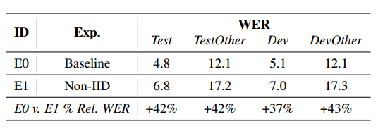
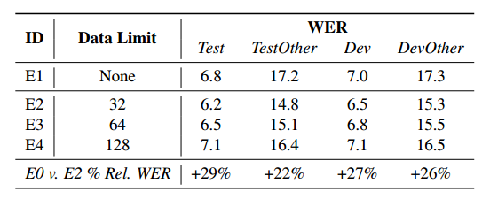
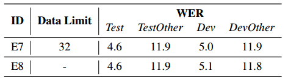
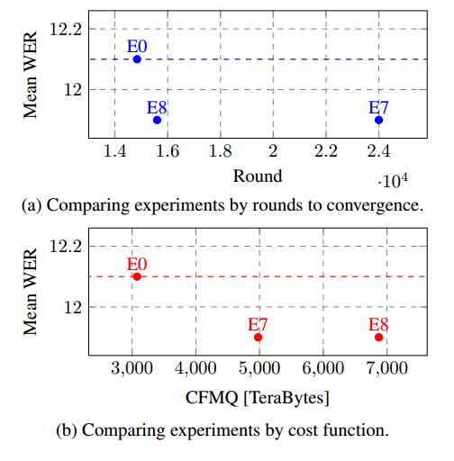
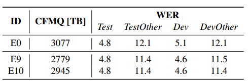

# 使用联邦学习训练语音识别模型：一个质量/成本框架

论文链接：https://arxiv.org/abs/2010.15965

我们提出使用联邦学习，一种分散的设备上学习范例，来训练语音识别模型。通过按用户进行每轮的训练，联邦学习必须承担处理**非独立同分布**（non-IID）数据分布的成本，这些数据分布预计会对训练模型的质量产生负面影响。我们提出了一个框架，通过这个框架，可以改变非独立同分布程度，从而展示模型质量与联邦训练的计算成本之间的权衡关系，我们通过一种新颖的度量来捕捉这种关系。最后，我们证明，通过超参数优化和适当使用变分噪声，可以弥补非独立同分布对模型质量的影响，同时减少成本。

## 引言

移动设备的普及率不断增加，这些设备具备高度的计算能力[1]，再加上序列到序列神经网络[2, 3]的进步，使得开发基于设备的自动语音识别（ASR）系统[4]成为可能。例如，具有最先进质量[5]的神经ASR模型已经在**设备上部署**，相对于基于服务器的模型，还带来了额外的延迟和可靠性优势[6]。

在设备上的ASR环境中考虑用户隐私，我们探讨了使用联邦学习（FL）[7, 8]在设备上训练语音模型的可行性。FL是一种**分布式的训练**方法，不需要将原始用户数据发送到中央服务器。相反，用户数据存储在设备上的训练缓存中，可以在其中进行训练迭代。FL的优化通过同步的训练轮次进行，其中一组客户端（设备）向中央模型提供更新。FL已成功部署在大型生产系统中，用于执行表情符号预测[9]、下一个单词预测[10]和查询建议[11]。

在用于执行基于用户的模型训练时，FL相对于集中式训练具有固有的差异，因为在FL下的训练数据是**非独立同分布**的。在标准的中央小批量训练中，通常假设数据是独立同分布（IID），因为样本是以均匀概率从训练集中抽取的。然而，在FL下，样本是从客户端分布中抽取的，这些分布可能相似但不相同（非IID）。在多个领域中已经证明，在非IID数据上进行训练通常不是最优的[12, 13, 14]，这仍然是联邦学习中的一个未解决问题[15, 16]。

在本研究中，我们研究了在ASR训练环境中说话者分离（非IID）数据的影响，并提出以下贡献： 

- 我们提供了一个**心智模型（mental model）**，用于推理IID和非IID训练之间的差异。
- 我们引入了一个**通用的FL成本函数**，用于衡量模型质量的计算成本。
- 我们展示了使用FL训练的ASR模型可以达到与服务器训练模型**相同的质量水平**。

## 方法论

### 联邦平均算法

联邦学习中常见的优化算法是**联邦平均**（FedAvg）[7]。在算法1中概述，FedAvg 包括两个层次的优化：首先在K个参与客户端上进行本地优化，然后通过服务器步骤来更新全局模型。在本研究的所有实验中，我们都采用了 FedAvg 算法。

>**Algorithm 1: FedAvg**
>
>1. 初始化 $w_0$
>2. 对于每一轮 $r = 1, 2, \ldots$ do
>   3. 随机选择 $K$ 个客户端子集（$M$ 个客户端中的子集）
>   4. 对于每个并行处理的客户端 $k \in K$ do
>      5. $w^r_k = \text{ClientUpdate}(k, w^r)$
>      6. $\Delta w^r_k = w^r - w^r_k$
>   5. 结束
>3. $w^r = \sum(\frac{n_k}{n})\Delta w^r_k$ （加权平均）
>4. $w^{r+1} = w^r - \eta w^r$ （服务器更新）
>5. 结束

### 理解非独立同分布数据

多项研究表明，使用**非独立同分布数据训练神经模型时会出现明显的质量下降**。缓解这一问题的策略包括考虑客户端模型漂移[14]、使用自适应优化器[17]、调整本地优化超参数[12, 7]，以及使用客户端数据偏斜估计来加权客户端更新[16, 18, 19]。

在这项工作中，我们基于这样的观察展开研究，即在**增加计算预算的情况下，可以修改非独立同分布的分布以逼近独立同分布分布**。具体来说，在联邦训练的一轮中，会随机从一个训练群体中选择一组客户端。如果在客户端优化中，抽取了一个本地样本并使用学习率为1来计算SGD更新，那么在服务器更新步骤中会汇总原始梯度。由于在联邦训练轮次中客户端的选择是随机的，因此在这个例子中，服务器步骤会有效地汇总独立同分布的贡献。然而，**以这种方式训练可能会导致需要更多轮次才能收敛，从而增加训练时间和服务器-客户端通信**。

因此，我们指出，根据所需的**质量和性能权衡**，可以牺牲计算成本来改变特定实验中的非独立同分布程度，并且可以根据需要调整实验设置。

### 联邦模型质量的开销

我们通过一个我们称之为“**联邦模型质量成本**”（Cost of Federated Model Quality，**CFMQ**）的度量来捕捉联邦计算的成本。

据我们所知，这是第一次尝试制定一个**通用的成本函数**，可用于任何联邦优化。除了非独立同分布和独立同分布的考虑外，这个成本函数还有助于比较收敛时间、本地优化、客户端参与以及通信负载对质量的影响。因此，当与质量度量一起使用时，CFMQ为比较实验提供了一种有用的方式。

设 $\mu$ 为客户端执行的平均本地优化步骤数量。设 $e$ 为本地迭代轮数，$N$ 为一轮中的总样本数，$b$ 为批量大小，$K$ 为参与的客户端数量。由此可得：
$$
\mu = \frac{eN}{bK}
$$
让 $P$ 代表以字节为单位的往返通信负载，$R$ 代表轮次的数量，$ν$ 代表在一步骤中的峰值内存消耗。方程2统一了通信成本和本地计算成本，因为这两者是联邦优化中受限制的两个方面[11]。在我们的研究中，我们假设服务器资源/内存非常充足。

因此，**我们将成本 $CFMQ$ 表述如下**：
$$
\text{CFMQ} = RK(P+\alpha \mu v)
$$
α 是添加到 CFMQ 中的平衡项，可以通过调整它来修改两个成本组成部分的重要性。

## 模型和数据

### 模型架构

我们在本文中使用了图1所示的**RNN-T架构**[5]。该模型具有122M个可训练参数，用于预测给定声学数据x的标签y的概率P(y|x)。它包括一个LSTM音频编码器，一个LSTM标签编码器，一个完全连接层将编码器的输出串联在一起，以及一个输出softmax层。输入的声学帧是128维的对数梅尔滤波器能量，输出的标签属于一个包含4096个词片段的集合。

图1 RNN-T 模型架构

### Librispeech 语料库

我们使用了Librispeech [20] 语料库，其中包含来自2338位发言人的960小时转录的训练语音，以及来自146位发言人的21小时评估音频，分为4个集合：*Dev、DevOther、Test 和 TestOther*，使用词错误率（WER）作为报告指标。标有“Other”的集合意在更难识别。数据在男性和女性发言人方面保持平衡。

我们在这个语料库上运行了联邦学习实验，将**每个发言人的标签**与可能参与**联邦训练轮次的设备**关联起来。Librispeech数据，在按发言人划分时，由于多种原因而是非独立同分布的，包括不同的声音、词汇、录音质量以及用户之间的话语数量差异（如图2所示）。

图2 说话人话语分布直方图

## 实验

### 基线和联邦训练

我们进行了一系列实验，旨在**恢复由于非独立同分布训练而导致的质量下降**，并将其与中央训练的独立同分布基线进行了比较。基线配置使用了线性逐渐升高的学习率调度、SpecAugment[21] 和 Variational Noise[22] 进行训练。基线结果（E0）可以在表1中找到。

表1 非独立同分布质量下降

我们使用 FedAvg 在一个运行在 TPU[24] 硬件上的 TensorFlow[23] 编写的 FL 模拟器上，通过说话者划分数据，进行了RNN-T模型的联邦训练。训练超参数尽可能与基线保持相似，唯一的例外是一开始没有使用 **Variational Noise**，因为它需要针对FL进行适应。

### 匹配基线模型质量

在非独立同分布的联邦实验中，SGD 被用作客户端优化器，学习率设置为 0.008，通过粗略的扫描确定。Adam [17] 用于服务器更新。参与的客户端数量 K 从 32 逐渐增加到 128，在这之后不再提高模型质量。在这个配置中，客户端在单一时期内循环处理本地数据。表 1 显示了基线性能和初始的非独立同分布配置，对所有评估集合都出现了显著的 WER 降低。

#### 限制每个说话人数据

为了试图使数据分布更接近独立同分布（IID），并减小每个客户端的漂移，从**参与联邦轮次的每个说话人中随机抽取了一部分示例**，以施加每个客户端的数据限制。我们通过一个思维实验展示了数据限制如何通过随机从每个客户端抽取一个示例来推动分布更接近 IID，假设客户端选择是随机的，那么一轮中的参与数据尽可能接近 IID。

需要注意的是，在多轮次中，整个每个发言者的数据集仍然被看到。

表2显示了由于数据限制而导致的质量改善，将 WER 降低了从超过40% 相对降至不到30% 的所有集合。

表 2. 数据限制对非独立同分布训练的影响。

#### 联邦变分噪声

基线使用了 Variational Noise [22]（VN），通过在每个优化步骤中向模型参数添加高斯噪声来应用VN。为了适应联邦学习中存在的两步优化过程，不得不对VN进行修改：**允许每个客户端在本地优化过程中添加自己的随机噪声张量**。我们将其称为 Federated Variational Noise（FVN），发现**它对恢复非独立同分布的质下降至关重要**。表3显示了实验E5和E6，它们以与基线类似的方式引入了FVN。通过在实验E7中在训练过程中线性增加了高斯噪声的标准差，我们进一步提高了FVN的应用，超过了基线模型的质量。

表 3. Federated Variational Noise（FVN）对非独立同分布训练的影响

此外，我们假设FVN对非独立同分布的客户端漂移进行正则化，因为VN旨在减少贝叶斯推断任务中的熵。它基于这样的思想，即模型参数就像从先验分布 $\gamma$ 中采样的随机变量，可以通过在训练过程中添加高斯噪声来更好地逼近给定分布 $Q(\beta)$。因此，在FL下，如果来自相同基础高斯分布的噪声应用于每个客户端，那么得到的近似就是所有客户端模型参数都从相同的 $Q(\beta)$ 分布中采样，从而**限制了每个客户端的漂移**。

表2中的结果显示，随着每个客户端的数据量增加，模型质量会下降。**客户端模型会朝不同的方向漂移，导致服务器更新不够优化**。然而，表4中的实验E7和E8显示，添加FVN后，即使没有每个客户端的数据限制，模型质量也几乎没有变化。这进一步证实了我们的说法，即FVN可以防止客户端漂移。

表 4. 数据限制对FVN实验的影响

### 计算效率

#### 质量-成本分析

到目前为止，我们关注的是由于非独立同分布训练而导致的质量影响。然而，正如第2.3节所描述的，设计FL系统的一个关键方面在于其计算成本。在生产FL中，由于存在传输压缩，模型有效载荷大小会因每个实验而异。同样，由于硬件特性不同，客户端内存使用会在不同设备之间变化。出于简单性考虑，在这个分析中使用了近似值。往返通信负载被近似为模型大小的两倍（960 MB），峰值内存被近似为模型大小加上10%的中间存储（660 MB）。由于公式2还需要设置α，因此在本研究中选择了1。

图3显示了前一节中关键实验的质量-成本权衡，将成本衡量标准定义为轮次数量，与CFMQ相对比。质量通过Other评估集上的平均WER来衡量，因为这些集合更具挑战性。如果以收敛所需轮次作为成本衡量标准，E8在成本略微增加的情况下实现了比基线更好的质量。然而，当使用CFMQ时，很明显E7在更低的成本下实现了与E8相同的质量。这是因为在E8中没有施加每个客户端的数据限制，导致客户端为了达到相同的模型质量而进行了更多的本地优化步骤，从而增加了成本。

图3. 实验效率比较

#### 降低非独立同分布模型质量的成本

到目前为止的实验已经恢复了由于非独立同分布训练数据而导致的质量损失，但增加了成本。新的实验旨在降低成本，通过改变本地时期的数量、服务器学习率调度和SpecAugment的数量进行了实验。表5显示了两个最有希望的实验，E9和E10，它们在与基线的比较中具有更低的CFMQ和更好的质量。它们都修改了学习率调度，使其具有更短的逐渐升高，并引入了指数衰减。E10在训练过程中增加了SpecAugment的数量，并获得了稍微更好的质量。因此，在本研究中，我们能够以比独立同分布基线更低的计算成本恢复由非独立同分布训练数据引起的质量降级。我们必须注意，为了限制范围，我们在这项工作中没有重新访问和优化基线。

表5. 在更低的CFMQ下超越基线质量

## 结论

联邦学习意味着在非独立同分布的数据上进行训练，这一特性一直被认为是该技术的潜在缺点。我们认为**非独立同分布程度可以通过随机客户端数据抽样进行调整**，从而实现灵活的成本-质量权衡。最初，在联邦设置中恢复质量很可能会导致成本增加。当这个问题得到解决时，例如**通过优化器配置、超参数调整和正则化器的使用**，FL可以以相对较低的成本提供与独立同分布（IID）水平相当的质量。我们证明了可以针对最先进的ASR模型进行这种双重优化，从而获得比基线Adam-SGD模型更好且成本更低的模型。

