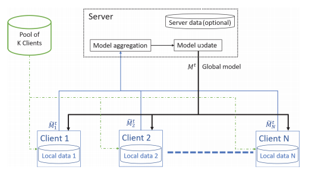
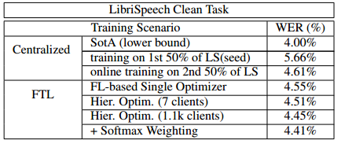

# 采用联邦学习方法训练声学模型

在本论文中，描述了一种基于联邦学习（FL）的声学模型训练新平台。这是**首次**尝试在语音识别（SR）任务中引入联邦学习技术。除了任务的新颖性之外，本论文还描述了一个易于泛化的FL平台，并提出了用于此任务的设计决策。在引入的新算法中，包括**采用成对优化器的分层优化方案和梯度选择算法**，从而提高了训练时间和SR性能。梯度选择算法基于在聚合步骤中加权梯度。它实际上充当了梯度传播之前的正则化过程。这个过程可能解决了联邦学习面临的挑战之一，即在非常异构的数据上进行训练。提议的系统的实验验证基于 LibriSpeech 任务，显示了1.5倍的加速和6%的WERR。提议的联邦学习系统似乎在收敛速度和整体模型性能方面优于分布式训练的黄金标准。在内部任务中还有进一步的改进。

## 引言

分布式训练（DT）旨在通过扩展模型训练过程来提高效率。随着训练数据集的不断增大，对训练并行化的需求变得更加紧迫。多年来提出了不同的技术 [1]，旨在实现更高效的训练流程，例如“Horovod” [2, 3] 或块模型更新过滤（BMUF） [4]。这些技术通常根据吞吐量（不损失准确性）、模型和/或数据集大小以及GPU利用率等指标进行评估。然而，在进行分布式训练时，通常会暗含一些基本假设，如数据和设备的一致性、工作节点之间的高效网络通信等。除了通信/网络约束外，**数据的一致性对于成功的训练至关重要**，这通常通过反复随机化和数据重排来实现。

另一方面，现在出现了数据管理方面的新约束。其中一些约束是由于对个人数据和信息的隐私合规性的需求所驱动 [5]。越来越多的数据存储在无法访问的防火墙后面或用户设备上，无法进行集中式训练的共享选项。为此，提出了联邦学习（FL）范式框架，解决了隐私问题，同时仍然处理这种无法访问的数据。**这个方案旨在在本地端节点的多个数据集上训练机器学习模型**，例如深度神经网络，而不在“协调器”和这些工作节点之间交换任何数据。一般原则是在本地数据样本上训练模型的不同版本，同时仅交换一些模型参数的更新，例如网络参数或相应的梯度。现在需要额外的步骤来同步这些本地模型并定期更新全局模型。有不同的FL方法，可以使用中央服务器，即“协调器或编排器”，也可以使用点对点学习，而不使用中央服务器 - **在这里，采用了第一种方法**。因此，服务器负责对客户端和服务器之间的采样和通信、模型和学习速率的更新等进行管理。

FL和DT之间的其他区别在于对本地数据集属性的假设[6]。DT主要旨在并行化本地计算能力，而FL则专注于使用异构数据集进行训练。由于DT的重点是在多个节点上训练单个模型，一个共同的基本约束是所有本地数据子集都需要是均匀分布的，而且大致大小相同。这些约束对于FL都不是必要的[7]；相反，**数据集通常是异构的**，它们的大小可能跨越几个数量级。FL提供了一个更灵活的训练框架，放宽了一些DT的约束。

就我们所知，像这里所介绍的大规模分布和异构的方法在语音识别（SR）任务中以前尚未应用过 - 一些工作已经存在于关键词检测（KWS）[8]方面。对于联邦学习平台（特定SR任务），**采用了一种序列到序列（seq2seq）方法，因为训练这种全神经模型比传统的SR系统要简单得多，同时更容易自动化这个过程**。seq2seq模型在SR任务中越来越受欢迎，因为传统SR系统的声学、语言和发音模型可以合并成一个单一的神经网络[9]。这种模型有各种各样的架构，包括“循环神经网络转录器”（RNN-T）[10]、“听、关注和拼写”（LAS）[11]等。在这里，采用了后一种范式，因为它在我们的内部测试集中一直提供最佳的离线结果。这个带有注意力机制的seq2seq模型包括一个**编码器（类似于传统的声学模型）**、一个注意层和一个**解码器（类似于语言模型）**，更多细节请参见第2.2节。

本文专注于针对SR任务的联邦学习平台，本文将其称为**“联邦迁移学习”（FTL）平台**。除了系统描述外，本文的贡献还包括分层优化和加权模型聚合算法。本文由以下几个部分组成：i. 在第2节中，提供了联邦学习的当前最新技术概述。该概述描述不特定于任务。ii. 在第3节中，更多关于SR系统的理论解释和细节被描述。由于这是FL在SR中的首次应用，因此详细介绍了针对此特定任务的理论扩展。iii. 然后，在第4节中介绍了实验结果，iv. 最后，在第5节中找到了讨论和结论。

## 背景

### 联邦学习

联邦学习相关的工作，例如[7]，主要集中在通信效率、更好的优化[12]和隐私方面。用于FL的算法被设计来处理具有特征的训练数据[6]，例如在大量节点K上的**数据并行性**、**某些客户端上的数据不平衡**以及**本地训练示例的数据稀疏性**。尽管在这项工作中我们没有明确关注数据稀疏性，但在每个客户端找到的数据可能偏向不同的分布 - 尤其是在SR应用中，而所提出的算法解决了这些问题。本文主要集中在FL的优化方面，解决了数据多样性和优化等挑战。

使用传统的分布式学习算法在实际应用数据 $ {x_i, y_i}, i = 1,...,N $ 上训练统计模型需要以下步骤：将数据复制到集中存储位置，随机洗牌，均匀分配，然后用它们来训练模型，类似于[6]。另一方面，FL方法遵循不同的范例，需要最小化数据传输，同时保护隐私。训练约束更为宽松，因为可用的计算节点可能多样化，甚至在一段时间内无法访问。所提出的算法不需要对整个数据集进行训练，而是在每次迭代中对可用节点进行采样。此外，标记数据的约束也可以得到缓解。

### 基于注意力机制的序列到序列模型（seq2seq）

基于注意力机制的序列到序列模型（seq2seq）在SR任务中获得了最先进的性能[11]。seq2seq模型由3个子网络组成：编码器、解码器和注意力。给定语音输入$X = {x_1,..., x_T }$，编码器首先将其转换为高级表示 $H^{enc}$ 的序列。在这些实验中，编码器是一个带有 LayerNorm 的 bLSTM[13]。

$$
H^{enc} = \{h_{1}^{enc}, \ldots, h_{T}^{enc}\} = \text{Encoder}(X)
$$

解码器充当声学条件语言模型。为了预测特定的标记$y_n$，用于条件的声学信号由注意力模块总结。对于每个解码器时间步$n$，注意力生成在$H^{enc}$上的对齐$\alpha_n$以及相应的上下文向量$c_n$。注意力层是一种位置感知的注意力，如[15]所述。

$$
c_n, α_n = LocationAwareAttention(d_n, α_{n-1}, H^{enc})
$$

在这里，$d_n$ 是时间步 $n$ 处的解码器状态向量。上下文向量 $c_n$ 被解码器 LSTM 用于以下操作：

$$
d_n, h_{n}^{dec} = \text{Decoder}(y_{n-1}, c_{n-1}, h_{n-1}^{dec})
$$

在这里，$y_n$ 表示输出的模型假设。

Decoder 是一个多层 LSTM，而 DecoderOut 包括一个仿射变换和一个 Softmax 输出层。该模型使用交叉熵损失函数 $L(\cdot)$ 在 $Y = \{y_1, y_2, \ldots, j_i\}$ 和参考标签 $R = \{r_1, \ldots, r_N, <ens>\}$ 之间进行训练。

$$
L(Y, R) = -\sum_n y_n \log(r_n)
$$

## 提出方法

开发的 FTL 平台是对 FL 训练过程的模拟，同时忽略了任务的通信以及安全/隐私方面。尽管以 seq2seq SR 模型 [9] 为例，但所得出的发现和结论也可以推广到其他任务。

### 系统描述

所提出的系统，如图1所示，由一个拥有固定数据集的K个客户端池组成。与DT相反，在每个 epoch 之后，训练数据既不均匀也不重新洗牌 - 数据分离在整个任务中保持不变。对于FTL情景，在每次迭代T中会随机抽样 $N<<K$ 个客户端，然后将它们返回到池中，即采用带替换的随机抽样。仅使用这些N个客户端而不损害性能提供了独特的灵活性，这是所提出的FTL平台的特点。

当这 $N$ 个客户端完成数据处理后，更新后的模型 $\tilde{w}_T$ 被返回到服务器进行聚合，并估算全局梯度。这个梯度用于在下一次迭代 $T + 1$ 之前更新全局模型 $w(s)$。由于对客户端的采样，全数据的扫描需要更长的时间。然而，理论上的证明和实验结果表明，这既不是达到最优点所必需的，也不会对模型性能产生不利影响。

图1：FTL平台：每批处理来自K个客户端池的N个客户端。

FTL仿真平台允许忠实地模拟FL系统，同时排除了加密等方面的影响。由于我们生产规模的SR模型非常庞大，因此我们允许模拟平台利用多个GPU，以使训练时间保持合理，通常为几小时或几天，而不是几周或几个月。同时，我们要求该平台能够在一定数量的固定GPU上模拟任意数量的客户端。为了满足这些需求，模拟是作为一个MPI程序实现的，具有P个进程[16]，其中每个进程都可以访问(GPU集群中的一个)专用GPU。排名为0的进程模拟服务器，而其余的P - 1个进程用作工作进程，模拟客户端的模型训练过程。

在每个迭代中，服务器会随机抽样 $N<<K$ 个客户端参与训练，如上所述。模拟平台通过向工作进程分派训练任务来执行这些N个客户端的模型训练：每当有一个空闲的工作进程时，客户端训练代码和所有必要的参数（全局模型、学习率、客户端数据集的标识等）都会被发送，模拟特定客户端的训练过程。工作进程执行该客户端的计算，并将结果（本地训练模型、损失等）发送回服务器进程。接下来，服务器更新一个包含可用资源和待处理客户端的字典。这个简单的调度过程会持续，直到所有N个客户端都被处理完毕。为了节省服务器内存，我们以流式方式聚合客户端模型，当它们被工作进程返回时进行聚合。例如，在简单的模型平均情况下，服务器将所有客户端模型聚合到一个存储在GPU内存中的模型副本中，然后将模型参数除以N以计算平均值。一旦计算出聚合模型，服务器就会更新全局（种子）模型并重新迭代。

### 层次优化

小批量优化方法，将经典的随机方法扩展到一次处理多个数据点，已经成为FL中流行的范式[17]。类似“联邦平均”（FedAvg）[6]的方法是基于局部随机梯度下降（SGD）更新的平均值。FedAvg能够很好地进行泛化，并且在速度方面表现出显著的性能提升。

在这里，提出了一种**层次化的优化过程，进一步增强了FedAvg**。训练过程分为两个层次：首先，在客户端使用“局部”优化器进行，然后在服务器上使用“全局”优化器进行，这是在聚合客户端梯度估计之后。这种两级优化方法结合了FedAvg的优点，并因第二个优化器而获得额外的加速。此外，由于每次迭代包含更多的数据，聚合梯度估计被证明是有益的。在数据量标准化之后，所提出的算法似乎比Horovod更快地收敛。此外，由于可以在客户端/服务器设置中使用各种组合/对的优化器，因此它提供了更大的灵活性和增强的优化能力。

更详细地说，第 $j$ 个客户端的更新运行 $t$ 次迭代，其中 $t \in [0, t_j]$，使用学习率 $\eta_j $在本地更新种子模型（在这里，为了方便起见，以SGD优化器为例）

$$
w^{(j)}_{t+1} = w^{(j)}_t - \eta_j \nabla w^{(j)}
$$

其中 $w(j)$ 是第 $j$ 个客户端的本地模型。

$\tilde{g}^{(j)}_T$（在这些 $t_j$ 次迭代后）是第 $j$ 个客户端返回的本地梯度的平滑近似，计算方法是最新更新的模型与前一个全局模型 $w^{(s)}_{T-1}$ 之间的差异

$$
\tilde g^{(j)}_T = w^{(j)}_T - w^{(s)}_{T-1}
$$

分布式训练过程对这 $N$ 个客户端是同步的。梯度 $\tilde{g}^{(j)}$ 在时间步 $T$（或者等同于所有客户端在$t_j$次迭代后处理完数据后）估算出来。请注意，估算梯度$g_T$是困难且占用内存。在这里，使用了差分近似 $\tilde{g}^{(j)}_T$

在所有梯度样本按权重加权并相应地聚合后，根据(8)更新全局模型$w^{(s)}_T$（在这里也使用SGD），

$$
w^{(s)}_T = w^{(s)}_{T-1} - \eta_s \sum_j \alpha^{(j)}_T \tilde{g}^{(j)}_T
$$

其中 $\alpha^{(j)}_T$ 是聚合步骤的权重，如下所示。

上述描述的过程是一种简单形式的“在线训练”[18]。在更新过程中，种子模型可能会偏离原始任务。为了确保与先前的任务兼容而不增加网络容量，我们提出在模型聚合和更新步骤之后，**在服务器端对保留数据进行额外的训练迭代**(9)。这样，模型可以被“引导”回到与保留数据匹配的方向。对模型的“轻微”更新可以避免过度偏离感兴趣的任务。这对于不平衡和/或非常异质的数据情况尤其有用。

$$
w^{(s)}_{\tilde{t}+1} = w^{(s)}_{\tilde{t}} - \eta_w \nabla {w_\tilde t}
$$

层次化优化方案的收敛速度提高了1.5倍，而不会对性能产生任何影响。此外，由于模型在每个客户端和迭代中传输两次（而不是在每个小批量之后传输模型梯度，如[19]中所示），通信开销显著降低。

### 加权模型平均

处理异构数据时，在**聚合步骤**（公式8）中存在一些挑战。首先，并非所有客户端都包含由模型表示的数据；因此，相应的训练损失预计会明显较高。在这种情况下，模型会朝着与其他模型大部分不同的方向移动。此外，特定数据分区（本地客户端数据）的质量可能不同，导致梯度更加嘈杂。无论哪种方式，这些梯度都应与其余梯度不同地进行处理。这里提出的解决方案是**在聚合步骤中使用权重**，即在公式(7)中使用本地梯度 $\tilde{g}^{(j)}_T$ 的权重。这种方法是**使用训练损失作为加权系数**。虽然加权聚合不会显著影响整体的词错误率（至少在LibriSpeech任务上，其中数据更加均匀），但它可以显著加快训练的收敛速度。权重处理过程可以看作是一种正则化，减弱了梯度方向，使那些模型发散得太厉害的地方的影响。因此，反向传播更新基于了更少噪声的小批量梯度。

这种“确定性”方法利用等式(5)中的负训练损失系数$L$，作为通过 `Softmax(·)` 层后的权重 $\alpha^{(j)}_t$

$$
\alpha^{(j)}_t = \frac{e^{L^{(j)}_t}}{\sum_i e^{-L^{(i)}_t}}
$$

较高的$L^{(j)}$系数值可以被视为模型未能很好表示的批次的指示。这些损失值的可能来源要么是数据质量差，例如嘈杂的数据，要么是数据分布与模型差距较大。无论哪种方式，训练后的模型（在训练步骤之后）将会被“移动”得更远，与其他模型更加分散；因此，聚合将会更加嘈杂。对于训练损失具有相似数量级的批次，预计会使模型朝着类似的方向移动；因此，**聚合过程将更好地对齐**。正如实验部分所示，这种聚合梯度的对齐对于收敛速度也是有益的。由于 Softmax 层考虑了所有可用的训练步骤，它减弱了具有相应较大损失值的步骤的影响。

## 实验和结果

实验测试使用了LibriSpeech任务[20]（LS任务）作为测试基础。该数据集包含来自2.5k名演讲者朗读书籍的约1,000小时的语音。在这个实验中，编码器使用了一个6层的bLSTM，带有dropout；解码器使用了2层单向LSTM；最后，使用了一个具有单个头的传统位置感知内容基于注意力层。输入特征是80维的对数梅尔滤波器组能量，每10毫秒提取一次。对于编码器，特征的3帧被堆叠并应用。基于unigram语言模型的16k个子词被用作识别单元。最初，使用Horovod在整个920小时的训练集上训练了一种最先进的seq2seq模型。该模型的性能提供了WER的下限，因为所有数据都以集中式方式使用。

在与FL相关的实验中，训练被分成两部分，每部分包含460小时的数据，没有重叠的演讲者。**第一部分用于训练种子模型**，不会再次使用这些数据。然后，**数据集的第二部分用于模拟在线训练**，在FL条件下。我们将按照FL训练过程的两个不同方向进行：首先，将训练集分为7个不同的部分，不再重新洗牌数据（与Horovod或其他DT方法相反）。这些拆分是随机的，它们之间没有重叠的演讲者。第二个方向是根据剩余的1100名演讲者进行拆分。每个分区，无论是7个还是1.1k，都分配给一个客户端节点。在FTL框架中，客户端不知道其他客户端的存在 - 只有服务器知道使用了哪些客户端，并随机抽样哪些客户端将被聚合。在我们的实验中，抽样的客户端数量N从25到400不等，较高的N效果更好，但整体性能波动较小。基于通信开销和内存使用的权衡，我们设定N = 100。

对于  $\alpha^{(j)}_T$ 的加权方法是基于训练损失的，这里称为 `Softmax` 加权。

表1中的前3行是集中式训练（Horovod）的结果，性能的下限来自于在整个数据集上训练的模型。这个模型的4% WER似乎与文献中的结果相符。第2个模型（“在线训练”行）基于最初在前半部分数据上训练并收敛的种子模型。该模型使用后半部分数据进行在线训练。在这两个步骤中都使用了Horovod。

表1：在LibriSpeech干净测试集上评估系统，训练了一种带有注意力机制的离线seq2seq模型。

对于模型聚合，研究了不同的策略，例如FedAVg，即表格中的 “Single Optimizer” 行，或使用Adam、LAMB、LAR和SGD等优化器的层次化优化。还研究了服务器/客户端优化器的组合。这些优化器组合的性能差异相对有限，为了节省空间，未在此列出。然而，在客户端采用无状态优化器作为标准，因为在每次迭代之后初始模型都会发生变化，因此将上一次迭代/模型的状态作为本地优化器的一部分没有意义。所有实验中使用的组合是服务器/客户端的Adam/SGD。

下一个实验是将数据划分为每个说话人的分区，即创建1100个分区和相等数量的客户端。如上所述，从1100个分区中每次抽样100个客户端进行处理和最终聚合。从均匀的数据分割，例如7个分区的情况，过渡到更异构的每个演讲者分区，轻微提高了模型的性能。这可以通过在聚合这样的客户端模型时提供的额外多样性来解释。然而，**由于这种多样性，训练期间的收敛需要额外的迭代**。

提出的加权聚合通过减弱对模型拟合不佳的批次（或同样是客户端）的梯度来解决了这个问题。尽管总体性能没有受到影响（特别是在LS任务的情况下），但**总体的收敛速度提高了大约1.5倍**。对于不加权的聚合，大约需要650次迭代，而基于Softmax的加权平均只需要440次。不同方法之间的性能差异有限；然而，这个任务相当均匀。进一步在其他内部任务中取得了进一步的改进，例如在演示会话上的自适应。

## 讨论和未来工作

在这里，提出了一种新颖的面向语音识别任务的联邦学习平台。据作者所知，这是其类别中的第一个。在这里，研究了联邦学习在其他任务中的应用，并与提出的方法进行了比较。尽管关于该平台的讨论集中在手头的任务上，但这个平台可以很容易地推广到其他任务。目前，我们正在使用FTL平台进行其他分类任务的研究，利用其他模态。

除了这些方法，我们还提出了解决语音识别场景中独特挑战的新算法。通过在小批量之间加权梯度的这种新方法，可以实现更快的收敛速度和更好的模型性能。提出的梯度聚合方案充当正则化器，减弱了数据未能很好建模的批次的影响。在这里，描述了一种加权梯度聚合算法，实现了1.5倍的加速和LibriSpeech任务上的6% WERR。