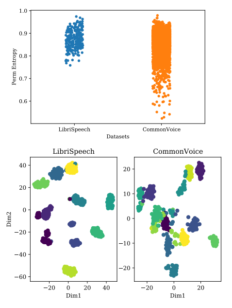
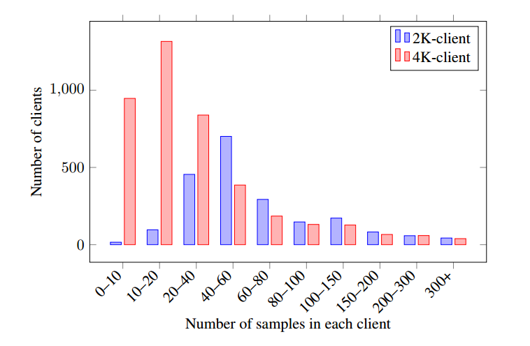
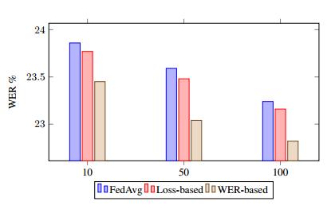
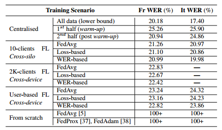
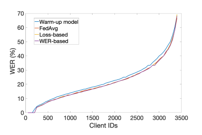

# 联邦声学模型的端到端语音识别

论文链接：https://ieeexplore.ieee.org/abstract/document/9747161

源代码：https://github.com/yan-gao-GY/Flower-SpeechBrain

在联邦学习（FL）设置下训练自动语音识别（ASR）模型近来引起了广泛关注。然而，文献中经常出现的FL场景往往是人为的，未能捕捉到真实FL系统的复杂性。在本论文中，我们构建了一个具有挑战性和现实性的ASR联邦实验设置，其中包括具有异构数据分布的客户端，使用CommonVoice数据集的法语和意大利语数据集部分，这是一个庞大的异构数据集，包含数千名不同的说话者、声学环境和噪音。我们首次进行了关于基于注意力的序列到序列端到端（E2E）ASR模型的实证研究，涵盖了三种聚合加权策略——标准FedAvg、基于损失的聚合和一种新颖的基于字错误率（WER）的聚合，在两个现实的FL场景中进行了比较：跨存储单元（cross-silo）包括10个客户端和跨设备（cross-device）包括2K和4K客户端。我们对来自异构和现实FL声学模型的E2E ASR进行的分析为未来基于现实FL的ASR应用的研究和开发奠定了基础。

## 引言

深度神经网络现在广泛应用于最先进的自动语音识别（ASR）系统[1]。这一成功主要依赖于**集中式训练范式**，其中数据首先需要在一个单一数据集中收集，然后才能用于训练[2, 3, 4]。这种方法有一些明显的优点，包括快速训练和能够以任何首选方式对数据进行采样，因为可以完全看到数据。然而，最近对数据隐私的关切以及强大的移动设备和低延迟通信技术的普及（例如5G），分布式训练范式如FL开始受到更多关注。

在FL中，训练发生在源端，训练数据从未发送到中央服务器。在典型的FL场景中，每个参与的客户端/设备都会接收一个初始模型的副本，并在本地数据上单独训练其模型。这个过程生成了一组权重更新，然后发送到服务器，进行更新的聚合。这个过程在多个轮次中重复进行[5, 6, 7]。能够从数千台移动设备中收集信息，而无需收集用户数据，使得联邦和设备端的ASR系统训练成为传统集中式训练的可行且有吸引力的替代方案[6]，同时提供了新的机会来提高ASR质量和鲁棒性，鉴于设备上直接可用的前所未有的大量用户数据。例如，这些数据可以用来更好地使ASR模型适应用户的使用方式，或提高模型对现实和低资源情境的鲁棒性[7]。

尽管越来越多的研究应用FL在与语音相关的任务中[8, 9, 10, 11, 12]，但其中**很少有研究探讨其在E2E ASR中的应用**。在实际的FL环境中正确训练E2E ASR模型面临着许多挑战。首先，在非独立同分布数据（non-IID）上使用FL训练深度学习模型非常复杂[7, 13, 14]，而设备上的语音数据本质上非常非独立同分布（例如，不同的声学环境、发音单词、语言、麦克风、可用语音量等）。其次，最先进的E2E ASR模型在计算上要求很高，可能不适合FL的设备上训练阶段。事实上，最新的ASR系统依赖于处理高维声学特征的大型Transformer[15, 16]、Transducer[17, 18]或注意力序列到序列（Seq2Seq）模型[19, 20]。最后，E2E ASR训练在优化的早期阶段非常困难且非常敏感，因为要学习潜在的语音表示和转录之间的正确对齐关系的复杂性。这三个特点使得从头开始完全训练ASR模型非常困难[21, 22]。

据我们所知，现有的面向ASR（自动语音识别）的联邦学习研究通常通过放弃环境协议的一些限制来应对这些挑战。这反过来导致他们的实验设置仍然远离FL ASR需要运行的条件。事实上，许多研究[23, 10]在不符合FL场景的不切实际数据集上进行评估，如仅包含选定说话者在受控环境中朗读书籍而没有背景噪声的LibriSpeech（LS）[24]。[11]中的作者引入了一种基于HMM-DNN的ASR系统的面向跨隔离FL的客户端自适应训练，这是一个特定设置，仅考虑了少量具有大量同质数据的客户端，从而简化了数据非IID性的真实FL设置的复杂性。然后，[10]提出了一种具有改进性能的联邦迁移学习平台，使用增强的联邦平均和分层优化进行E2E ASR，缓解了上述对齐问题，但仅在LS上进行了评估。

在这项工作中，我们提出了**远离干净语音语料库**来评估基于FL的ASR系统的需求。我们在更加现实的环境中研究了使用**法语Common Voice（CV）数据集[**25]的FL模型，该数据集提供了一个大型、异构且不受控制的说话者集合，他们使用自己的设备录制了一组句子；这与具有各种用户、声学条件、麦克风和口音的FL非常匹配。在训练SOTA E2E ASR系统时，我们评估了跨隔离和跨设备（即大量客户端但只有少量非IID数据的情况）的FL设置。特别是，在模型聚合过程中，我们比较了三种不同的权重策略。我们的贡献包括：

1. 在实现一个真实的FL设置的情况下，定量比较了LibriSpeech和Common Voice，以突显FL-based ASR模型评估需要转变的必要性。
2. 提出了关于FL场景的基于注意力的Seq2Seq E2E ASR模型的第一项研究。我们的设置探讨了其他人以前忽视的挑战，如极度异构的录音条件。
3. 在法语和意大利Common Voice的自然分区和异构子集上评估了跨隔离和跨设备FL，最多有4K个客户端。
4. 首次提出了基于识别错误率（WER）的自适应聚合策略，以整合ASR与FL的特定性。
5. 发布了使用Flower [26]和SpeechBrain [27]的源代码，以促进复制和未来研究。

## 端到端语音识别

所考虑的E2E ASR系统依赖于广泛采用的联合连接主义时间分类（CTC）与注意力范式[19]。该方法将Seq2Seq基于注意力的模型[28]与CTC损失[29]相结合。

典型的ASR Seq2Seq模型包括三个模块：编码器、解码器和注意力模块。给定一个语音输入序列（即语音信号或声学特征）$x = [x_1; \ldots; x_{T_x}]$，其中$T_x$是长度，编码器首先将其转换为隐藏的潜在表示$h_e = [h_{1}^{e}, \ldots; h_{T_x}^{e}]$。然后解码器会关注编码表示$h^e$，结合来自注意力模块的注意力上下文向量$c_t$。这将产生不同的解码器隐藏状态$h^d = [h_{1}^{d}; \ldots; h_{T_y}^{d}]$，其中$T_y$对应于目标序列$y$的长度。在语音识别场景中，$T_x > T_y$。

联合CTC-注意力ASR管道的标准训练过程基于数据集S上的两种不同损失。首先，CTC损失是针对Seq2Seq模型的编码器模块获得的预测而导出的：

$$
L_{CTC} = -\sum_{S} \log p(y | h^e)
$$

其次，基于注意力的解码器根据交叉熵（CE）损失进行优化：

$$
L_{CE} = -\sum_{S} \log p(y | h^d)
$$

这些损失通过一个超参数 $\mu$（取值范围为[0, 1]）进行组合，综合损失如下：

$$
L = \mu L_{CE} + (1 - \mu) L_{CTC}
$$

在实际应用中，CTC损失通过其单调性行为促进系统的早期收敛，而注意力解码器需要首先确定在整个输入序列的隐藏表示中应该关注的位置。

## 声学模型联邦训练

使用联邦学习来训练端到端（E2E）声学模型的过程遵循四个步骤：

1. 根据[10]的方法，模型权重首先在中心化数据集上进行预训练。
2. 中心化服务器从M个客户端中随机选择K个客户端，并将模型的权重上传给它们。
3. 客户端基于其本地用户数据并行训练模型，进行 $t_{local}$ 个本地周期，并将新的权重发送回服务器。
4. 服务器对权重进行聚合，然后重新开始步骤2。这个过程执行 $T$ 轮，直到模型在专用的验证集上收敛（例如，每个客户端的本地验证集或中心化验证集）。

### 联邦优化

对于每个训练轮次，每个客户端 $k \in K$ 包含 $n_k$ 个音频样本，运行 $t \in [0, t_{\text{local}}]$ 次迭代，使用学习率 $\eta_l$ 基于综合损失公式在本地更新模型：

$$
w^{(k)}_{t+1} = w^{(k)}_t - \eta_l \tilde g^{(k)}_t
$$

在全局轮次 $T$ 中，客户端 $k$ 的本地模型权重为 $w^{(k)}_T$，而 $g^{(k)}_T$ 是本地样本的平均梯度。在经过 $t_{local}$ 本地周期的训练后，客户端 $k$ 的更新权重 $w^{(k)}_T$ 被发送回服务器。然后，本地梯度 $g^{(k)}_T$ 计算如下：

$$
g^{(k)}_T = w^{(k)}_T - w_{T-1}
$$

然后，来自所有客户端的梯度聚合如下：

$$
\Delta_T = \sum_{k=1}^{K} \alpha^{(k)}_T g^{(k)}_T
$$

这里，$\alpha^{(k)}_T$ 表示第3.2节中描述的不同权重策略。根据服务器学习率$\eta_s$，更新的全局模型权重$w_T$计算如下：

$$
w_T = w_{T-1} - \eta_s \Delta T
$$

在联邦学习训练中，特别是在使用异构数据时，全局模型可能会偏离原始任务或者根本不会收敛[7, 13, 14]，从而导致性能下降。为了缓解这个问题，并受[10]的启发，我们建议**在标准模型更新过程（使用公式7）之后，在服务器上使用一小批保留数据进行额外的训练迭代**。

### 加权策略

Federated Averaging（FedAvg）[5]是一种流行的[30, 31, 32, 8, 9, 23]聚合策略，其中来自每个客户端的模型更新根据 $\alpha_T(k)$ 进行加权，该值表示每个客户端中数据样本数与在该轮中使用的总样本数的比例：

$$
\alpha_T(k) = \frac{n_k}{\sum_{k=1}^{K} n_k}
$$

在具有异构客户端数据分布的现实联邦学习环境中，**一些客户端可能包含偏斜且不代表全局数据分布的数据**（例如，包含不同语言或多个说话者的音频样本）。因此，如果这些客户端的训练样本比其他客户端多，聚合模型可能根本无法收敛。例如，在我们的实验中，所有尝试从头开始训练语音识别系统都因此问题而失败，需要先进行声学模型的预训练阶段。

其次，包含低质量数据的客户端会引入意外的噪音到训练过程中（例如，背景中的极端噪音）。任何一种情况都可能导致模型在聚合步骤中发生偏离，这无法通过标准的FedAvg权重方法（Eq. 8）来解决。一个潜在的解决方案是使用**平均训练损失作为权重系数**，从而反映本地训练模型的质量。直观地说，较高的损失表明全局模型难以从客户端的本地数据中学习。更准确地说，我们使用从Eq. 3的训练损失获得的Softmax分布来计算权重。Eq. 8被修改如下：

$$
\alpha_T(k) = \frac{-L_k}{\sum_{k=1}^{n_k} \exp{(-L_k)}}
$$

在ASR（自动语音识别）的背景下，通常使用WER（词错误率）作为模型的最终评估指标，而不是训练损失。因此，我们提出了一种基于WER的聚合加权策略。这个方法使用在验证集上获得的值 $(1-wer)$ 作为权重系数 $\alpha_T(k)$ 

$$
\alpha_T(k) = \frac{\exp{(1 - wer_k)}}{\sum_{k=1}^{n_k} \exp{(1 - wer_k)}}
$$

以这种方式，我们直接优化模型以满足语音识别的相关度量指标。

## Common Voice 作为联邦学习结果测试

在这一部分，我们首先介绍了用于联邦学习实验的Common Voice（CV）数据集。然后，我们通过定量方法证明CV比LibriSpeech（LS）更适合推动联邦学习研究，从而激发了对标准评估流程的改变需求。

### Common Voice 数据集

CV数据集（版本6.1）[25] 包括法语和意大利语子集。这些话语是从世界各地的志愿者使用智能手机、电脑、平板电脑等设备录制的，涵盖了不同语言。

法语子集总共包含328,000个话语（总计475小时），具有多种口音，由10,000多名讲法语的志愿者录制。训练集包括4212名讲话者（总计425.5小时的语音），而验证集和测试集分别包含来自2415名和4247名讲话者的约24小时的语音。另一方面，意大利语子集相对较小，包括89小时、21小时和22小时的意大利语培训数据（748名讲话者）、验证数据（1219名讲话者）和测试数据（3404名讲话者）。

### 配置分析和 LibriSpeech 比较

我们认为，**与LS相比，CV更接近自然的联邦学习条件**，因为在客户内部和客户之间都观察到更强烈的变化。虽然CV是一个众包数据集，包含数千种不同的声学条件、麦克风和噪音，但LS是一个受严格控制的工作室质量语料库。后者被大多数联邦学习自动语音识别（FL ASR）研究使用。

我们在三个层面比较了这两个数据集：

#### 低级信号特征——信号差异

我们选择了低级信号特征。所选特征应更能描述背景和录音条件，而不是说话者身份，因为这在分析聚类纯度时进行了研究。因此，我们将考虑以下内容：**响度**，因为它与麦克风和录音距离高度相关；**谐波噪声比的对数**（logHNR），作为背景噪声的代理指标；**置换熵**（PE），因为它已成功用于麦克风识别[33]。

通过对每个话语的每帧值求平均值来计算信号特征的平均值。然后，对于每个客户，我们计算每个客户的平均值和标准差。前者描述了客户之间的变化，而后者描述了客户内部的变化。对于这三个考虑的特征，每个客户的平均值分布的标准差在Common Voice上高于LibriSpeech，分别为0.034、11.466和0.053，而在LS上为0.017、9.096和0.040。关于客户内部的变化，每个客户的标准差分布的标准差也在CV上高于LS，分别为0.009、2.69和0.014，而在LS上为0.007、2.31和0.007。值得注意的是，使用Permutation Entropy获得的分布呈现重尾分布，如图1所示。实际上，Kurtosis在CV上达到4.16，而在LS上为-0.13。实际上，这意味着许多客户可能对CV来说是异常值，会严重影响使用传统聚合机制的联邦学习。

图1：（上图）Librispeech和Common Voice中每个客户的置换熵均值的带状图。CV显示出重尾分布，这是由于更多多样化的录音设置造成的结果。（下图）嵌入式语音话语的TSNE表示。颜色对应于真实的客户（即说话者）。CV的客户明显更难分开，而LS的客户则相对容易分开。

#### 盲信噪比——噪声差异

盲信噪比。我们进一步通过计算盲信噪比估计来检查两个数据集之间的**噪音差异**。首先，对每个样本计算了一个10阶的 LPC 近似。其次，使用 Probabilistic YIN 算法进行 F0 估计来检测声音块。最后，仅考虑容易用 LPC 估计逼近的声音块，**盲信噪比估计中的噪音定义为实际信号与LPC近似之间的差异**。与信号特征观察到的趋势一致，CV显示出更高的SNR均值标准差，$σ_{SnrCV} = 18.47$，而LS为 $σ_{SnrLS} = 10.32$。然后，观察到了同一客户录音中的更大差异。实际上，对于同一客户的每个音频样本获得的标准差的标准差在CV中高于LS，分别为6.54和3.82。这表明与**同一客户相关的录音条件具有更高的变异性**。Common Voice的说话者可能来自不同的地方和设备。

#### 聚类纯度——说话人之间难以分开

我们使用预训练的说话者嵌入来比较使用说话者嵌入的说话者之间的重叠情况。对于这两个数据集，使用在pyannote.audio [36]上开源的Tristounet模型[35]来计算每个话语的说话者嵌入。

需要提到的是，Tristounet没有在LS、CV或有声书数据上进行训练。然后，使用K均值算法进行聚类，使用kmeans++初始化，聚类中心的数量等于客户的数量。聚类的纯度定义为属于与其计算出的群集中的大多数相同客户的点的比例。在LS上，纯度达到0.77，在CV上为0.62。图1显示了话语嵌入的TSNE表示，并突出了CV中的聚类困难性。

这表明使用**说话者嵌入难以将CV中的说话者分开**。这与前两个使用低级音频特征的实验结果一致，因为它暗示了不同的信号特征和录音条件会污染语音话语，导致说话者识别更加困难。

本节提供的分析显示了LS和CV之间语料库的显著差异。后者更好地捕捉了当FL系统在真实世界中部署时所面临的复杂性。

## 实验设置

这一部分首先介绍了端到端（E2E）语音识别器的架构。然后，它描述了联邦学习环境的实验设置以及关键的超参数。

### 端到端语音识别器

实验基于一个使用联合CTC-注意力目标[19]进行训练的Seq2Seq模型。编码器采用首次描述的CRDNN架构[27]（即2D CNN - LSTM - DNN）。解码器是具有单个隐藏层的位置感知GRU。描述模型的完整参数集可以在GitHub存储库中找到。模型是用来预测子词单元的。**没有进行语言模型融合，以便正确评估训练过程对声学模型的影响**。在训练期间，数据在时间域上进行了增强。该模型已经在SpeechBrain [27]中实现，因此非常容易操作、自定义和重新训练。

### 现实联邦学习

基于CV数据集的自然分割，我们进行了两组实验，反映了联邦学习的实际用途：

#### Cross-silo FL

在这种情况下，客户端通常较少，每一轮都有高可用性，通常训练数据的分布相似[7]。共享数据通常是独立且分布相同的。我们的实现遵循[10]的方式，将数据集分为10个随机分区（即每个客户端一个），每个分区都包含大致相同数量的语音数据，并且没有重叠的说话者。

#### Cross-device FL

这种设置通常涉及成千上万个客户，其数据分布非常不同（非独立同分布），每个客户只参与一轮或几轮[7]。在这里，我们定义了两种设置：首先，我们模拟了单个说话者使用其个人设备的实际情况。为了复制这个情景，我们根据用户将训练集自然地分成了4095和649个分区，分别用于法语和意大利语子集。第二个情景将每个设备分配给两个用户（例如，个人助手或智能汽车中的情况）。对于CV法语子集，这将客户数量降至2036。如图2所示，每个设置都显著改变了低资源客户的分布。4K设置提供了一个具有挑战性的场景，因为**大多数客户只包含很少的样本**。

图2：法语Common Voice数据集中的2K客户和4K客户联邦学习设置中样本分布的示意图

### ASR 联邦学习：一种混合方法

在联邦学习设置中训练端到端（E2E）ASR模型是具有挑战性的。同时学习对齐和潜在语音表示是一个困难的任务，通常需要大型数据集。因此，正如我们在分析过程中经验到的那样，**在实际的联邦学习设置中几乎不可能从头开始训练一个E2E ASR模型**。表1显示，**所有测试过的现有联邦学习聚合方法在没有预训练的情况下都无法收敛**。这是因为大多数客户只包含很少的语音，导致学习对齐的梯度非常嘈杂。为了解决这个问题，我们首先在一半的数据样本上对全局模型进行预训练。我们通过将原始数据集分成一个小的说话者子集（具有许多样本）进行集中训练（后文称为**热身数据集**），以及一个更大的说话者子集（每个子集具有较少的样本）进行联邦学习实验。对于CV法语，小的子集包含117名说话者，留下4095名说话者用于联邦学习。意大利语的统计数据降至99名和649名说话者。我们认为这种情况仍然是现实的，因为在实践中，集中的数据通常是可用的，因此可以用来引导对齐。

每轮参与的客户数量也会影响实验结果。为了量化这种变化，我们建议在4K设置上对所有加权策略的每轮选择的客户数量K进行变化，从10变化到100。然后，我们根据获得的最佳WER（即100）固定K，用于其他设置。对于跨辖区环境，每一轮都选择了所有客户（K = 10）。

除了设置联邦学习实验的全局轮数，我们还必须定义每个客户端上的本地轮数。然而，这是一个非常棘手的任务[5]。实际上，**我们发现增加本地轮数会导致客户端过拟合其本地数据**。因此，客户端仅本地训练5轮。

根据可用的计算资源，同时训练大量客户端可能会变得具有挑战性。虽然模型可以在真实嵌入式硬件上使用CPU或适度的GPU进行训练（例如RapsberryPi或NVIDIA Jetson），但我们的模拟联邦学习设置允许我们在现代GPU上运行这些工作负载（例如Nvidia Tesla V100），在单个GPU上同时运行多个客户端，并使用Flower [26]和SpeechBrain [27]进行实现。

最后，模型在集中测试集上进行评估，并使用本地句子的小型集合在客户端级别进行评估。对于法语4K设置，每个客户端都保留了10％（至少有2个样本）用于测试。具体来说，**集中式说话者是新的说话者，而本地说话者在训练时已经见过**。

## 语音识别结果

首先，我们比较每轮选择不同数量的客户K对最具挑战性设置（法语4K客户，图3）的影响。与文献相反，较高的K值倾向于产生更好的WER。这可以通过CV数据集的异质性来解释，其中极其嘈杂的客户可能会扰乱每轮仅有少数客户的平均化过程。实际上，即使在完全训练之后，仍然有很少的客户的WER超过100％。因此，在接下来的实验中，K将被固定为100。

图3：在法国CV的4K客户设置中，每轮选择的样本客户数量变化时的语音识别性能

**表 1** 报告了在不同训练设置下获得的结果。我们注意到，**以集中方式在整个数据集上训练可以获得最佳的WER**，分别为法语和意大利语集合的20.18％和17.40％，这与当前最佳的文献结果[27]相当。这个下限是可以预期的，因为系统完全可见数据，并且可以以几乎独立同分布的方式对输入进行采样。另一方面，当仅使用热身数据集时，我们注意到由于训练数据点较少，WER 增加到法语集合的 25.26％ 和意大利语集合的 25.90％。这也是可以预期的，因为现在系统有更少的数据可供学习。这为FL的**固有下限限制**提供了一些启示，FL仅限于每轮中的部分数据观察。第三种集中式情景在在线训练方式下对热身模型在数据的后半部分进行了训练。与法语集合中的所有FL模型相比，该模型提供了稍低的WER。但是，我们应该注意，这是一种不现实的设置，因为以集中方式训练模型将使FL提供的所有隐私保障无效。特别是，与热身模型相比，该模型在意大利语集合中仅改善了0.14％。这表明即使在集中方式下，对第二半数据进行模型训练也很困难。在服务器端每轮之间的集中微调使所有FL设置的结果均超过了集中式训练。

表1：不同情景和加权策略下法语（Fr”）和意大利语（It”）CV数据集的集中测试集上的语音识别结果。“基于用户”的FL代表法语4K客户和意大利语649客户

**数据可见性**的影响确实可以在跨辖区和跨设备情景中看到，这两种情况都不能均匀地访问数据。然而，由于在前一种设置中问题不那么严重，通过选择正确的聚合策略，我们仍然能够获得法语集合的WER为20.99％，非常接近20.18％的集中式下限。另一方面，更具挑战性的意大利集合获得了19.98％的WER，与下限相差2.58％。至于跨设备情景，设备之间非独立同分布的数据分布效应导致法语集的最佳WER为2K和4K客户设置下的22.43％和22.82％，甚至在意大利集合中更差（23.86％）。这些值比最差的跨辖区结果还要大，显示了数据分区的非独立同分布性的影响。

与不同的**加权策略**相比，基于WER和基于损失的方法在所有设置中都获得更好的性能，这表明削弱低质量客户的影响可以帮助在数据分布不均匀的联邦训练中进行聚合。在这里，我们有两种反映客户质量的指标。表1中的结果显示，基于WER的策略在两种情景下都获得了最低的WER。这可以很容易地解释为这种策略的性质，它直接优化模型以适应语音识别的相关度量。

**客户级别的测试**性能是现实中FL的另一个关注点。图4显示了法语集合中每个客户的单独WER。所有FL方法的性能都优于热身模型（蓝线），但三种聚合策略之间的差异变得不那么显著。然而，基于WER的方法在计算所有客户的平均性能时获得了最低的WER为21.91％。如前所讨论，我们可以看到许多客户的WER仍然高于50％，其中500个客户的本地WER甚至高于100％，清楚地表明CV数据集对于FL而言具有挑战性。

图4：不同加权策略在法语Common Voice集合上的客户测试性能。热身模型、标准FedAvg、基于损失和基于WER的聚合的平均WER分别为23.76％、22.13％、22.11％和21.91％。客户按其WER排序。WER高于100％的客户已被删除

## 结论

在本文中，我们提出了基于注意力的Seq2Seq E2E ASR模型在现实联邦学习场景下的首个研究，使用了三种聚合加权策略 - 标准FedAvg、基于损失的聚合和一种新颖的基于WER的聚合。

我们对LibriSpeech和Common Voice进行了量化比较，以实现现实的FL设置。所有方法都在两种语言上进行了跨辖区和跨设备的FL评估。我们的工作为未来在开放源码环境下进行现实FL ASR应用的研究奠定了基础。

