# LLaMA-Adapter：使用零初始化注意力高效微调语言模型

论文链接：https://arxiv.org/abs/2303.16199

论文代码：https://github.com/OpenGVLab/LLaMA-Adapter

我们提出了**LLaMA-Adapter**，这是一种轻量级的适应方法，可将LLaMA有效地微调为一个**遵循指令的模型**。借助52,000个自我指导的演示，LLaMA-Adapter仅在冻结的LLaMA 7B模型上引入了**1.2M**个可学习的参数，并在8个A100 GPU上微调不到**一小时**。具体而言，我们采用了一组可学习的适应提示，并将它们前置到较高的 Transformer 层的单词标记之前。然后，我们提出了一个零初始化的注意力机制，带有零门控，它可以自适应地将新的指导线索注入LLaMA，同时有效地保留其预训练的知识。通过我们的高效训练，LLaMA-Adapter可以生成高质量的响应，与完全微调的7B参数的Alpaca相媲美。**除了语言指令，我们的方法还可以简单地扩展到多模态指令**，用于学习基于图像的LLaMA模型，从而在ScienceQA和COCO Caption基准上实现出色的推理性能。此外，我们还评估了零初始化的注意力机制，用于微调其他预训练模型（ViT、RoBERTa）用于传统的视觉和语言任务，展示了我们方法的卓越泛化能力。

## 引言

大规模语言模型（LLMs）[13, 52, 73, 53, 15] 已经在学术界和工业界引起了广泛的关注。在大规模语料库和先进硬件的驱动下，LLMs展现出出色的理解和生成能力，将语言任务推向了更高的水平。最近，在**指令跟随模型**方面取得了显著进展，例如ChatGPT [2] 和 GPT-3.5（text-davinci-003）[4]。通过遵循自然语言的指令，它们可以以对话的方式生成专业和上下文相关的响应。然而，指令模型的进一步普及在很大程度上受到了闭源限制和高开发成本的阻碍。

为了缓解这一问题，斯坦福的**Alpaca** [60] 提出了将一个LLM，即LLaMA [61]，进行微调，以创建一个经济实惠且可复制的指令跟随模型。Alpaca从175个人工编写的指令-输出对[62]开始，利用GPT-3.5以自我指导的方式扩展训练数据到52K。在此基础上，**Alpaca微调LLaMA中的全部7B参数**，生成了一个出色的指令模型，性能类似于GPT-3.5。尽管Alpaca非常有效，但对大规模LLaMA的完全微调仍然耗时、计算密集、不支持多模态，且在不同下游场景中转移麻烦。

在本论文中，我们介绍了**LLaMA-Adapter**，这是一种有效的微调方法，用于将LLaMA调整为性能良好的指令跟随模型。我们还利用了52K条指令-输出数据用于训练，但冻结了整个LLaMA模型，以提高资源利用效率。具体来说，在LLaMA的较高的Transformer层中，我们在输入指令标记的前面附加了一组可学习的适应提示。这些提示学会了自适应地将新的指令（条件）注入到冻结的LLaMA中。为了避免在早期训练阶段出现的适应提示噪音，我们修改了插入层中的普通注意力机制，将其初始化为零初始化的注意力，同时具有可学习的门控因子。通过零向量初始化，门控首先保留了LLaMA中的原始知识，并在训练过程中逐渐融入指导信号。这有助于在微调过程中**稳定的学习**，并提高了最终模型的指令跟随能力。

总体而言，我们的LLaMA适配器具有四个主要特性，如图1所示：

- **1.2M 个参数**：与更新完整的7B参数不同，我们冻结了预训练的LLaMA，仅在其顶部学习了1.2百万个参数的适应提示。然而，这显示出与7B Alpaca相当的指令跟随能力。
- **一小时微调**：由于我们的轻量级适应模块具有零初始化的门控，LLaMA-Adapter的训练收敛速度不到一小时，在使用8个A100 GPU 情况下，比Alpaca快三倍。
- **专业插件**：对于不同的情景，插入其各自的适应器以赋予LLaMA不同的专业知识是灵活的。因此，只需在每个上下文中存储一个 1.2M 适配器，而不是完整的7B模型的复制。
- **多模态指令**：除了文本指令，我们的方法还可以接受图像作为多模态推理的输入。通过将图像标记添加到适应提示中，LLaMA-Adapter在ScienceQA [41]和COCO Caption [8]基准上表现出竞争力。

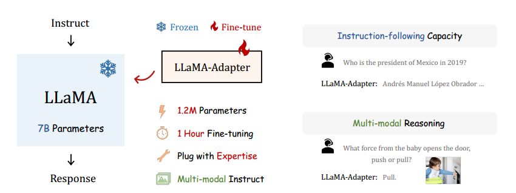

图1：LLaMA-Adapter的特点。我们的轻量级适应方法在一小时内高效微调了LLaMA [61] 的7B模型，只需1.2M可学习参数。训练后，LLaMA-Adapter展现出卓越的指令跟随和多模态推理能力

除了指令跟随模型外，我们的零初始化注意力可以推广到**其他视觉和语言模型**，用于高效微调。对于视觉模型，我们利用我们的方法对预训练的ViT [16]进行微调，用于下游图像分类，在各种图像分布上获得了VTAB-1k [67]基准上的卓越性能。对于其他语言模型，我们评估了我们的微调效果，对ReBERTa [40]进行提取式问题回答，在SQuAD [54] v1.1和v2.0基准上取得了领先的成绩。通过这些实验证明了LLaMA-Adapter在传统的视觉和语言任务中的有效性。

## 相关工作

### 指令跟随语言模型

当涉及到语言模型领域的**指令跟随能力子领域**时，研究人员致力于根据自然语言指令生成相应的回应，这已在语言[64, 63, 3, 46]和多模态[59, 42]领域得到了广泛研究。这些方法通常通过使用**高质量的指令-输出数据对**来微调预训练的LLMs，以增强模型对用户意图的理解并更准确地遵循指令。在其中，FLAN [64] 提出了一种指令微调方法，在未知任务中优于未经微调的LLMs。PromptSource [3] 提供了一个基于Web的GUI开发环境，用于创建和管理自然语言提示，支持零样本学习和基于梯度的少样本学习。SUP-NATINST [63] 建立了一个包括1,616个多样化语言任务的大型基准，并在T5模型上采用多任务训练。InstructGPT [46] 显著提高了指令跟随能力，可能已整合到闭源的GPT-3.5 [4]和GPT-4 [45]中。斯坦福的Alpaca [60] 以端到端方式微调了LLM的全部7B参数，即LLaMA [61]，这是开源的且可复制的。然而，这种全模型微调在时间和内存方面可能效率不高，限制了它在下游应用中的可传递性。相比之下，**我们的LLaMA-Adapter旨在仅微调冻结的LLaMA之上的轻量级适配器，而不是更新整个模型的参数**。与并发工作Alpaca-LoRA [1]相比，我们的方法进一步降低了计算需求，并可以推广到多模态推理的视觉指令跟随。

### 高效参数微调

在不同的语言和视觉任务中，预训练和微调范式已被证明是非常有效的。与完全微调相比，**参数高效微调（PEFT）**[47]方法冻结了大多数预训练模型的参数，并仍然可以在下游任务中展现出可比较的能力。已经探索了各种PEFT技术，包括**提示微调（Prompt Tuning）**[35, 30, 39, 38, 50, 72]，**低秩适应（LoRA）**[23, 69, 20]和**适配器（Adapter）**[22, 48, 37, 9, 55]。提示微调将一组可训练的提示标记附加到预训练的大型模型，这些标记插入到输入嵌入层[30, 39]或所有中间层[35, 38]中。LoRA [23]引入了可训练的秩分解矩阵到每个网络权重[25]中，已经在大型生成模型[12, 61]上表现出有希望的微调能力。适配器[22]将轻量级适应模块插入到预训练 Transformer 的每个层中，并已在众多领域[19, 18, 70, 71]中进行了扩展。**在本论文中，我们提出了一种新的PEFT方法，LLaMA-Adapter**，专门为LLaMA [61]和指令跟随微调而设计。现有的PEFT方法可能通过直接插入随机初始化的模块来扰乱预训练的语言知识。这导致了在早期训练阶段出现大的损失值的不稳定微调。为此，**LLaMA-Adapter采用了带有门控因子的零初始化注意力，以很好地缓解这个问题**，逐渐将指导信号与冻结的LLaMA结合起来。此外，我们验证了我们的方法在其他领域微调大型模型的有效性。在零门控的适应提示的帮助下，我们对ViT [16]和RoBERTa [40]的高效微调分别在视觉和语言任务上展现出竞争力的下游性能，显示出卓越的泛化能力。

## LLaMA-Adapter

在第3.1节中，我们首先介绍了如何将可学习的适应提示插入到LLaMA [61]的变换器中。然后，在第3.2节中，我们介绍了带有零门控的零初始化注意机制的详细内容，并在第3.3节中将LLaMA-Adapter推广到多模态推理。最后，在第3.4节中，我们将我们的方法扩展到视觉和视觉-语言模型的高效微调。

### 可学习自适应提示

在给定52K条“指令-输出”数据[62]和具有N层transformer的预训练LLaMA [61]的情况下，我们采用一组**可学习的适应提示进行指令跟随微调**。我们将用于L个transformer层的提示表示为$\{P_l\}_{l=1}^L$，其中$P_l \in \mathbb{R}^{K \times C}$，其中 $K$表示每个层的提示长度， $C$等于LLaMA transformer的特征维度。请注意，我们将这些提示插入到transformer的最顶部的$L$层中（$L \leq N$）。这可以更好地微调具有**更高级语义的语言表示**。

以第 $l$ 个插入层为例（$l$ ≤ L），我们将 $M$ 长度的词汇标记表示为 $T_l \in \mathbb{R}^{M \times C}$，这些标记代表了输入指令和已生成的响应。可学习的适应提示被连接到 $T_l$ 上，作为前缀，具体形式如下：

$$
[P_l; T_l] \in \mathbb{R}^{(K+M) \times C}
$$

通过这种方式，$P_l$ 中学到的指令知识可以有效地通过 transformer 块中的注意力层引导 $T_l$ 生成后续的上下文响应。

### 零初始化注意力

如果自适应提示随机初始化，它们可能会在训练初期对单词标记造成干扰，从而损害微调的稳定性和效果。考虑到这一点，我们修改了最后 $L$ 个 Transformer 层中的 vanilla 注意机制，将其初始化为零注意力，如图2所示。假设模型在第 $l$ 个插入层的 $[P_l ; T_l ]$ 之上生成了第 $(M + 1)$ 个单词，我们将相应的第 $(M+1)$ 个单词标记表示为 $t_l \in R^{1 \times C}$。在注意机制中，首先应用几个线性投影层将输入标记转换为查询、键和值，如下所示：

$$
Q_l = \text{Linear}_q(t_l); \\
K_l = \text{Linear}_k([P_l ; T_l ; t_l]); \\
V_l = \text{Linear}_v([P_l ; T_l ; t_l]). \\
$$

接下来，计算 $Q_l$ 和 $K_l$ 在 softmax 函数之前的注意力得分如下：

$$
S_l = \frac{Q_lK_l^T}{\sqrt{C}} \in R^{1 \times (K+M+1)}
$$

记录了新单词 $t_l$ 与所有 $K + M + 1$ 个标记之间的特征相似性。同时，$S_l$ 可以被重新表达为两个部分，如下：

$$
S_l = [S_{K_l}; S_{M+1_l}]^T
$$

其中，$S_{K_l} \in R^{K \times 1}$ 和 $S_{M+1_l} \in R^{(M+1) \times 1}$ 分别表示 K 个自适应提示和 M + 1 个单词标记的注意力得分。前者 $S_{K_l}$ 代表了可学习提示对生成 $t_l$ 贡献了多少信息，这可能会在早期训练阶段引起干扰。

为此，我们采用一个可学习的门控因子，表示为 $g_l$，以自适应地控制 $S_{K_l}$ 在注意力中的重要性。初始值为零的 $g_l$ 可以首先消除不合适提示的影响，然后增加其幅度以提供更多指导语义给 LLaMA。因此，我们独立地对方程（6）中的两个部分应用 softmax 函数，并将第一个项乘以 $g_l$，表示为：

$$
S^{g}_{l} = \left[\text{softmax}(S^{K}_{l}) \cdot {\color{blue}{g_l}}; \text{softmax}(S^{M+1}_{l})\right]^T
$$

独立的 softmax 函数确保第二项与自适应提示无关。当 $g_l$ 接近零时，它可以主要传达 LLaMA 的原始预训练知识给标记 $t_l$，以进行可信的生成。在实践中，我们采用多个 $g_l$ 独立学习，用于注意力的不同头部，有益于多头机制的学习多样性。

最后，我们使用线性投影层来计算第 $l$ 个注意力层的输出，如下所示：

$$
t^{o}_{l} = \text{Linear}_o(S^{g}_{l}V_l) \in R^{1 \times C}
$$

通过我们提出的零初始化注意力，自适应提示可以逐渐将新获得的指导信号注入到 Transformer 中，同时融合 LLaMA 的预训练知识，以提供高质量的响应。

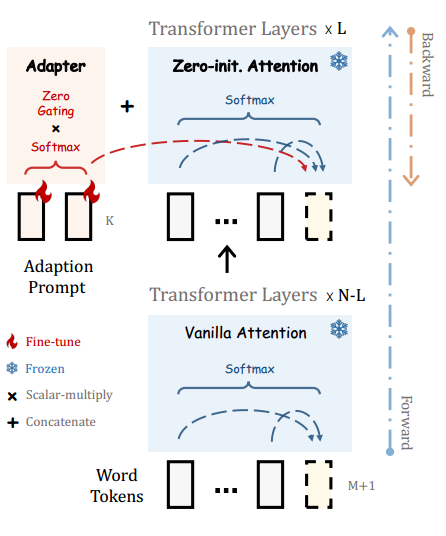

图2: LLaMA-Adapter的详细信息。我们在LLaMA的N个Transformer层中的L个中插入具有可学习提示的轻量级适配器。为了逐渐学习指导性知识，我们采用零初始化的注意力和门控机制，以在早期阶段稳定训练。

### 多模态推理

除了文本指导，LLaMA-Adapter还能够根据其他模态的输入回答问题，这为语言模型提供了丰富的跨模态信息。如图3所示，我们以 ScienceQA 基准 [41] 为例，它类似于 COCO Caption 数据集 [8]。在给定**视觉**和**文本上下文**以及相应的问题和选项的情况下，模型需要进行多模态理解以给出正确的答案。

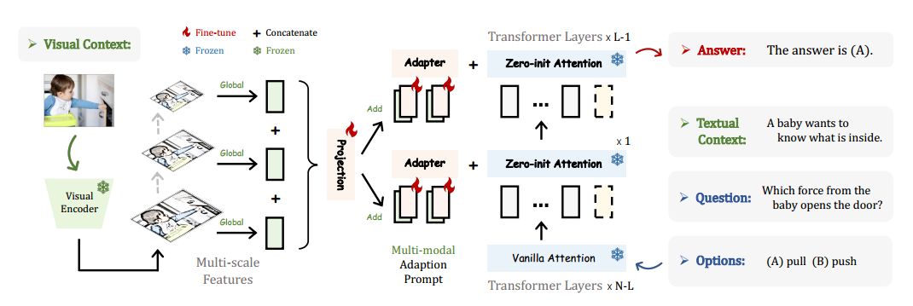

图3: LLaMA-Adapter的多模态推理。在 ScienceQA 基准 [41] 上，LLaMA-Adapter 扩展为一种多模态变体，用于基于图像的问题回答。在给定图像作为视觉上下文的情况下，我们通过多尺度聚合获得全局图像标记，然后将其逐元素添加到自适应提示中，以进行视觉指导

对于作为视觉上下文的输入图像，我们首先利用预训练的视觉编码器，例如 CLIP [51]，提取其多尺度全局特征，表示为 $\{I_m\}^{M}_{m=1}$，其中 $I_m \in R^{1 \times C_m}$，而 $M$ 表示尺度数量。然后，我们沿通道维度连接这些多尺度特征，并在其上应用一个可学习的投影网络，如下所示：

$$
I_p = \text{Projection} \left(\text{Concat} \left\{I_m\right\}_{m=1}^{M}\right)
$$

其中，$I_p \in R^{1 \times C}$，被视为与我们的自适应提示具有相同特征维度的整体图像标记。之后，我们将 $I_p$ 重复 K 次，并逐元素地添加到所有 L 个插入的 Transformer 层中的长度为 K 的自适应提示中。对于第 $l$ 层，我们表示获得的多模式提示为：

$$
P^{v}_{l} = P_l + \text{Repeat}(I_p) \in R^{K \times C}
$$

其中，$P^{v}_{l}$ 表示包含来自给定图像上下文的视觉信息的自适应提示。通过这种方式，LLaMA 可以进行微调，以在视觉-语言输入条件下生成响应，并可以处理更具挑战性的多模态理解的生成任务。

### 其它大模型零初始化注意力

我们的方法，即具有零初始化注意力的自适应提示，不仅限于指导模型的领域，还可以进一步用于传统视觉和语言任务中微调大型模型，发挥出色的泛化能力。

#### 视觉模型

我们选择一个预训练的 **ViT** [16] 作为下游图像分类任务的基础视觉模型。与LLaMA类似，我们将自适应提示插入到ViT的最顶层的L个Transformer层中，并修改所有插入层的注意力操作以零初始化。通过逐渐注入下游视觉语义，我们仅在冻结的ViT之上引入了一些参数，并在VTAB-1k [67]基准上达到了与完全微调相当的分类准确性，这表明我们的注意力操作符在视觉领域的有效性。

#### 语言模型

我们利用在大规模未标记文本语料库上预训练的 **RoBERTa** [40]，并在 SQuAD [54] 提取式问答基准上评估我们提出的零初始化注意力。我们在 P-tuning v2 [38] 之上实现了零初始化注意力，P-tuning v2 是一种用于高效适应大型语言模型的提示调整方法。同样，我们仅在 P-tuning v2 中启用提示标记和我们的零门控因子在微调期间可学习。领先的结果展示了我们在传统语言任务上的卓越表现。请参阅附录材料以了解如何将零初始化注意力机制应用于更多大型模型和任务。

## 实验

在第4.1节中，我们首先评估了LLaMA-Adapter的指令遵循能力。接着，在第4.2节中，我们展示了我们在ScienceQA [41]基准测试中的多模态性能，并在第4.3节中对ScienceQA的验证集进行消融研究。最后，在第4.4节中，我们报告了我们的方法在其他视觉和语言模型上的微调结果。

### 指令跟随能力评估

#### 设置

设置。与Stanford Alpaca [60]一样，我们使用了52,000条指令遵循数据进行训练，这些数据是从175个指令-输出对[62]扩展而来的。我们在8台A100 GPU上对LLaMA-Adapter进行了为期5个时期的微调。预热时期、批处理大小、学习率和权重衰减分别设置为2、64、0.009和0.02。默认情况下，我们使用具有7B参数和N = 32个Transformer层的预训练LLaMA模型。我们采用了提示长度K = 10，并将适应提示插入到最后L = 30层中。在生成阶段，我们采用了默认的解码方法，即top-p采样[21]，温度为0.1，top-p = 0.75。为了定量评估[10]，我们请GPT-4 [45]评估80个问题上的指令遵循模型的响应质量。由于我们观察到GPT-4更倾向于给予第一个响应更高的分数，我们还交换了两个响应的位置，从而总共有160个评估项目。

#### 性能

我们在图4中比较了LLaMA-Adapter和Alpaca [60]生成的响应，并在图6中报告了定量结果。请参考附录材料以全面比较Alpaca-LoRA [1]、GPT-3 [4]和LLaMA-I [61]。在图4中，针对不同类型的指令，我们的方法可以输出与完全微调的Alpaca相媲美的合理响应，包括问题回答、语言翻译和代码生成。在图6中的GPT-4评估中，LLaMA-Adapter在与Alpaca和Alpaca-LoRA的比较中获得更多的“胜利”。这充分证明了我们的适配器与零初始化的注意机制的有效性。

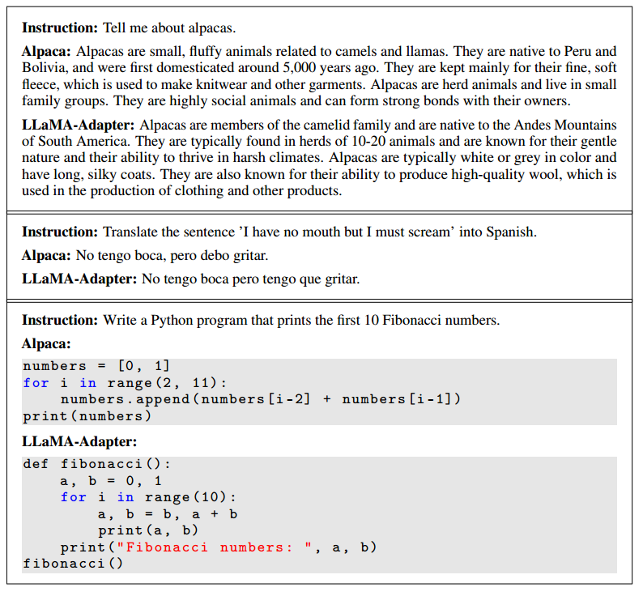

图4：Alpaca [60]与LLaMA-Adapter之间的指令遵循比较

图6：由GPT-4 [45]评估的LLaMA-Adapter、Alpaca [60]和Alpaca-LoRA [1]之间的定量比较。

#### 效率

在表1中，我们比较了不同指令遵循方法的可学习参数、存储空间和训练时间。作为一种轻量级即插即用模块，LLaMA-Adapter具有卓越的训练效率，仅使用了1.2百万个参数、4.9百万的存储空间，并仅需一小时的训练时间。这使我们能够在移动设备上对大规模语言模型，例如LLaMA，进行微调。由于在多节点训练中只需要传输1.2百万个参数的梯度，而不是Alpaca的70亿个参数，LLaMA-Adapter的效率优势可以进一步显现。

表1：不同指令遵循方法的效率比较。训练时间在8台A100 GPU上进行测试。

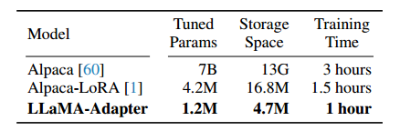

### 多模态评估

#### 设置

对于多模态LLaMA-Adapter，我们采用了CLIP [51]的视觉编码器来提取输入图像的多尺度全局特征，并利用简单级联的MLP作为可学习的投影网络。我们采用贪心搜索作为生成的解码方法，并保持其他超参数与指令遵循LLaMA-Adapter相同。我们使用两个多模态数据集来训练我们的模型并评估性能：ScienceQA [41]和COCO Caption [8]。ScienceQA是一个大规模的多模态科学问题回答数据集，收集自各种知识领域。每个示例包括一个视觉上下文、一个文本上下文、一个问题、多个选项和一个答案。我们将给定的问题、文本上下文和选项按顺序连接成一个句子作为LLaMA-Adapter的输入。COCO Caption数据集包含0.6百万个训练图像字幕数据（每个图像5个字幕），覆盖了广泛的分布范围。我们使用“为此图像生成字幕”作为LLaMA-Adapter的文本指令输入。

#### 性能

在表2中，我们将LLaMA-Adapter与现有流行的VQA方法[65, 33, 34]和大型语言模型[27, 4, 74]在ScienceQA数据集上进行比较。如表所示，我们的单模态变体（'LLaMA-AdapterT'）仅使用1.2百万个参数就达到了78.31%的准确率。通过进一步引入0.6百万参数的视觉条件投影网络，我们的多模态变体（'LLaMA-Adapter'）在回答准确性方面表现出+6.88%的提升。与传统的VQA方法相比，它们需要使用相当多的资源预算通过领域内数据集训练整个网络，而LLaMA-Adapter只需微调少量参数就能获得更好的性能。尽管GPT系列[4, 2, 45]可以在不微调的情况下实现零样本回答，但它们的参数远远超过我们的LLaMA 7B模型与轻量级适配器。此外，MM-CoT [74]与我们的方法相媲美，但它高度依赖复杂的两阶段推理。因此，我们的LLaMA-Adapter在实现竞争力问题回答能力的同时，展现了出色的参数效率。

表2：在ScienceQA [41]测试集上的问题回答准确率（%）。我们报告了GPT-3 [4]、ChatGPT [2]和GPT-4 [45]的零样本推理结果。CoT表示利用附加的思维链来进行问题回答。T表示仅使用文本输入的单模态模型。

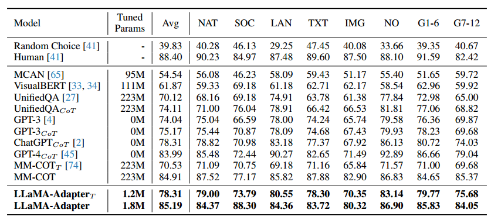

在表5中，我们报告了在COCO Caption数据集上的图像字幕生成结果。BLIP [32]和BLIP-2 [31]都采用了昂贵的预训练阶段，使用附加数据集来获得卓越的性能，包括Visual Genome [29]、Conceptual Captions [58, 7]和LAION [57]。相比之下，我们的LLaMA-Adapter仅需要COCO Caption的0.6百万数据的训练集，却比ClipCap [43]实现了更高的准确性。

表5：根据Karpathy等人[26]的方法，在COCO Caption [8]的验证集上的性能（%）。PT表示在附加数据集[8, 29, 58, 7, 57]上进行预训练，FT表示在COCO Caption上进行微调。

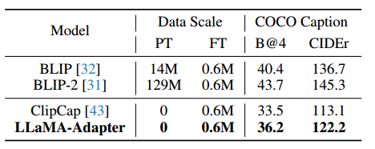

### 消融实验

#### 插入层

我们首先研究要在LLaMA-Adapter中插入的Transformer层数。如表3所示，增加层数会引入更多参数，但会显著提高ScienceQA验证集的准确性，例如，从10层到30层提高了17.41%，从20层到30层提高了10.49%。这表明**在不同层次上添加更多的适应提示可以为预训练的LLaMA提供更强的任务特定指导**。

表3：LLaMA的Transformer插入层消融实验。

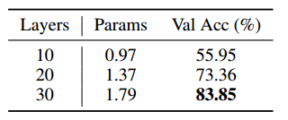

#### 零初始化注意力

我们提出的注意力机制对LLaMA-Adapter的早期训练稳定性和最终生成能力至关重要。如表4所示，它在验证集上贡献了显著的+43.08%的性能提升。

表4：零初始化注意力消融实验。蓝色部分突出显示了性能提升。

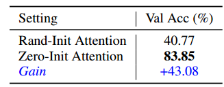

相比之下，随机初始化的基准仅达到40.77%的准确率，几乎与'Random Choice'（见表2的第一行）相同。这种比较证明了**零初始化注意力在我们的方法中的决定性作用**。在图7中，我们绘制了带有零初始化和不带零初始化的损失曲线，其中'zero-init attention'的收敛速度更快，并达到了比'rand-init attention'更低的损失界限。

图7：带有（蓝色）和不带（橙色）零初始化注意力的损失曲线。

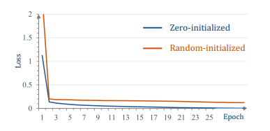

#### 对过拟合的鲁棒性

由于大型语言模型的微调数据通常比预训练数据规模小得多，研究人员必须小心调整一组超参数以避免过拟合。在表6中，我们展示了我们的LLaMA-Adapter相对于过拟合问题是相对稳健的。与[46]中的结论类似，即使我们的模型已经过拟合了微调数据，例如，验证损失从15个时期的0.136略微变化到60个时期的0.282，验证准确率仍在增加，例如，从82.08%到83.94%。这是因为LLaMA-Adapter保持了预训练的LLaMA 7B模型冻结，并只学习了一些参数较少的轻量级适配器。

表6：对过拟合的鲁棒性。我们比较了LLaMA-Adapter在不同训练时期的训练损失、验证损失和验证准确度。

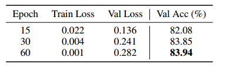

### 对其他大型模型的零初始化注意力

#### 设置

对于图像分类，我们对在监督ImageNet-21k [14]数据集上预训练的ViT-B/16 [16]进行微调。我们采用VTAB-1k [67]进行评估，这是一个包含19个不同视觉任务的集合，并根据图像领域分为三组：自然、专业和结构化。对于抽取式问题回答，我们遵循P-tuning v2 (PT2) [38]来微调RoBERTalarge [40]模型，用于SQuAD [54] v1.1和v2.0基准。我们报告了在开发集上的精确匹配（EM）和F1得分。关于命名实体识别（NER）和语义角色标注（SRL）任务的评估，我们将其推迟到附录材料中进行。

#### 性能

我们在表7和表8中展示了对ViT和RoBERTa进行微调的结果。对于三个数据集组，包括各种图像分布，例如自然图像、医疗图像和卫星图像，我们的方法相对于VPT [24]提高了+3.26%、+2.00%和+1.77%。在SQuAD v1.1和v2.0的开发集上，零初始化注意力可以提升P-tuning v2不同幅度，表明了强大的语言理解能力。这证明了与现有微调方法相比，我们在传统的视觉和语言任务上具有卓越性。

表7：使用ViTB/16 [16]在VTAB-1k [67]上进行视觉模型微调。我们报告了三个任务组的平均准确率（%）。

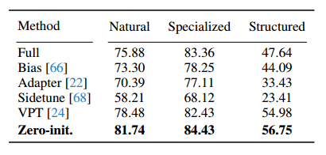

表8：使用RoBERTalarge [40]在SQuAD [54]上进行语言模型微调。*表示我们复现的P-Tuning v2 [38]的结果。

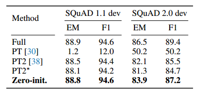

## 结论

在本论文中，**我们提出了LLaMA-Adapter，这是一种用于训练指令跟随模型的高效适配方法。我们的方法仅使用1.2百万个参数和一小时的训练时间，相对于拥有7B参数的Alpaca，能够高效地对LLaMA进行微调**。为了获得更好的训练稳定性和最终性能，我们引入了具有门控机制的零初始化注意力，它能够自适应地整合指令信号，同时保留了LLaMA中的预训练知识。LLaMA-Adapter还可以推广到图像条件下进行多模态推理，实现了在ScienceQA和COCO Caption基准上的竞争性结果。在传统的视觉和语言任务上，我们的零初始化注意力也取得了令人满意的微调性能，这表明了强大的泛化能力。局限性：由于我们的多模态变体呈现出一种通用的范例，用于整合外部语义，我们将进一步扩展LLaMA-Adapter，使其成为一个统一的多模态框架，可以根据各种指令，如视频、音频和点云来进行条件化。我们不预见提出的工作会对社会产生负面影响。