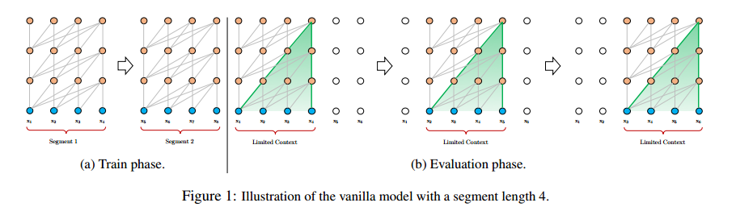
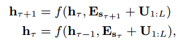
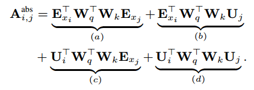
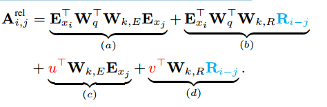
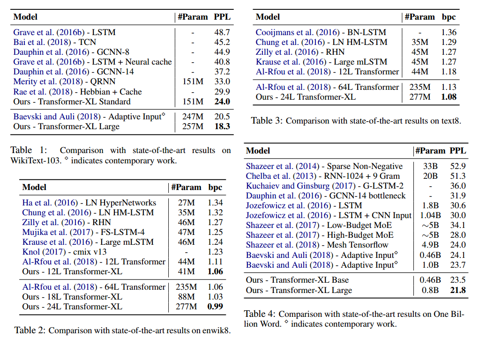

# 1-Transformer-XL-Attention Language Models Beyond a Fixed-Length Context

论文链接：https://arxiv.org/abs/1901.02860

开源代码：https://github.com/kimiyoung/transformer-xl

本文提出了一个新的神经架构 Transformer XL，在不破坏时间连续性下实现超过固定长度学习依赖性，由分段递归机制和新颖的位置编码组成，解决了上下文碎片化问题，在短序列和长序列都能获得更好的性能

## 一、引言

语言模型需要对长期依赖性进行建模。

AI-Rfou 等人设计了一组辅助损失来训练用于字符级语言建模的深度 Transformer 网络，但训练是在几百个字符固定长度片段上进行的，模型无法捕获超出预定义上下文长度的任何长期依赖关系，且模型不考虑句子的语义边界，缺乏预测前几个符号所必要的上下文信息，出现上下文碎片化问题。

本文提出的  Transformer-XL 架构可以解决固定长度上下文限制，在深度自注意力网络中引入了递归的概念。我们不再从头开始计算每个片段的隐藏状态，而是复用之前片段所获得的隐藏状态，以在段与段之间建立循环连接。信息可以通过循环连接传播，因此可以建立非常长期的依赖关系。本文引入了相对位置编码，以便在不造成时间混乱的情况下实现状态复用。

本文的主要技术贡献包括在纯自注意力模型中引入递归的概念，并推导出一套新的位置编码方案。

## 二、相关工作

语言模型领域取得重大进展，包括设计新的架构更好地编码上下文，改进正则和优化算法，加速 Softmax 计算，丰富输出分布族。

在通用序列模型中，如何捕获长期依赖性是一个长期存在的问题，很多工作是在 LSTM 框架基础上缓解消除梯度问题，本文的工作基于 Transformer 体系结构，表明语言任务受益于学习长期依赖性的能力。

## 三、模型

本文采用标准方法建模条件概率，具体而言，使用可训练神经网络将上下文 $\bf x_t$ 编码为固定大小的隐藏状态，将其与词嵌入相乘得到 logits，然后将 logits 输入到 Softmax 函数，在下一个 token 上产生分类概率分布

### 3.1 Vanilla Transformer 语言模型

Transformer 应用于语言建模的核心问题是如何训练 Transformer 将任意长的文本有效编码为固定的上下文表征。如果给定无限内存和计算，一个简单的解决方案是使用无条件 Transformer 解码器处理整个上下文序列，类似于一个前馈神经网络，然而在有限资源下通常不可行。

一种可行但粗略的方案是将整个语料库分割成较短的片段，只在每个片段中训练模型，忽略之前片段的所有上下文信息，这是 AI Rfou 等人采用的观点，称之为 vanilla 模型，如图  **1 (a)**  所示，在这种模式下，无论前向传输还是后向传输，信息流都不会跨段移动，但使用固定长度的上下文具有限制。首先，最大依赖长度是片段长度的上限；其次，简单将序列分块为固定长度将会导致上下文碎片的问题。

在评估阶段，每一步 Vanilla 模型都会采用与训练长度相同的片段，在最后一个位置进行预测，在下一步该片段向右移动一个位置而后从头处理新的片段，如图 **1(b)** 所示，确保每个预测利用了训练期间的最长可能的上下文，并缓解了训练过程中上下文碎片化的问题，然而这种评估非常浪费，我们将证明我们的架构能显著提高评估速度。

### 3.2 状态复用的分层递归

为了解决使用固定长度上下文所带来的局限性，本文在 Transformer 架构中引入递归机制。在训练过程中，为前一个片段计算的隐藏特征序列是固定的，被保存起来，以便模型处理下一个片段时作为扩展的内容进行复用，如图 **2(a)** 所示，这种额外输入允许网络利用历史信息，从而实现长期的依赖性建模，并避免上下文碎片化问题。

这种递归机制应用于语料库每两个连续的片段，本质是在隐藏状态下创建片段级的递归，实际上所利用的上下文远超这两个部分，考虑到递归依赖性 $\bf h_{\tau+1}^n$ 和 $\bf h_{\tau}^{n-1}$ 之间相差了一层，不同于传统 RNN 中的同层递归，最大可能的依赖长度随着层数和分段的长度线性增长，即 $O(N \times L)$，如图 2 中的阴影部分所示。

除了实现超长上下文及解决碎片化问题外，递归方案的另一个好处是大大加快了评估速度。在评估过程中，可以复用先前片段的表征，而不是像 vanilla 那样从头开始计算，在我们的 enwiki8 实验中，评估速度比 vanilla 模型快了 1800+ 倍。

最后，注意到递归方案不需要仅限于前一个片段，只要在 GPU 内存允许的情况下可以缓存尽可能多的先前片段。我们可以缓存预定义长度为 $M$ 的跨越多个片段的旧隐藏状态，放到内存中，与记忆增强神经网络相联系。在我们的实验中设置 $M$ 等于片段长度，该值在评估过程中多次增加。

### 3.3 相对位置编码

为了复用隐藏状态，还有一个关键挑战是如何保持位置信息的一致性。在标准的 Transformer 中，序列顺序信息是由一组位置编码提供，第 $i$ 行对应于第 $i$ 个绝对位置，还规定了建模的最大长度。Transformer 的实际输入是将单词嵌入与位置编码元素相加：

其中 $\bf E_{s_{\tau}}$ 表示词序列 $\bf s_{\tau}$ 的嵌入向量，其中 $\bf E_{s_{\tau}}$ 和 $\bf E_{s_{\tau+1}}$ 与相同的位置编码相关。因此，模型没有能力区分 $x_{\tau,j}$ 和 $x_{\tau+1,j}$ 之间的位置差，会导致性能的损失。

为了避免这种模式，基本思想是只对隐藏状态中的相对位置信息进行编码。原理上，位置编码为模型提供了关于如何收集信息的时间线索，出于同样的目的，可以将相同的信息注入到每一层的注意力得分中，而不是注入到初始嵌入中。以相对的方式定义时间偏置更加直观。例如，将查询向量添加到键向量时，不需要知道每一个键向量的绝对位置来识别片段的时间顺序，相反，只需要知道每个键向量 $k_{\tau,j}$ 与查询  $q_{\tau,i}$ 本身的相对距离 $i-j$ 即可。实际上，可以创建一组相对位置编码 $\bf R$，其中第 $i$ 行表示两个位置之间的相对距离，通过将相对距离动态注入到注意力得分中，查询向量可以很轻松区分 $x_{\tau,j}$ 和 $x_{\tau+1,j}$ 来自不同距离的表征，因为绝对位置可以从相对距离中恢复，同时不会丢失任何时间信息。

此前，相对编码的概念已经在机器翻译和音乐生成上进行了探索。这里提供了一个不同的推到，得出一种新的形式的相对位置编码，不仅与绝对位置编码有一对一的映射关系，而且经验上具有更好的泛化能力。首先，在标准 Transformer 中，同一片段内的查询 $q_i$ 和键向量 $k_j$ 之间的注意力得分可以分解为：

将下面四项进行重参数化：

- 第一个改变是将 (b) 和 (d) 键向量的绝对位置嵌入 $\bf U_j$ 替换为相对嵌入 $\bf R_{i-j}$，注意到，$\bf R$ 是没有可学习参数的正弦编码矩阵
- 第二个改变是引入了可学习参数 $u$ 取代 (c) 中的查询项 $\bf U_i^{T} \bf W_q^{T}$，这种情况下，所有查询位置的查询向量都是相同的，无论查询位置如何，对不同单词的注意力偏向都应保持不变。类似的，在 (d) 中也添加了同样的替换。
- 最后，有意分离两个权重矩阵 $\bf W_{k,E}$ 和 $\bf W_{k,R}$，用于分别产生基于内容的键向量和基于位置的键向量。

在新的参数化下，每个式子都具有其直观的含义：

- (a) 表征内容项
- (b) 捕获内容的位置偏差
- (c) 管理内容的全局偏差
- (d) 编码一个全局位置偏差

我们的相对位置嵌入 $\bf R$ 更适用于正弦公式，我们在某个特定长度的记忆单元上训练的模型可以在评估过程中自动推广到多个几倍长的记忆。

将我们提出的递归机制与相对位置嵌入相结合，最终得出了 Transformer-XL 结构。这里总结了具有单注意力头的 N 层 Transformer-XL 的计算过程，对于 $n=1$：

其中 $\omicron$ 表示两个隐藏向量的级联，其中 $\bf h_{\tau}^{0}$ 表示词嵌入序列 $\bf E_{s_{\tau}}$。 

## 四、实验结果

表 2 我们的模型与最先进结果的比较，12 层 Transformer-XL 获得了新的 SoTA 结果。为了观察是否可以通过增加模型大小来获得更好的性能，我们训练了模型大小 18 和 24 层的 Transformer-XL。训练期间的注意力长度为 784，评估期间的长度为 3800。得益于更好的模型架构，Transformer-XL 不需要任何辅助损失。

