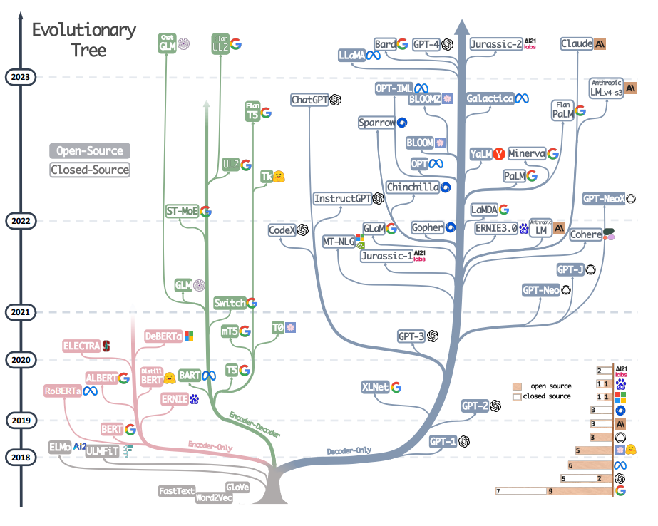
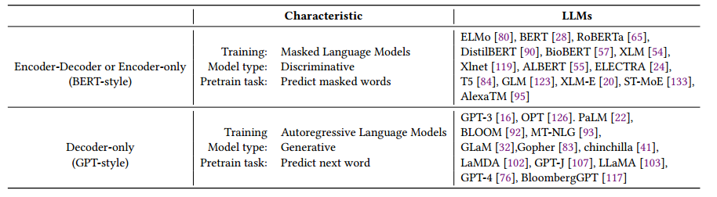
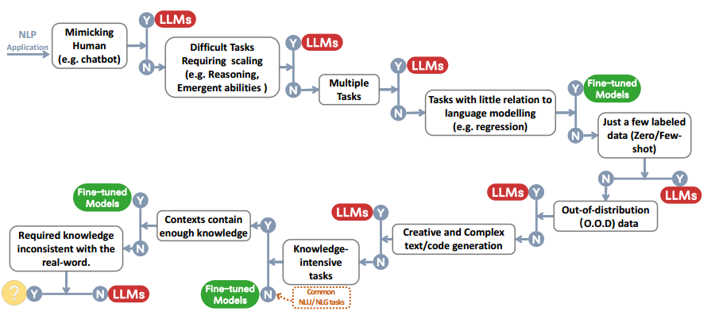

# 利用大型语言模型的实践应用：ChatGPT及其拓展的调查

论文链接：https://arxiv.org/abs/2304.13712

论文代码：https://github.com/mooler0410/llmspracticalguide

本文为从事大型语言模型（LLMs）在下游自然语言处理（NLP）任务中的从业者和终端用户提供了一份全面而实用的指南。我们从**模型**、**数据**和**下游任务**的角度提供了关于LLMs的使用的讨论和见解。首先，我们介绍并简要总结了当前的GPT和BERT风格的LLMs。然后，我们讨论了预训练数据、训练数据和测试数据的影响。最重要的是，我们详细讨论了在各种自然语言处理任务中使用和不使用大型语言模型的情况，如知识密集型任务、传统自然语言理解任务、**自然语言生成任务**、新兴能力以及针对特定任务的考虑。我们提供了各种使用案例和不使用案例，以说明LLMs在实际场景中的实际应用和局限性。我们还试图了解数据的重要性以及与每个NLP任务相关的特定挑战。此外，我们探讨了杂音偏见对LLMs的影响，并深入探讨了其他重要考虑因素，如效率、成本和延迟，以确保全面理解在实践中部署LLMs。这份全面的指南旨在为研究人员和从业者提供有关与LLMs合作的宝贵见解和最佳实践，从而在各种NLP任务中成功实施这些模型。我们定期更新的LLMs实用指南资源的策划列表可在https://github.com/Mooler0410/LLMsPracticalGuide找到。

## 引言

近年来，大型语言模型的迅速发展正在彻底改变自然语言处理领域 [12, 128, 131]。这些强大的模型在解决各种自然语言处理任务方面展现出巨大潜力，涵盖了从自然语言理解（NLU）到生成任务的各个领域，甚至为人工通用智能（AGI）铺平了道路。然而，要有效而高效地利用这些模型，需要对它们的能力和局限性以及涉及到的NLP数据和任务有实际的理解。

为了为从业者和终端用户提供指南，本工作侧重于在下游NLP任务中处理LLMs的实际方面。该指南旨在就在特定任务中选择或不选择LLMs提供实用建议，以及如何选择最合适的LLM，考虑到模型大小、计算需求和领域特定预训练模型的可用性等因素。**本工作从实际角度全面理解LLMs**，因此为从业者和终端用户提供了成功利用LLMs强大功能的实际知识。

我们的工作结构如下。首先，我们通过讨论最重要的模型，如GPT风格和BERT风格的架构，对LLMs进行了简要介绍。然后，我们深入探讨了从数据角度影响模型性能的关键因素，包括预训练数据、训练/调整数据和测试数据。最后而且最重要的是，我们深入研究了各种具体的NLP任务，深入剖析了LLMs在知识密集型任务、传统NLU任务和生成任务方面的适用性，以及这些模型具有的新兴能力和具有挑战性的实际情景。我们提供了详细的示例，以突显LLMs在实践中既成功的用例，又存在的局限性。

为了分析大型语言模型的能力，我们将它们与微调模型进行比较。截至目前，对于LLMs和微调模型，尚无普遍认可的定义。考虑到实际的实用性，在我们的文章中，对它们的定义提出如下建议：**LLMs是在大量数据集上预训练的庞大语言模型，没有在特定任务的数据上进行微调**；**微调模型通常是较小的语言模型，也经过预训练，然后在较小的、任务特定的数据集上进一步微调，以优化其在该任务上的性能**。

本工作总结了以下主要的LLMs使用实用指南：

- **自然语言理解：** 在面对分布范围之外的数据或只有很少的训练数据时，利用LLMs卓越的泛化能力。
- **自然语言生成：** 利用LLMs的能力为各种应用创建连贯、语境相关和高质量的文本。
- **知识密集型任务：** 利用LLMs中存储的丰富知识来处理需要领域专业知识或通用世界知识的任务。
- **推理能力：** 了解并利用LLMs的推理能力，以提高在各种背景下的决策和问题解决能力。

## 模型实用指南

本节对最先进的LLMs进行了简要介绍。这些模型在训练策略、模型架构和用例上存在差异。为了更清晰地了解LLM的现状，我们将它们分为两种类型：**编码器-解码器**或**仅编码器语言模型和仅解码器语言模型**。在图1中，我们展示了语言模型的详细演变过程。从这个演化树中，我们得出以下有趣的观察：

图1. 现代LLMs的演化树追踪了近年来语言模型的发展，并突出了一些最著名的模型。在同一分支上的模型关系更为密切。基于Transformer的模型以非灰色显示：仅解码器模型位于蓝色分支，仅编码器模型位于粉色分支，编码器-解码器模型位于绿色分支。模型在时间轴上的垂直位置表示它们的发布日期。开源模型由实心正方形表示，而封闭源代码模型由空心正方形表示。右下角的堆叠条形图显示了来自各种公司和机构的模型数量。

a) 仅解码器模型逐渐在LLMs的发展中占据主导地位。在LLMs早期发展阶段，仅解码器模型不如仅编码器和编码器-解码器模型流行。然而，自2021年以来，随着具有颠覆性影响的LLMs（如GPT-3）的引入，仅解码器模型经历了显著的增长。与此同时，在BERT带来的初始爆炸性增长之后，仅编码器模型逐渐开始消失。

b) OpenAI在LLM领域保持着当前和潜在的领导地位。其他公司和机构努力赶超OpenAI，开发出与GPT-3和当前的GPT-4可媲美的模型。这种领导地位可以归因于OpenAI对技术路径的坚定承诺，即使最初并未得到广泛认可。

c) Meta在开源LLMs方面作出了重大贡献并推动了LLMs的研究。在考虑对开源社区的贡献时，特别是与LLMs相关的贡献，Meta以其所有由Meta开发的LLMs都是开源的身份脱颖而出，成为最慷慨的商业公司之一。

d) LLMs呈现出对封闭源代码的倾向。在LLMs发展的早期阶段（2020年之前），大多数模型都是开源的。然而，随着GPT-3的推出，公司越来越倾向于关闭其模型，如PaLM、LaMDA和GPT-4。因此，学术研究人员更难进行关于LLM训练的实验。结果，基于API的研究可能会成为学术界的主要方法。

e) 编码器-解码器模型仍然具有潜力，因为这种架构仍在积极探索，大多数模型都是开源的。Google在开源编码器-解码器架构方面做出了重大贡献。然而，解码器模型的灵活性和多功能性似乎使得Google对这个方向的坚持变得不太有前途。

我们还在表1中简要总结了每种类型的特征和代表性LLMs。

表1：大型语言模型总结

### BERT风格的语言模型：编码器-解码器或仅编码器

随着自然语言数据的广泛可用和提出更好利用大数据集的**无监督训练范式**，这促使了对自然语言的无监督学习的兴趣。一个常见的方法是在考虑周围上下文的情况下预测句子中的屏蔽单词。这种训练范式被称为屏蔽语言模型（Masked Language Model，MLM）。这种训练允许模型更深入地理解单词之间的关系以及它们被使用的上下文。这些模型使用Transformer等技术在大量文本语料库上进行训练，在许多NLP任务中取得了最先进的结果，如情感分析和命名实体识别。屏蔽语言模型的显著例子包括BERT [28]、RoBERTa [65]和T5 [84]。由于它们在各种任务中取得成功，MLMs已经成为自然语言处理领域中的重要工具。

### GPT风格的语言模型：仅解码器

尽管语言模型在架构上通常是与任务无关的，但这些方法需要在特定下游任务的数据集上进行微调。研究人员发现，将语言模型扩大规模显著提高了few-shot，甚至是zero-shot的性能 [16]。**在实现更好的few-shot和zero-show性能方面最成功的模型是自回归语言模型**，它们通过生成给定前面单词的下一个单词来进行训练。这些模型已被广泛用于下游任务，如文本生成和问答。自回归语言模型的例子包括GPT-3 [16]、OPT [126]、PaLM [22]和BLOOM [92]。改变游戏规则的GPT-3首次通过提示和上下文学习展示了合理的few-/zero-shot性能，从而显示了自回归语言模型的优越性。还有一些针对特定任务进行优化的模型，如CodeX [2]用于代码生成，BloombergGPT [117]用于金融领域。最近的突破是ChatGPT，它专门对GPT-3进行了细化，以用于对话任务，从而在各种实际应用中实现了更具交互性、连贯性和上下文感知的对话。

## 数据实用指南

在本节中，我们将讨论数据在选择下游任务的适当模型中所起的关键作用。**数据对模型效果的影响始于预训练阶段，并持续到训练和推断阶段**。

>(1) 在面对分布范围之外的数据，如对抗性示例和领域转变等下游任务中，LLMs的泛化能力优于微调模型。
>
>(2) 在使用有限的带注释数据时，LLMs优于微调模型，而在有大量带注释数据可用时，根据具体任务要求，两者都可以是合理的选择。
>
>(3) 建议选择在与下游任务相似的数据领域上进行预训练的模型。

### 预训练数据

预训练数据在大型语言模型的发展中起着关键作用。作为LLMs显著能力 [5, 47] 的基础，预训练数据的质量、数量和多样性显著影响LLMs的性能 [124]。通常使用的预训练数据包括大量文本来源，包括书籍、文章和网站。这些数据经过精心策划，以确保全面反映人类知识、语言细微差异和文化视角。预训练数据的重要性在于它有能力向语言模型提供丰富的词汇知识、语法、句法和语义的理解，以及识别上下文并生成连贯响应的能力。预训练数据的多样性也在塑造模型性能方面起着至关重要的作用，而**选择LLMs主要取决于预训练数据的组成部分**。例如，PaLM [22] 和 BLOOM [92] 在多语言任务和拥有大量多语言预训练数据的机器翻译方面表现出色。此外，PaLM在问答任务中的性能得到了提升，其中包括大量社交媒体对话和Books语料库 [22]。同样，GPT-3.5（code-davinci-002）的代码执行和代码补全能力通过集成代码数据到其预训练数据集中而得到增强。简而言之，**在选择用于下游任务的LLMs时，建议选择在类似领域的数据上进行预训练的模型**。

### 微调数据

在部署用于下游任务的模型时，根据带注释数据的可用性，考虑三种主要场景是至关重要的：**零、少和丰富**。在本节中，我们对每种情景使用的适当模型提供简洁的概述。

**零注释数据**：在无法获得注释数据的情况下，采用零-shot设置中的LLMs被证明是最合适的方法。已经证明LLMs在零-shot方法上优于以前的方法 [120]。此外，由于语言模型参数保持不变，缺乏参数更新过程确保了避免灾难性遗忘 [49]。

**有限注释数据**：在这种情况下，少量示例直接并入LLMs的输入提示中，这被称为上下文学习，并且这些示例可以有效地指导LLMs推广到任务。如 [16] 所述，一次和少量示例的性能显著提升，甚至能够匹敌最先进的微调开放域模型的性能。LLMs的零/少量-shot能力可以通过扩大规模来进一步提高 [16]。另外，一些少量-shot学习方法被设计用于增强微调模型，如元学习 [56] 或迁移学习 [88]。然而，由于微调模型规模较小且容易过拟合，性能可能不如使用LLMs。

**丰富注释数据**：在某个特定任务的大量注释数据可用的情况下，可以考虑使用微调模型和LLMs。在大多数情况下，微调模型可以很好地适应数据。然而，LLMs可以用于满足某些约束，如隐私 [99]。在这种情况下，选择使用微调模型还是LLM是任务特定的，还取决于许多因素，包括期望的性能、计算资源和部署约束。

简而言之：LLMs在数据可用性方面更加灵活多样，而在有丰富注释数据的情况下可以考虑使用微调模型。

### 测试数据/用户数据

**在部署LLMs进行下游任务时，我们经常面临着由于测试/用户数据与训练数据之间的分布差异而产生的挑战**。这些差异可能涉及到领域转变 [132]、分布范围之外的变化 [31]，甚至对抗性示例 [82]。这些挑战显著阻碍了微调模型在实际应用中的有效性。它们适应于特定的分布，并且在面对分布范围之外的数据时泛化能力较差。然而，LLMs在面对这些情况时表现得相当出色，因为它们没有明确的拟合过程。而且，最近的进展进一步增强了语言模型在这方面的能力。从人类反馈中强化学习（RLHF）方法显著增强了LLMs的泛化能力 [77]。例如，InstructGPT在各种任务中展现了遵循各种指令的能力，偶尔还能遵循不同语言的指令，尽管这样的指令相对较少。类似地，ChatGPT在大多数对抗性和分布范围之外（OOD）的分类和翻译任务上表现出一致的优势 [109]。它在理解与对话相关的文本方面的优越性表现，使其在DDXPlus数据集 [101] 上取得了出色的OOD评估性能，该数据集是为医学诊断设计的。

## NLP 任务实用指南

在本节中，我们详细讨论了LLMs在各种下游自然语言处理任务中的使用情况和不适用情况，以及相应的模型能力。在图2中，我们将所有讨论总结成一个决策流程。这可以作为在面对任务时进行快速决策的指南。

Fig. 2. 选择LLMs或微调模型用于用户NLP应用的决策流程。决策流程帮助用户评估他们手头的下游NLP应用是否满足特定条件，并根据该评估确定LLMs或微调模型是否是他们应用的最合适选择。在图中的决策过程中，Y表示满足条件，N表示不满足条件。最后一个条件的Y的黄色圆圈表示在这种应用上没有模型表现良好。

### 传统 NLU 任务

传统的自然语言理解（NLU）任务是自然语言处理（NLP）中的一些基础任务，包括文本分类、命名实体识别（NER）、蕴涵预测等。其中许多任务旨在作为更大的人工智能系统中的中间步骤，例如，NER用于知识图谱构建。

>在传统的自然语言理解（NLU）任务中，通常微调模型比LLMs更好，但在需要强大的泛化能力时，LLMs也可以提供帮助。

#### 不适用案例

在大多数自然语言理解任务中，例如GLUE[106]和SuperGLUE[105]中的任务，如果这些任务具有丰富的、良好注释的数据，并且在测试集上包含非常少的分布范围之外的示例，那么微调模型仍然具有更好的性能。对于不同的任务和数据集，小型微调模型和LLMs之间的差距是不同的。

在**文本分类**中，在大多数数据集上，LLMs的性能略逊于微调模型。对于情感分析，例如在IMDB [69]和SST [94]上，微调模型和LLMs表现同样出色。对于毒性检测，这是另一个标志性的文本分类任务，差距要大得多。所有LLMs在这个任务上表现都不好，在CivilComments [13]上，即使最好的一个也只比随机猜测稍好 [59]。另一方面，大多数流行的微调模型可以获得更好的性能 [33]。而且Perspective API 3在检测毒性方面仍然是最好的之一。这个API由基于多语言BERT的模型驱动，该模型在公开可用的毒性数据上进行了调整，并使用了从该模型中提取的几个较小的单语言CNN。这可能是因为毒性是由语言表达中微妙的细微差异定义的，大型语言模型仅依靠提供的输入无法准确理解这个任务。

在一些其他任务中，性能差距的趋势也相似。对于**自然语言推理（NLI）任务**，在大多数数据集上，例如RTE [106]和SNLI [14]，微调模型的表现优于LLMs，而在一些数据上，例如CB [105]，LLMs已经获得了与微调模型相媲美的性能 [22]。对于问答（QA）任务，在SQuADv2 [86]、QuAC [21]和许多其他数据集上，微调模型具有更优越的性能，而在CoQA [87]上，LLMs的性能与微调模型相当 [22]。

在**信息检索（IR）任务**中，LLMs尚未被广泛利用。一个主要原因是IR任务从根本上与其他任务不同。没有自然的方式将数千个候选文本转换为LLMs所需的少量/零量表单。MS MARCO（常规/TREC）[73]上的现有评估结果显示，基于微调模型的方法具有更好的性能 [59]。在这个评估中，LLMs以一种非正统的方式对段落进行排名，这要求LLMs逐个为段落产生概率。

对于一些低级中间任务，这些任务并不是为了常规用户而是为了高级任务，例如**命名实体识别（NER）和依赖分析**，LLMs没有足够的结果，因为LLMs的当前评估主要集中在实际任务上。根据现有的评估结果，对于NER任务，CoNLL03 [89]对LLMs仍然是一个挑战 [81]，微调模型的性能大约是LLMs的两倍。这些中间任务可能很快就会消失，因为LLMs可以在没有这些中间任务的情况下接管高级任务（例如编码任务的依赖解析；某些文本生成任务的NER）。

简而言之，对于大多数传统的NLU任务，就基准数据集和计算成本的性能而言，微调模型是更好的选择。LLMs的规模通常是微调模型的10倍甚至100倍。LLMs在某些任务上性能较差的一个可能原因是指令/提示的设计。将类似IR和句子标注的任务的输入转换为少量/零短指令形式并不是一件简单的事。未来可能会有更好的方法来使语言模型适应传统的NLP任务。另一方面，微调模型的能力上限尚未达到，一些方法如FLAN-tuning [67]可以进一步提升NLU任务的性能。另一个有趣的发现是，在NLU任务上，经过微调的掩码语言模型，如T5[85]，在相同规模下比大多数自回归语言模型更好，而一些最新结果暗示着通过扩展[22]可以弥合这个差距。

#### 适用案例

其中一个代表性的任务是**杂类文本分类[59]**。与情感分析等经典领域特定的文本分类任务相比，杂类文本分类涉及一系列可能与彼此之间没有明确或强烈关系的主题和类别。它更接近实际情况，难以为微调模型格式化使用。另一个是Adversarial NLI (ANLI)[74]。这是一个由对抗挖掘的自然语言推理问题组成的困难数据集，分为三轮(R1、R2和R3)。LLMs在ANLI上表现出色，特别是在R3和R2上。这两个例子展示了**LLMs在传统NLP任务中在面对分布之外和稀疏注释数据上表现出色的卓越能力**，超过了微调模型。我们在上面的3.3节中讨论了这一点。

### 生成式任务

自然语言生成广泛涵盖两大主要类别的任务，其目标是创建连贯、有意义和与上下文相适应的符号序列。第一类任务侧重于将输入文本转换为新的符号序列，如段落摘要和机器翻译等任务。第二类任务是“开放式”生成，旨在从头开始生成文本或符号，以准确匹配输入描述，例如编写电子邮件、撰写新闻文章、创作虚构故事和编写代码。

#### 适用案例

生成任务要求模型对输入内容或要求有全面的理解，并具有一定水平的创造力。这正是LLMs擅长的领域。

对于**摘要任务**，尽管在传统的自动评估指标（如ROUGE [60]）下，LLMs与微调模型相比并没有明显的优势，但人工评估结果表明，人们倾向于更喜欢LLMs生成的结果[38, 127]，而不是微调模型的结果。例如，在CNN/DailyMail [71]和XSUM [72]上，像Brio [66]和Pegasus [125]这样的微调模型在ROUGE方面的性能要比任何LLMs都好得多，但LLMs像OPT [126]在人工评估中的表现要好得多，考虑到忠实度、连贯性和相关性等方面[127]。这证明了LLMs在摘要任务中的优越性。另一方面，这也意味着当前的摘要基准可能不包含高质量的摘要，或者自动评估指标不适用于摘要的评估。

在**机器翻译（MT）领域**，LLMs可以进行胜任的翻译，尽管考虑到一些自动指标如BLEU[78]时，平均性能略逊于一些商业翻译工具[45]。LLMs在将一些低资源语言文本翻译成英文方面表现尤为出色，例如在WMT’16的罗马尼亚语-英语翻译中[11]，零样本或少样本的LLMs可以胜过SOTA微调模型[22]。这主要是因为英语资源占据了预训练数据的主要部分。BLOOM [92]在更多的多语言数据上进行了预训练，导致在富资源和低资源翻译中都有更好的翻译质量。另一个有趣的发现是，BLOOM在罗曼语系语言之间实现了良好的翻译质量，甚至对加利西亚语的翻译也是如此，而加利西亚语并未包含在预训练数据中。一个合理的解释是，同一语言组中一些语言的文本可以帮助LLMs更多地从相似性中学习。如果更多的多语言文本可以添加到预训练数据中，翻译能力可能会进一步提高。

此外，LLMs在**开放式生成**方面表现出色。一个例子是，LLMs生成的新闻文章几乎无法被人类与真实新闻文章区分开[16]。LLMs在代码合成方面也表现出色。无论是文本代码生成，如HumanEval [18]和MBPP [7]，还是代码修复，如DeepFix [39]，LLMs都能表现得相当不错。GPT-4甚至可以通过Leetcode中的25%问题，这对大多数人类编码者来说并不是微不足道的[76]。通过在更多的代码数据上进行训练，LLMs的编码能力可以进一步提高[22]。在执行这些任务时，LLMs生成的代码应该经过仔细测试，以找出任何微妙的错误，这是将LLMs应用于代码合成的主要挑战之一。

#### 不适用案例

在大多数丰富资源翻译和极低资源翻译任务中，微调模型，如DeltaLM+Zcode [118]，仍然表现最佳。在**丰富资源的机器翻译**中，微调模型略优于LLMs [22, 92]。在**极低资源的机器翻译**中，如英语-哈萨克语翻译，微调模型明显优于LLMs。

### 知识密集型任务

知识密集型的自然语言处理（NLP）任务是指一类对背景知识、领域专业知识或一般现实世界知识具有强烈依赖的任务。这些任务超越了简单的模式识别或语法分析，它们高度依赖于对特定实体、事件以及我们现实世界常识的记忆和恰当利用。

>(1) 由于其庞大的现实世界知识，LLMs 在知识密集型任务上表现出色。
>(2) 当任务的知识要求不匹配它们学到的知识，或者当它们面对只需要上下文知识的任务时，LLMs 会遇到困难，而在这种情况下，微调模型可以与LLMs 一样有效。

#### 适用案例

总体而言，拥有数十亿训练标记和参数的LLMs比微调模型具有更多的现实世界知识。

**封闭式问答任务**要求模型在没有任何外部信息的情况下回答有关事实知识的给定问题。这确实需要模型对真实世界的知识进行记忆。LLMs在几乎所有数据集上表现更好，如在NaturalQuestions [52]、WebQuestions [9]和TriviaQA [46]上。在TriviaQA上，即使是零样本的LLMs也要好得多 [22]。

大规模**多任务语言理解**（MMLU）[40]也是高度知识密集型的。它包含涵盖57个不同主题的多选题，需要模型的通用知识。即使对LLMs来说，这也是相当具有挑战性的，尽管新发布的GPT-4 [76]在英语上的准确率达到了令人满意的86.5%，明显优于现有模型。

此外，Big-bench[96]中的一些任务旨在探测LLMs并推测它们的未来能力，这些任务严重依赖于对**真实世界知识的记忆**。在这些任务中，一些LLMs的表现优于人类的平均水平，甚至可与最佳人类表现相媲美。例如，任务Hindu_knowledge要求模型提供有关印度教神话的事实，Periodic Elements需要从周期表中预测元素名称，而Physics通过询问模型解决给定物理问题所需的公式来测试模型的物理知识。

#### 不适用案例

有一些其他任务需要与LLMs学到的知识不同的知识。这些任务所需的知识不是LLMs在现实世界学到的知识。在这类任务中，LLMs并没有明显的优势。

有些任务只需要模型捕捉上下文中所包含的知识。来自输入的上下文中的知识足以让模型进行预测。对于这些任务，小型微调模型可以表现得相当不错。其中一种任务是**机器阅读理解**（MRC）。MRC任务提供了几段文字，并要求模型根据这些段落预测问题的答案。我们在前面的部分已经讨论过MRC，因为它也是传统NLU任务的一部分。

另一种情况是LLMs关于**现实世界的知识对任务无用**，甚至所需的知识与现实世界相悖。因此，LLMs在这类任务上表现不佳。在某些情况下，不一致的知识甚至可能使LLMs比随机猜测还要糟糕。例如，在Big-Bench中，Mnist ascii 任务要求模型告诉由ASCII艺术表示的数字。这项任务所需的能力与现实世界的知识无关。此外，在Inverse Scaling Phenomenon竞赛[70]中，重新定义数学的任务重新定义了一个常见符号，并要求模型在原始含义和重新定义的含义之间进行选择。它所需的能力与LLMs的知识相反，因此LLMs甚至比随机猜测更糟糕。

作为LLMs中现实世界知识的替代方案，允许使用**额外的知识**，因此模型可以通过检索增强获得足够的任务知识。检索增强的基本思想是在进行预测之前添加一个额外的信息检索步骤，在这一步中，将从大型语料库中检索与任务相关的一些有用文本。然后，模型将基于输入上下文和检索到的文本进行预测。通过检索到的额外信息，闭书任务可以变成“开书”。在这种情况下，由于所需的知识可以通过检索获得，微调模型在较小的规模下表现相当不错。例如，在NaturalQuestions [52]上，使用额外语料库的检索增强模型[44, 48]比任何其他方法都要好得多。

### 缩放能力

LLMs（例如参数、训练计算等）的规模化可以极大地增强预训练语言模型的性能。随着模型规模的增大，模型在一系列任务中通常变得更加强大。从一些指标中可以看出，**性能与模型规模呈现出幂律关系**。例如，用于衡量语言建模性能的交叉熵损失随着模型规模的指数增长呈线性下降，这也被称为“规模定律”[41, 47]。对于一些关键的能力，如推理，通过扩大模型规模，这些能力逐渐从非常低的状态转变为可用状态，甚至接近人类的能力。在本节中，我们总览了LLMs的能力和行为在规模方面的使用情况。

>（1）随着模型规模的指数增长，LLMs特别擅长进行算术推理和常识推理。
>
>（2）随着LLMs的规模扩大，出现了一些意外的能力，比如在词语处理和逻辑能力方面的能力。
>
>（3）在许多情况下，性能并不会随着规模的增加而稳步提高，这是因为对于大型语言模型规模扩大时其能力如何变化的理解还存在限制。

#### 推理适用案例

推理涉及理解信息、推断和决策，是人类智能的基本方面之一。这对于自然语言处理是一个具有挑战性的任务。许多现有的推理任务可以归类为常识推理和算术推理。

**算术推理/问题解决**。LLMs 的算术推理能力在模型规模扩大的情况下得到了很大的提升。对于 GPT-3，只有当参数数量超过 13B 时，其进行两位数加法的能力才变得显而易见 [16]。测试算术推理的任务对人类来说是微不足道的，旨在挑战将自然语言转化为数学符号和进行多步推理的能力。在 GSM8k [26]、SVAMP [79] 和 AQuA [61] 上，作为通用模型的LLMs 在与大多数具有特定任务设计的方法竞争中表现出色。而 GPT-4 超过了任何其他方法 [76]，甚至超过了一些专门针对算术问题进行调整的庞大模型 [104]。然而，值得注意的是，如果没有外部工具的干预，LLMs 在执行基本计算时可能会偶尔出错，尽管链式思考 (CoT) 提示 [115] 可以显著提高LLMs在计算方面的能力。

**常识推理**。常识推理不仅要求LLMs记住事实知识，还要求LLMs对这些事实进行多步推理。随着模型规模的增长，常识推理逐渐增强。与精调模型相比，LLMs 在大多数数据集上仍然具有优势，例如 StrategyQA [36] 和 ARC-C [25]。特别是在 ARC-C 上，该数据集包含从三年级到九年级的科学考试中的难题，GPT-4 的性能已经接近 100%（96.3%）[76]。

#### 新兴能力的用例

模型的扩展还赋予了模型一些前所未有的、超越幂律规律的奇妙能力。这些能力被称为“新兴能力”。正如[113]所定义的，LLMs的新兴能力是指在小规模模型中不存在但在大规模模型中存在的能力。这意味着这种能力不能通过对小规模模型性能改进的外推来预测，一旦规模超过一定范围，模型就会在某些任务上突然取得良好的表现。新兴能力通常是不可预测和令人惊讶的，导致任务随机或意外地出现。我们将具体的LLMs新兴能力示例进行了审查，并将它们提供为决定是否利用LLMs新兴能力的重要参考。

**处理词汇操作**是一种典型的新兴能力。它指的是学习符号操作的能力，例如颠倒单词[16]，其中模型被给定一个拼写颠倒的单词，并且必须输出原始单词。例如，GPT-3 [16]展示了在单词排序和单词解谜任务方面的新兴能力。PaLM [22]在ASCII单词识别和排比任务上表现出新兴能力。随着语言模型的规模增加，语言模型的逻辑能力往往会显现出来，如逻辑推理、逻辑序列和逻辑网格谜题。此外，其他任务，如高级编码（例如自动调试、代码行描述）和概念理解（例如新概念、简单的图灵概念），也是大型语言模型新兴能力的用例。

#### 不适用案例和理解

尽管在大多数情况下，如上所讨论，更大的模型会带来更好的性能，但在选择适当的模型时仍有许多例外情况需要考虑。

在某些任务上，随着LLMs的规模增加，性能开始下降，例如**Redefine-math**：测试语言模型是否能够处理当常见符号被重新定义为其他含义时的情况；**Intothe-unknown**：要求模型选择哪个信息片段有助于回答问题；**Memo-trap**：要求LM以一个以名言开始但以不同方式结束的方式写短语。这也被称为反比例缩放现象。在LLMs的规模扩大的情况下观察到的另一个有趣现象被称为U形现象[114]。正如其名字所示，这种现象指的是随着LLM大小的增加，它们在某些任务上的性能最初会提高，然后开始下降，最终再次提高，例如在：Hindsight-neglect：测试语言模型是否能够评估是否值得根据其期望值进行下注；**NegationQA**：该任务使用现有的多项选择数据集，并对每个问题的一部分进行否定，以查看语言模型是否对否定敏感；**Quote-repetition**：它要求模型重复回复提示中给出的句子，并提供了少量的示例来帮助识别任务。因此，应注意性能下降的风险，如果任务类似于我们刚刚讨论的任务，应仔细考虑是否使用庞大的LLMs。

深入了解LLMs中的新兴能力、反比例缩放现象和U形现象对于推动这一领域的研究至关重要。从某种意义上说，U形现象表明小规模模型和大规模模型使用不同的内部机制进行预测。从这个角度来看，U形现象可以被看作是由足够大的模型中的一些新兴能力导致的反比例缩放现象的转变[114]。GPT-4 [76]在某些情况下展示了反比例缩放现象的逆转，例如在一个名为Hindsight Neglect的任务中。关于LLMs在扩展过程中的这些行为的解释仍然是一个悬而未决的问题。**已经提出了几种假设。对于新兴能力，一种解释是任务可能有多个关键步骤，只有在LLM足够大以处理每个步骤时，它才能处理这个任务**，另一种解释侧重于评估**指标的粒度**[113]。对于反比例缩放现象和U形现象，解释主要集中在模型过度依赖其先验信息而不是输入提示、有效但具有误导性的少量示例，以及在困难任务中包含了分散注意力的更容易的任务[114]。

### 杂项任务

本节探讨了在先前的讨论中未涉及的各种任务，以更好地理解LLMs的优势和劣势。

>(1) 在远离LLMs预训练目标和数据的任务中，精调模型或指定模型仍然有其用武之地。
>
>(2) LLMs在模拟人类、数据标注和生成方面表现出色。它们还可用于NLP任务的质量评估，并具有可解释性等优势。

#### 不适用案例

LLMs在一些任务上面临挑战，这主要归因于目标和训练数据的差异。

尽管LLMs在各种自然语言处理任务中取得了显著成功，但它们在**回归任务**中的表现则相对较差。以ChatGPT在GLUE STS-B数据集上的表现为例，该数据集是一个评估句子相似性的回归任务，其性能不如精调的RoBERTa模型[130]。回归任务通常涉及**预测连续值而非离散标签**，这为LLMs带来了独特的挑战。其表现不佳的一个主要原因是语言建模目标与回归任务目标之间的固有差异。LLMs的设计目的是预测序列中的下一个词或生成连贯的文本，其预训练重点是捕捉语言模式和关系。因此，它们的内部表示可能不适合建模连续的数值输出。此外，LLMs主要在文本数据上进行训练，专注于捕捉自然语言处理的复杂性。因此，它们在多模态数据上的表现，其中涉及处理文本、图像、音频、视频、动作和机器人等多种数据类型，仍然大部分未经深入探讨。而精调的多模态模型，如BEiT[110]和PaLI[19]，在视觉问答（VQA）和图像字幕等许多任务上仍然占据主导地位。然而，最近推出的GPT-4[76]已经在多模态融合方面迈出了一步，但其能力尚缺乏详细的评估。

#### 适用案例

LLMs在某些任务上表现得特别出色。

LLMs非常擅长**模仿人类，充当聊天机器人**，并执行各种任务。由LLMs支持的ChatGPT以其一致性、可靠性、信息量和与人类进行多次对话时的稳健性而令人惊讶。人类反馈过程在获取这些能力方面起到了重要作用，LLMs既可以充当良好的注释者，又可以作为数据增强的数据生成器，例如在[27, 29, 99, 121, 122]中。

一些LLMs在某些任务上已被发现与人类注释者一样优秀[37]。从GPT3.5（text-davinci-003）收集的文本已被用作类似人类的指导性演示，用于训练其他语言模型[100]。

LLMs还可以用于对一些**自然语言生成**（NLG）任务进行质量评估，例如摘要和翻译。在摘要任务中，GPT-4作为评估器的相关性与人类的相关性较其他方法要高出很大幅度[64]。一些基于LLMs的其他评估器[34, 50, 64, 108]在更多NLG任务中也展现出良好的人类一致性，尤其是与传统的自动评估指标相比。但LLM评估器可能对LLM生成的文本存在偏见[64]。

此外，正如我们上面讨论的，LLMs的一些能力除了性能改进外还带来额外的奖励，比如解释性。LLMs的CoT推理能力可以展示LLM如何达到预测，这是对单个实例的良好解释，同时也提高了性能。

### 真实世界任务

在本节的最后一部分，我们想讨论LLMs和精调模型在现实世界中的使用情况。我们宽泛地使用术语“任务”，因为现实场景通常缺乏类似学术界那样明确定义的规范。许多对模型的请求甚至不能被视为自然语言处理任务。从三个角度来看，模型在现实世界中面临着挑战：

- **嘈杂/非结构化的输入**。现实世界的输入来自真实世界的非专业人士。他们对如何与模型交互知之甚少，甚至可能无法流利地使用文本。因此，现实世界的输入数据可能混乱，包含有拼写错误、口头语和混合语言，与用于预训练或精调的规范数据不同。
- **学术界未形式化的任务**。在现实世界的场景中，学术界经常无法明确定义任务，任务也比学术界的任务更加多样化。用户经常提出不容易归入预定义类别的查询或请求，有时一个查询中可能包含多个任务。
- **遵循用户的指令**。用户的请求可能包含多个隐含意图（例如，对输出格式的具体要求），或者他们想要的预测可能在没有后续问题的情况下不够清晰。模型需要理解用户意图，并提供与这些意图一致的输出。

实质上，现实世界中的这些挑战源于用户的请求明显偏离为特定任务设计的任何NLP数据集的分布。公共NLP数据集不能反映模型的实际使用方式[77]。

>相对于精调模型，LLMs更适合处理现实世界的场景。然而，评估模型在实际应用中的有效性仍然是一个未解决的问题。

应对这样的现实场景需要处理模糊性、理解上下文并处理嘈杂的输入。与精调模型相比，LLMs更适合这样做，因为它们在多样化的数据集上进行了训练，涵盖了各种写作风格、语言和领域。此外，LLMs展现了生成开放域响应的强大能力，使它们非常适合这些场景。另一方面，精调模型通常定制为特定的、明确定义的任务，可能难以适应新的或意外的用户请求。它们严重依赖于清晰的目标和规范的训练数据，以指定模型应该学习遵循的指令类型。由于其更窄的关注点和结构化数据，精调模型可能会在嘈杂的输入方面遇到困难。精调模型通常需要额外的系统作为助手，以处理非结构化的上下文、确定可能的意图，并相应地改进模型的响应。

此外，一些机制，如指令调整和人类对齐调整，进一步增强了LLMs更好地理解和遵循用户指令的能力。这些方法提高了模型生成有帮助、无害和真实响应的能力，同时保持了一致性和连贯性。虽然这两种方法都可以使LLMs更好地推广到看不见的任务和指令，但注意到在人类对齐调整的情况下，标注人员更喜欢调整为人类对齐的模型，而不是使用公共NLP任务的指令，例如FLAN和T0。原因可能与精调模型的劣势相似：公共NLP任务/数据集旨在进行简单和自动评估，它们只能涵盖实际使用的一小部分。

在涉及到现实场景时，一个主要问题是如何评估模型的好坏。在没有任何形式化的任务或指标的情况下，评估模型效果只能依赖于人类标注员的反馈。考虑到人类评估的复杂性和成本，目前尚没有关于精调模型和LLMs的大规模系统比较。然而，LLMs（例如chatGPT）的巨大成功和普及在一定程度上证实了LLMs的优越性。

## 结论和未来的挑战

近期大型语言模型的进展正在彻底改革自然语言处理领域。有效使用LLMs需要了解它们在各种NLP任务中的能力和局限性。本文提供了一个实用指南，指导如何在下游NLP任务中使用LLMs。我们首先讨论了像GPT风格和BERT风格的显著模型以及影响它们性能的因素。然后，我们探讨了LLMs在下游任务中的应用，包括知识密集型任务、NLU和NLG任务，并提供了成功和局限性的具体示例。这一实用指南为LLMs的使用提供了深刻见解，并提供了在NLP任务中利用它们的最佳实践。我们希望这将使研究人员和从业者能够充分发挥它们的潜力，并推动语言技术的创新。

以下，我们将探讨LLMs未来面临的挑战：

- **在真实世界的“数据集”上评估提出的模型**。尽管现有的深度学习模型主要是在标准的学术数据集上进行评估的，比如ImageNet，这在深度学习的发展中达到了里程碑。然而，标准的学术数据集的局限性不能完全反映真实世界的性能。随着模型的进步，对它们进行更多样化、复杂和现实的数据评估，以反映真实世界的需求，变得至关重要。在真实世界的“数据集”上评估模型，除了学术数据集之外，将更严格地测试它们的能力，同时更好地了解它们在实际应用中的有效性。这确保了模型能够解决真实世界的挑战并提供实用的解决方案。
- **模型对齐**。确保越来越强大和自主的模型与人类的价值观和优先事项保持一致至关重要。必须开发方法来确保这些模型按预期行为，不会优化不良的结果。在模型开发过程的早期阶段集成对齐技术至关重要。模型的透明度和可解释性也是评估和确保对齐的重要因素。此外，展望未来，一个更为艰巨的挑战正在逼近：对齐超级智能系统。虽然这项任务目前超出了我们的需求，但考虑并为对齐这些先进系统可能带来的潜在影响做好准备至关重要，因为它们可能涉及独特的复杂性和伦理关切 [8, 15]。
- **安全对齐**。尽管讨论人工智能存在的风险是重要的，但需要具体的研究来确保先进人工智能的安全发展。这包括解释性技术、可扩展的监督和治理，以及对模型属性进行正式验证的技术。安全性不应被视为附加组件，而应被视为模型构建过程的一个组成部分。
- **扩展性能**。难以预测在模型规模和复杂性大幅增加时模型性能将如何变化。开发更好地预测模型性能的方法，尤其是在扩大规模或开发新架构时，将允许更有效地利用资源并加速进展。一些可能性包括：训练一个较小的“种子”模型并推断其增长，模拟规模增加或模型调整的影响，以及在不同规模上对模型的迭代进行基准测试以建立扩展规律。这些方法可以在构建模型之前提供对模型性能的洞察。

