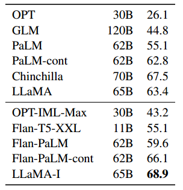

# LLaMA: 开放而高效的基础语言模型

论文链接：https://arxiv.org/abs/2302.13971

我们介绍了LLaMA，一个参数范围从7B到65B的基础语言模型集合。我们在数万亿的标记上训练我们的模型，并展示了可以仅使用公开可用的数据集进行训练，而无需使用专有且无法访问的数据集就能训练出最先进的模型。特别是，LLaMA-13B在大多数基准测试中表现优于GPT-3（175B），而LLaMA65B在竞争中与最佳模型Chinchilla-70B和PaLM-540B相媲美。我们将所有模型发布给研究社区。

## 引言

大规模语言模型（LLMs）在大规模文本语料库上训练已经展现出它们能够根据文本指令或少量示例执行新任务的能力（Brown等，2020）。这种少样本性质首次在将模型扩大到足够规模时出现（Kaplan等，2020），从而引发了一系列关注进一步扩大这些模型的工作（Chowdhery等，2022；Rae等，2021）。**这些努力基于这样的假设：更多的参数将导致更好的性能**。然而，Hoffmann等人（2022）的最新研究表明，在给定的计算预算下，最佳性能并非由最大的模型实现，而是由在更多数据上训练的较小模型实现。

Hoffmann等人（2022）的缩放定律的目标是确定在特定的训练计算预算下，如何最好地调整数据集和模型大小。然而，这个目标忽视了推理预算，在大规模提供语言模型时推理预算变得至关重要。在这种情境下，鉴于目标性能水平，优选的模型不是训练最快的模型，而是在推理时最快的模型，**尽管训练一个大型模型以达到一定性能水平可能更便宜，但训练时间更长的较小模型最终在推理时将更为经济**。例如，尽管Hoffmann等人（2022）建议在200B标记上训练一个10B模型，我们发现一个7B模型在训练了1T标记后性能仍然持续提升。

**本工作的重点是训练一系列在各种推理预算下实现最佳性能的语言模型，通过对比通常使用的标记更多的标记进行训练**。由此产生的模型，称为LLaMA，参数范围从7B到65B，性能与最佳现有的大规模语言模型相媲美。例如，LLaMA-13B在大多数基准测试中表现优于GPT-3，尽管体积小了10倍。我们相信这个模型将有助于使大规模语言模型的访问和研究更加民主化，因为它可以在单个GPU上运行。在规模的高端，我们的65B参数模型也与最佳的大规模语言模型如Chinchilla或PaLM-540B相媲美。

与Chinchilla、PaLM或GPT-3不同，**我们只使用公开可用的数据**，使我们的工作与开源兼容，而大多数现有模型依赖的数据要么不公开，要么没有文档记录（例如“Books – 2TB”或“社交媒体对话”）。存在一些例外，尤其是OPT（Zhang等，2022）、GPT-NeoX（Black等，2022）、BLOOM（Scao等，2022）和GLM（Zeng等，2022），但没有一个能与PaLM-62B或Chinchilla竞争。

在本文的其余部分，我们概述了我们对 Transformer 架构（Vaswani等，2017）所做修改以及我们的训练方法。然后，我们报告了我们模型的性能，并在一组标准基准上与其他LLMs进行比较。最后，我们揭示了我们模型中编码的一些偏见和毒性，使用了一些最新的来自负责任人工智能社区的基准测试。

## 方法

我们的训练方法类似于先前工作中描述的方法（Brown等，2020；Chowdhery等，2022），并受到了Chinchilla缩放定律（Hoffmann等，2022）的启发。我们使用标准优化器在大量文本数据上训练大型 Transformer。

### 预训练数据

我们的训练数据集是表1中报告的几个来源的混合，涵盖了各种领域。在很大程度上，我们重复使用了已经用于训练其他LLMs的数据来源，但限制只使用公开可用且与开源兼容的数据。这导致了以下数据混合以及它们在训练集中所占的百分比：

表1：预训练数据。用于预训练的数据混合，对于每个子集，我们列出了在使用1.4T标记进行训练时在该子集上执行的采样比例、epoch 数以及磁盘大小。使用1T标记进行的预训练运行具有相同的采样比例。

**英语CommonCrawl [67%]**。我们对五个CommonCrawl转储进行预处理，时间跨度从2017年到2020年，使用CCNet管道（Wenzek等，2020）。这个过程在行级别对数据进行去重，使用fastText线性分类器进行语言识别以去除非英语页面，并使用ngram语言模型过滤低质量内容。此外，我们训练了一个线性模型，用于将页面分类为Wikipedia中的引用页面与随机抽样的页面，并丢弃未被分类为引用的页面。

**C4 [15%]**。在探索性实验中，我们观察到使用多样化的预处理CommonCrawl数据集可以提高性能。因此，我们将公开可用的C4数据集（Raffel等，2020）包含在我们的数据中。C4的预处理也包括去重和语言识别步骤：与CCNet的主要区别在于质量过滤，主要依赖于启发式方法，如标点符号的存在或网页中的单词和句子数。

**GitHub [4.5%]**。我们使用在Google BigQuery上可用的公共GitHub数据集。我们只保留了以Apache、BSD和MIT许可分发的项目。此外，我们使用基于行长度或字母数字字符比例的启发式方法过滤低质量文件，并使用正则表达式去除了标题等样板文件。最后，我们在文件级别进行了精确匹配的去重。

**Wikipedia [4.5%]**。我们添加了来自2022年6月至8月期间的Wikipedia转储，涵盖20种语言，使用拉丁或西里尔脚本：bg、ca、cs、da、de、en、es、fr、hr、hu、it、nl、pl、pt、ro、ru、sl、sr、sv、uk。我们处理数据以去除超链接、注释和其他格式样板。

**Gutenberg和Books3 [4.5%]**。我们在训练数据集中包括两个图书语料库：古腾堡计划，其中包含公有领域中的图书，以及ThePile（Gao等，2020）的Books3部分，这是一个用于训练大规模语言模型的公开可用数据集。我们在书级别进行去重，删除具有90%以上内容重叠的图书。

**ArXiv [2.5%]**。我们处理arXiv的Latex文件，将科学数据添加到我们的数据集中。按照Lewkowycz等人（2022）的做法，我们删除了第一部分之前的所有内容，以及参考文献。我们还删除了.tex文件中的注释，并展开了用户编写的定义和宏，以增加论文间的一致性。

**Stack Exchange [2%]**。我们包含了Stack Exchange的转储，这是一个高质量问题和回答的网站，涵盖了从计算机科学到化学等各种领域。我们保留了来自28个最大网站的数据，从文本中删除了HTML标签，并按照得分（从高到低）对回答进行排序。

**分词器**。我们使用字节对编码（BPE）算法（Sennrich等，2015）对数据进行标记化，使用了SentencePiece（Kudo和Richardson，2018）的实现。值得注意的是，我们将所有数字拆分为单个数字，并在未知的UTF-8字符上使用字节进行分解。

总体而言，我们整个训练数据集在标记化后包含大约1.4T标记。**对于我们的大多数训练数据，每个标记在训练过程中只使用一次，但对于Wikipedia和Books领域的数据，我们进行了大约两个 epoch 的训练**。

### 架构

遵循对大型语言模型的最新研究，我们的网络基于 Transformer 架构（Vaswani等，2017）。我们利用了随后提出的各种改进，在不同模型中得到了应用，比如PaLM。以下是与原始架构的主要区别，以及我们从何处得到这些变化的灵感（括号内）：

**预标准化 [GPT3]**。为了提高训练稳定性，我们对每个 Transformer 子层的输入进行标准化，而不是对输出进行标准化。我们使用了由Zhang和Sennrich（2019）引入的RMSNorm标准化函数。

**SwiGLU激活函数 [PaLM]**。我们用SwiGLU激活函数替换了ReLU非线性，该函数由Shazeer（2020）引入以提高性能。我们使用的维度是 $\frac{2}{3}4 d$，而不是PaLM中的 $4d$。

**旋转嵌入 [GPTNeo]**。我们删除了绝对位置嵌入，而是在网络的每一层添加了由Su等人（2021）引入的旋转位置嵌入（RoPE）。

我们不同模型的超参数细节在表2中给出。

表2：模型大小、架构和优化超参数。

### 优化器

我们的模型使用AdamW优化器（Loshchilov和Hutter，2017）进行训练，具有以下超参数：$\beta_1 = 0.9$；$\beta_2 = 0.95$。我们使用余弦学习率调度，使最终学习率等于最大学习率的10%。我们使用权重衰减为0.1和梯度裁剪为1.0。我们使用2,000个预热步骤，并根据模型的大小变化学习率和批量大小（有关详细信息，请参见表2）。

### 有效实现

我们进行了几项优化来提高模型的训练速度。首先，我们使用了**因果多头注意力（causal multi-head attention）**的高效实现，以减少内存使用和运行时。这个实现在xformers库中可用，2受到了Rabe和Staats（2021）的启发，并使用了Dao等人（2022）的反向传播。通过不存储注意权重和不计算由于语言建模任务的因果性质而被屏蔽的键/查询分数，实现了这一点。

为了进一步提高训练效率，我们通过检查点技术减少了在反向传播期间重新计算的激活数量。更具体地说，**我们保存了计算成本较高的激活**，例如线性层的输出。这是通过手动实现 Transformer 层的反向函数来实现的，而不是依赖于PyTorch autograd。为了充分利用这一优化，我们需要通过使用模型和序列并行，如Korthikanti等人（2022）所述，减少模型的内存使用。此外，我们还尽可能地重叠了激活的计算和在网络上传输之间的通信（由于all_reduce操作）。

在训练一个65B参数的模型时，我们的代码在拥有2048个A100 GPU和80GB RAM的情况下每秒处理约380个标记/GPU。这意味着在包含1.4T标记的数据集上训练大约需要21天。

## 说明微调

在这一部分，我们展示了简要微调指令数据迅速导致MMLU上的改进。尽管LLaMA-65B的非微调版本已经能够遵循基本的指令，但我们观察到微调一小部分数据可以提高MMLU上的性能，并进一步提高模型遵循指令的能力。由于这不是本文的重点，我们只进行了一次实验，遵循了Chung等人（2022）的相同协议来训练一个指导模型LLaMA-I。

在表10中，我们报告了我们的指导模型LLaMA-I在MMLU上的结果，并与现有的中等大小的指导微调模型进行了比较，即OPT-IML（Iyer等，2022）和Flan-PaLM系列（Chung等，2022）。所有报告的数字均来自相应的论文。尽管我们在这里使用的指导微调方法相对简单，但我们在MMLU上达到了68.9%的性能。LLaMA-I（65B）在MMLU上的性能超过了现有的中等大小的指导微调模型，但仍远未达到最先进水平，即GPT code-davinci-002在MMLU上的77.4（数据来自Iyer等人（2022））。有关57项任务在MMLU上的性能详细信息，请参见附录中的表16。

表10：指导微调 – MMLU（5-shot）。在MMLU上，中等大小的模型在是否进行指导微调的比较。

## 相关工作

**语言模型** 是对单词、标记或字符序列的概率分布（Shannon，1948，1951）。这个任务通常被构建为下一个标记的预测，在自然语言处理中长期以来一直被视为核心问题（Bahl等，1983；Brown等，1990）。由于Turing（1950）提出通过“模仿游戏”使用语言来衡量机器智能，语言建模已被提出作为衡量人工智能进展的基准（Mahoney，1999）。

**架构**。传统上，语言模型基于n-gram计数统计（Bahl等，1983），并提出了各种平滑技术以改善对稀有事件的估计（Katz，1987；Kneser和Ney，1995）。在过去的二十年中，神经网络已成功应用于语言建模任务，从前馈模型（Bengio等，2000），循环神经网络（Elman，1990；Mikolov等，2010）和LSTM（Hochreiter和Schmidhuber，1997；Graves，2013）开始。最近，基于自注意力机制的Transformer网络取得了重要的进展，特别是在捕捉长距离依赖性方面（Vaswani等，2017；Radford等，2018；Dai等，2019）。

**规模化**。对于语言模型，无论是模型大小还是数据集大小，都存在着悠久的规模化历史。Brants等人（2007）展示了使用训练在2万亿标记上的语言模型的好处，产生了3000亿个n-gram，对机器翻译的质量产生了影响。尽管这项工作依赖于一种称为“Stupid Backoff”的简单平滑技术，Heafield等人（2013）后来展示了如何将Kneser-Ney平滑技术扩展到Web规模的数据。这使得可以在CommonCrawl的9750亿标记上训练一个5-gram模型，生成了一个包含5000亿个n-gram的模型（Buck等人，2014）。Chelba等人（2013）引入了One Billion Word基准，这是一个用于衡量语言模型进展的大规模训练数据集。

在神经语言模型的背景下，Jozefowicz等人（2016）通过将LSTM模型扩展到10亿参数，在One Billion Word基准上取得了最先进的结果。后来，将Transformer模型进行尺度化改进了许多自然语言处理任务。值得注意的模型包括BERT（Devlin等人，2018），GPT-2（Radford等人，2019），MegatronLM（Shoeybi等人，2019）和T5（Raffel等人，2020）。GPT-3（Brown等人，2020）是一项重大突破，具有1750亿参数的模型。这导致了一系列大型语言模型的出现，如Jurassic-1（Lieber等人，2021），Megatron-Turing NLG（Smith等人，2022），Gopher（Rae等人，2021），Chinchilla（Hoffmann等人，2022），PaLM（Chowdhery等人，2022），OPT（Zhang等人，2022）和GLM（Zeng等人，2022）。Hestness等人（2017）和Rosenfeld等人（2019）研究了尺度对深度学习模型性能的影响，展示了模型和数据集大小与系统性能之间存在的幂律关系。Kaplan等人（2020）特别为基于Transformer的语言模型导出了幂律关系，后来由Hoffmann等人（2022）在扩展数据集时通过调整学习率调度进行了细化。最后，Wei等人（2022）研究了尺度对大型语言模型能力的影响。

## 结论

在本文中，我们介绍了一系列开放发布的语言模型，并且这些模型在性能上与最先进的基础模型相竞争。特别值得注意的是，LLaMA-13B在比GPT-3小10倍以上的情况下性能更好，而LLaMA-65B与Chinchilla-70B和PaLM-540B相媲美。与先前的研究不同，**我们展示了通过仅在公开可用数据上训练而不依赖专有数据集即可实现最先进性能的可能性**。我们希望将这些模型发布给研究社区将加速大型语言模型的发展，并有助于改善它们的鲁棒性以及缓解已知问题，如毒性和偏见。此外，我们观察到，与Chung等人（2022）一样，对这些模型进行指导微调会产生有希望的结果，并计划在未来的工作中进一步研究这一点。最后，我们计划在未来发布在更大的预训练语料库上训练的更大型号的模型，因为随着规模的扩大，性能不断提高。