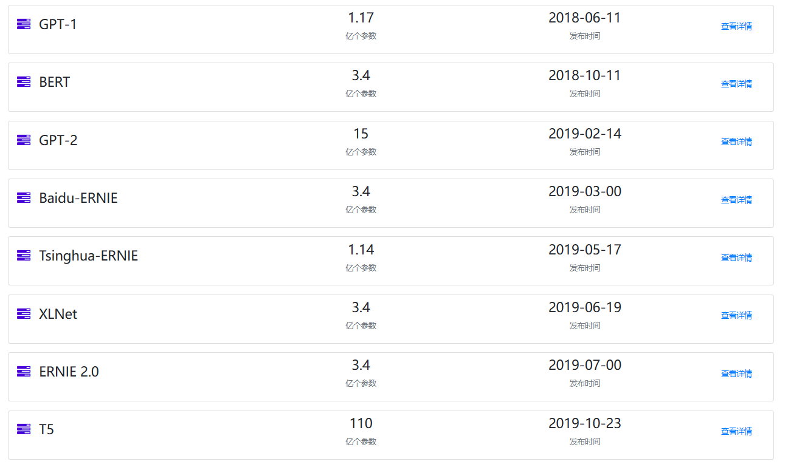
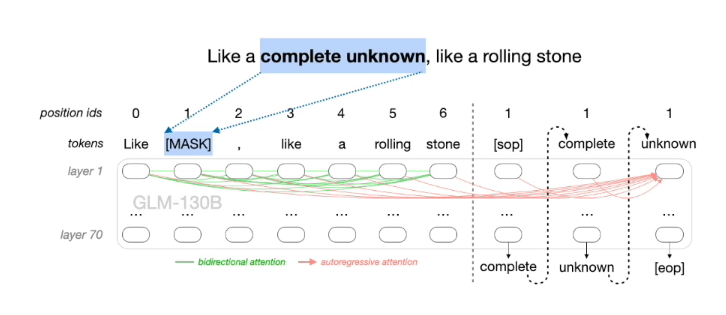

### ChatGLM微调实验

微调实验参考链接：[https://github.com/liucongg/ChatGLM-Finetuning](https://github.com/liucongg/ChatGLM-Finetuning)

**预训练AI大模型**

AI预训练大模型网址：[最近几年AI模型列表](https://www.datalearner.com/ai-models/pretrained-models)



AI模型月报


AI大模型预览图：


**ChatGLM-6B模型结构**

​	ChatGLM-6B的底层架构是通用语言模型（GLM），GLM利用自回归空白填充作为其主要的预训练目标，它掩盖了随机的连续文本区间，并对其进行自回归预测，采用两种不同的掩码标识符[MASK]和[gMASK]分别用于短文和长文的生成



​	ChatGLM-6B是清华大学知识工程和数据挖掘小组发布的一个开源的对话机器人，约60亿参数的中英文语言模型，并对中文做了优化。

- 28层Transformer，采用`final_layernorm`进行输出
- 每一层的结构：`input_layernorm` -> `attention.query_key_value` ->` attention.dense `-> `post_attention_layernorm` -> `mlp.dense_h_to_4h` -> `mlp.dense_4h_to_h`
- 总共参数6173286400

**多卡部署**

如果你有多张 GPU，但是每张 GPU 的显存大小都不足以容纳完整的模型，那么可以将模型切分在多张GPU上。首先安装 accelerate: `pip install accelerate`，然后通过如下方法加载模型：

```
from utils import load_model_on_gpus
model = load_model_on_gpus("../chatglm-6b", num_gpus=2)
```

即可将模型部署到两张 GPU 上进行推理。

单卡部署显存占用：


多卡部署显存占用：


在多卡部署模式下，可以进行推理，但无法进行训练，会出现错误：

```
RuntimeError: Expected all tensors to be on the same device, but found at least two devices, cuda:1 and cuda:0! (when checking argument for argument weight in method wrapper__native_layer_norm)
```


**三元组抽取任务**

- 采用一个领域的比赛数据集-[汽车工业故障模式关系抽取](https://www.datafountain.cn/competitions/584)，随机抽取50条作为测试集

- 本任务为信息抽取中的关系抽取任务，带抽取的文本语料为工业制造领域相关故障案例文本
- 部件单元（燃油泵、换流变压器、分离器）、性能表征（压力、转速、温度）、故障状态（漏油、断裂、变形、卡滞）

未微调：


理想答案：


**Freeze方法**

​	Freeze方法，即参数冻结，对原始模型部分参数进行冻结操作，仅训练部分参数，以达到在单卡或不进行TP或PP操作，就可以对大模型进行训练。核心代码如下：


训练采用[DeepSpeed](https://www.deepspeed.ai/)进行训练。deep speed是微软的新大规模模型分布式训练的工具，专门为训练超大模型而生，号称可以训练10B参数的模型，比目前最好的模型大10倍，训练速度块10倍，兼容pytorch的模型，改动最少代码。

- 模型训练时，最大长度为768，Batch size为2，训练轮数为5，fp16训练，仅训练模型的后5层参数

- 训练示例

```
prompt_text = 你现在是一个信息抽取模型，请你帮我抽取出关系内容为\"性能故障\", \"部件故障\", \"组成\"和 \"检测工具\"的相关三元组，三元组内部用\"_\"连接，三元组之间用\\n分割。文本：
输入：332号汽车故障报告故障现象空调系统故障，按空调控制器任何按键都没有反映。
输出：空调系统_部件故障_故障\n空调控制器_部件故障_没有反映
```

单卡训练脚本：

```
conda activate chatglm

CUDA_VISIBLE_DEVICES=0 deepspeed finetuning_freeze.py --num_train_epochs 5 --train_batch_size 2
```

多卡训练脚本：

```
CUDA_VISIBLE_DEVICES=0,1 deepspeed finetuning_freeze.py --num_train_epochs 5 --train_batch_size 2
```

在多卡模式下，训练显存翻倍增加，训练时间变慢很多？？？

**P-tuning V2方法**

​	是一种针对大模型的soft-prompt方法，P-tuning V2将大模型的Embedding和每一层前加入新的Prompt参数，核心代码：


当`prefix_encoder`为True时，采用`P-Tuning V2`方法；为`False`时，采用`P-Tuning`方法，仅在大模型的Embedding上添加参数

```
CUDA_VISIBLE_DEVICES=0 deepspeed finetuning_pt.py --num_train_epochs 5 --train_batch_size 2 --pre_seq_len 16
```


| 微调方法     | 未微调   | Freeze(fp16) | PT(int 4) | Lora |
| ------------ | -------- | ------------ | --------- | ---- |
| 显存占用     |          | 22.938GiB    | 21.894GiB |      |
| 可训练参数   |          | 1.01B        | 0.96B     |      |
| 总参数       |          | 6.17B        | 4.31B     |      |
| 可训练参数比 |          | 16.31%       | 22.18%    |      |
| 训练耗时     |          | 78.86min     |           |      |
| 测试结果F1   | 0.0      | 0.5467       |           |      |
| 测试耗时     | 113.215s | 38.731s      |           |      |


