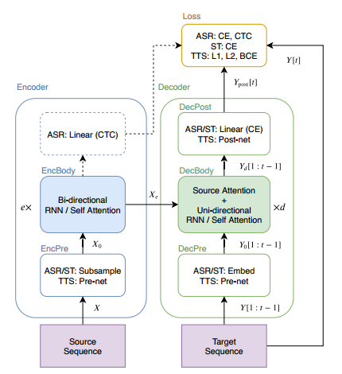

### 2-A Comparative Study On Transformer VS RNN In Speech Applications

本文介绍了一个新兴的Sequence-to-Sequence模型，名为Transformer。本文在15个ASR、一个多语言ASR、一个语音翻译（ST）和两个文本转语音（TTS）基准对Transformer和RNN进行了实验比较分析，Transformer在每项任务中具有显著的性能优势。

#### 一、引言

- 本文对Transfoemr和RNN进行了大规模比较研究，特别是在ASR相关任务中取得了显著的性能提升
- 介绍语音应用程序使用Transformer的训练技巧：ASR、ST和TTS
- 在开源工具包ESPnet中，在大量公开可用数据集上提供了可重复的端到端配方和预训练模型

本文旨在收集先前的基础研究，并在我们的实验中探索更广泛的话题（如准确性、速度和训练技巧）

#### 二、Sequence-to-Sequence RNN

​	下面首先给出S2S的通用描述：	

​	S2S一个神经网络，学习转换源序列到目标序列。图1展示了S2S架构，由编码器和解码器组成。其中$X$是语音序列的源特征，$e$是编码器部分的层数，$d$是解码器部分的层数，$t$是目标帧索引，S2S最小化生成序列$Y_{post}$和目标序列$Y$的损失。

图1 语音应用的Sequence-to-Sequence架构

​	基于RNN的编码器，通常采用BLSTM，对于ASR，编码器序列输出$X_e$可用于源级逐帧预测，使用CTC联合训练和解码。

​	解码器是将编码序列$X_e$和目标前缀$Y_0[1:t-1]$生成下一个目标帧，基于RNN的解码器视线中，经常使用具有注意力机制的单向LSTM，该注意力机制将源逐帧权重给编码源帧$X_e$加权和，作为加权目标逐帧向量和前缀$Y_0[1:t-1]$进行转换。称这种类型的注意力为“编码器-解码器注意力”。

#### 三、Transformer

