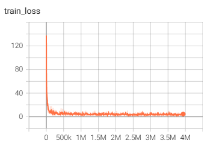

# 5-WeNet实验小结

### 1、开源模型

下载地址：https://github.com/wenet-e2e/wenet/blob/main/docs/pretrained_models.en.md

| Datasets |      | Checkpoint Model                                             |
| -------- | ---- | ------------------------------------------------------------ |
| aishell2 |      | [Conformer](https://wenet-1256283475.cos.ap-shanghai.myqcloud.com/models/aishell2/20210618_u2pp_conformer_exp.tar.gz) |
| multi_cn |      | [Conformer](https://wenet-1256283475.cos.ap-shanghai.myqcloud.com/models/multi_cn/20210815_unified_conformer_exp.tar.gz) |

### 2、开源multi_CN数据集

OpenSLR: http://www.openslr.org/resources.php

| 数据集           | 内容                                        | 时长（小时） | 训练集大小 | 录制人 | 标注准确率 | 数据下载                                     |
| ---------------- | ------------------------------------------- | ------------ | ---------- | ------ | ---------- | -------------------------------------------- |
| aidatatang_200zh | 口语化句子                                  | 200          | 18G        | 600    | >98%       | [下载](http://openslr.magicdatatech.com/62/) |
| aishell1         | 智能家居、无人驾驶、工业生产等**11**个领域  | 178          | 15G        | 400    | 98%        | [下载](http://openslr.magicdatatech.com/33/) |
| magicdata        | 互动问答，音乐搜索，SNS信息，家庭指挥和控制 | 755          | 52G        | 1080   | \>98%      | [下载](http://openslr.magicdatatech.com/68/) |
| primewords       |                                             | 100          | 9.0G       | 296    | \>98%      | [下载](http://openslr.magicdatatech.com/47/) |
| stcmds           | 网上语音聊天和智能语音控制                  | 102600条话语 | 8.2G       | 855    |            | [下载](http://openslr.magicdatatech.com/38/) |
| thchs            | 主要是新闻                                  |              | 6.4G       |        |            | [下载](http://openslr.magicdatatech.com/18/) |

总共包含1021000条音频数据，443065394个帧，词汇表有7028个单元

### 3、模型训练

​	训练完成的模型可以使用tensorboard查看，如果在容器内运行则需要添加端口映射

```
tensorboard --logdir=./tensorboard --host=0.0.0.0 --port 2001
```

可以获得训练时的训练损失、验证损失和lr。





### 4、测试结果

- 官方下载的multi-cn预训练模型结果，模型结构为Unified Conformer，chunk size为16，模型大小为213.4MB

| Dataset    | attention decoder | ctc greedy search | ctc prefix beam search | attention rescoring |
| ---------- | ----------------- | ----------------- | ---------------------- | ------------------- |
| Aishell    | 1.32%             | 2.73%             | 2.73%                  | 1.71%               |
| aidatatang | 3.78%             | 5.15%             | 5.15%                  | 4.21%               |
| magicdata  | 2.60%             | 3.81%             | 3.79%                  | 2.94%               |
| thchs      | 10.16%            | 11.85%            | 11.85%                 | 10.80%              |

thchs是带噪的测试语音，所以效果较差，且转录文本字数较多，平均一段音频对应30段中文字。

如果使用LM模型，使用WFST进行解码，下载官方runtime模型final.zip，测试在不同数据集下的WER:

| Dataset    | WFST   |
| ---------- | ------ |
| Aishell    | 1.80%  |
| aidatatang | 3.34%  |
| magicdata  | 2.04%  |
| thchs      | 11.99% |

词典里面没有英文，对英文的识别能力显著下降

- 自己的预训练模型结果，模型结构为UnifiedConformer, chunk size为16，找到最好的cv loss的模型，采用30次模型平均可以获得更好的效果，模型大小为189.057MB，选择的epoch为[177 171 165 172 164 175 170 176 155 173 157 178 179 147 166 152 149 144 169 174 141 138 163 162 167 150 154 148 146 168]，得到平均后的模型avg_30.pt，然后对其在测试集上进行测试：

| Dataset    | attention decoder | ctc greedy search | ctc prefix beam search | attention rescoring |
| ---------- | ----------------- | ----------------- | ---------------------- | ------------------- |
| Aishell    | 4.37%             | 5.49%             | 5.50%                  | 4.57%               |
| aidatatang | 4.02%             | 5.30%             | 5.30%                  | 4.36%               |
| magicdata  | 2.53%             | 3.51%             | 3.50%                  | 2.77%               |
| thchs      | 13.31%            | 14.47%            | 14.74%                 | 13.41%              |

自己的预训练模型不如下载的可能原因分析：建模单元少了3000（自己的词汇表为7028，官方的为11008），主要体现在对英文模型的建模能力弱了很多。

- 模型平滑对性能的影响，解码方式选择attention_rescoring

| 数据集  | with Average（30） | last epoch |
| ------- | ------------------ | ---------- |
| AISHELL | 4.57%              | 4.88%      |
| THCHS   | 13.41%             | 14.22%     |

- 量化模型对性能的影响（Runtime模式）JIT模型·：

| 数据集  | quantization(int 8) | FP32 |
| ------- | ------------------- | ---- |
| AISHELL |                     |      |
| THCHS   |                     |      |

### 5、心得记录

**动态bath size和静态batch size**

​	参考：[动态batch和静态batch的原理和代码详解_少游223的博客-CSDN博客](https://blog.csdn.net/shaoyou223/article/details/122642487)

​	wenet支持两种batch训练方式

- 第一种是常规的静态batch方案，但当语音长短差异过大时，显存利用率低，同时带来显存oom风险
- 第二种是动态batch方案，不指定batch_size的大小，只限制batch中的最大总帧数，这样就能充分利用显存，同时不会有oom的风险

静态batch代码实现：

```
def static_batch(data, batch_size=16):
    for sample in data:
        buf.append(sample)
        if len(buf) >= batch_size:
            yield buf
            buf = []
    if len(buf) > 0:
        yield buf
```

动态batch代码实现：

```
def dynamic_batch(data, max_frames_in_batch=12000):
    buf = []
    longest_frames = 0
    for sample in data:
        assert 'feat' in sample
        assert isinstance(sample['feat'], torch.Tensor)
        new_sample_frames = sample['feat'].size(0)
        longest_frames = max(longest_frames, new_sample_frames)
        frames_after_padding = longest_frames * (len(buf) + 1)
        if frames_after_padding > max_frames_in_batch:
            yield buf
            buf = [sample]
            longest_frames = new_sample_frames
        else:
            buf.append(sample)
    if len(buf) > 0:
        yield buf
```

**解决爆显存的方法**

1、若采用static_batch训练，减少batch size，对于24G的RTX 4090，需要减少batch size为4；若采用dynamic_batch训练，为了平衡训练速度和显存，设置max_frame_in_batch为24000，这两种方法可以有效解决OOM的问题，但是训练速度会有明显下降

2、减小filter_conf设置项的max_length，减少为20480，对OOM有一定的缓解，但缓解作用不大

3、网上说tensorboard会影响速度，但感觉没啥影响

**训练过程中GPU利用率忽高忽低，有时为0**

​	把数据集从机械硬盘放到固态硬盘可以有效解决

**Python永久设置路径**

- 当需要import文件夹中的.py文件时，会出现`ModuleNotFoundError: No module named 'wenet'`的报错信息，需要自主添加path：

- 临时添加：sys.path.append()，需要修改代码，且为临时修改，程序退出后需要清空环境变量

- 在site-packet下建立一个wenet_path.pth文件，并添加需要自定义包含引入的路径

```
vim ~/anaconda3/envs/wenet/lib/python3.8/site-packages/wenet_path.pth
```

添加以下内容：

```
/home/lzl/python/wenet/wenet-main
```

核对路径是否添加

```
>>> import sys
>>> sys.path
['', '/home/lzl/anaconda3/envs/wenet/lib/python38.zip', '/home/lzl/anaconda3/envs/wenet/lib/python3.8', '/home/lzl/anaconda3/envs/wenet/lib/python3.8/lib-dynload', '/home/lzl/anaconda3/envs/wenet/lib/python3.8/site-packages', '/home/lzl/python/wenet/wenet-main']
>>> from wenet.dataset.dataset import Dataset
```

没有出现报错信息说明路径已成功添加

**Ubuntu下载多版本的CUDA**

- 下载CUDA Toolkit

  首先去官网https://developer.nvidia.com/cuda-toolkit-archive下载对应版本的 CUDA Toolkit，采用runfile(local)方式

  

  可以得到`cuda**.run`文件

- 安装CUDA

  使用命令安装

```
sudo sh cuda**.run
```

在安装选项中仅安装CUDA Toolkit，其它如驱动、示例等不安装

- 安装cudnn

  进入cudnn官网https://developer.nvidia.com/rdp/cudnn-archive，下载tar包，采用`tar -xf cudnn**.tgz`解压，解压后

```
sudo cp cudnn-linux-x86_64-8.8.1.3_cuda11-archive/include/cudnn.h /usr/local/cuda-11.6/include/
sudo cp cudnn-linux-x86_64-8.8.1.3_cuda11-archive/lib/libcudnn* /usr/local/cuda-11.6/lib64/
sudo chmod a+r /usr/local/cuda-11.6/include/cudnn.h
sudo chmod a+r /usr/local/cuda-11.6/lib64/libcudnn*
```

- 新建环境变量并建立软链接

  - 新建环境变量：

```
# 打开环境变量目录
vim ~/.bashrc

# 添加
export PATH=/usr/local/cuda/bin:$PATH
export LD_LIBRARY_PATH=/usr/local/cuda/lib64:$LD_LIBRARY_PATH
```

环境变量建好后就不用更改了。

- 建立软链接用于CUDA版本自动切换

```
# 删除之前的软链接
sudo rm -rf /usr/local/cuda
# 创建新的cuda软链接
sudo ln -s /usr/local/cuda-11.6 /usr/local/cuda
```


