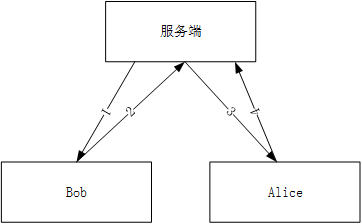
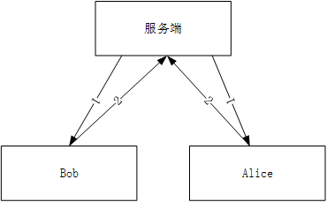
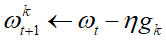
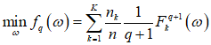
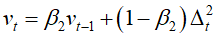

### 联邦学习开源项目

| 框架                   | 介绍                                                         |
| ---------------------- | ------------------------------------------------------------ |
| TensorFlow Federated   | 由Google开发的联邦学习框架，使用TensorFlow作为后端，支持Python API和TensorFlow.js。 |
| PySyft                 | 由OpenMined社区开发的Python库，提供了一个可扩展的框架，支持多种类型的神经网络，包括PyTorch和TensorFlow。 |
| Flower                 | 一个用于构建联邦学习系统的Python框架，它使用PyTorch和TensorFlow作为后端，支持异构设备和安全多方计算。 |
| IBM Federated Learning | IBM开发的联邦学习框架，使用Python和TensorFlow，支持不同类型的神经网络和分布式数据训练。 |
| FATE                   | 由WeBank开发的联邦学习平台，支持Python和Java，提供了许多联邦学习算法和组件，包括数据预处理、模型训练和模型评估。 |
| XayNet                 | 一个用于构建联邦学习系统的Rust库，它支持异构设备和多方计算，并提供了一些安全的通信协议。 |

#### 1、Pysyft

​	对于机器学习模型，多方安全计算（SMPC）将保护模型权重，同时允许多个工作节点使用自己的数据集参加训练阶段，这一过程称为联邦学习。

- Pysyft是一个库，其中包含保护隐私的机器学习工具，Hagrid是一个命令行工具，可以加快PyGrid的部署，PyGrid是一个由数据所有者和数据科学家组成的对等网络提供商，可以使用Syft联合训练人工智能模型。

- 术语

| 名词                | 解释                                                         |
| :------------------ | ------------------------------------------------------------ |
| pysyft              | 一个开源平台，结合联邦学习和差分隐私技术，实现远程数据科学实验 |
| PyGrid              | PyGrid是数据所有者和数据科学家组成的peer-to-peer网络，可以使用Pysyft联合训练AI模型，PyGrid也是进行以模型为中心和以数据为中心的联邦学习的中心服务器，可以通过用户界面PyGrid Admin来控制PyGrid |
| HaGrid              | HaGrid是一个命令行工具，可以加快PyGrid的部署，该软件提供了一个由数据所有者和数据科学家组成的peer-to-peer网络，他们可以共同训练模型 |
| Remote Data Science | 数据科学的一个子领域，其中数据科学家能够从数据所有者拥有的数据集中提取见解(insights)，但只能提取数据所有者明确规定的见解，这些见解的偏好由加密，信息安全和分布式系统等技术强制执行 |

- 两种训练方式

  - 非并行训练：

  

  

  - 并行训练：

  

- 关键实现代码

```
# 定义虚拟用户
hook = sy.TorchHook(torch)
bob = sy.VirtualWorker(hook, id="bob")
alice = sy.VirtualWorker(hook, id="alice")
# 数据通信
data.send(bob)
model.send(data.location)
modelget()
```

- 测试结果

  - 设备GTX1080Ti，MNIST手写数字识别任务，5次迭代训练，训练时间和识别准确率

  | Syft       | with CUDA         | No CUDA           |
  | ---------- | ----------------- | ----------------- |
  | 中心化     | 6.88862s  (98%)   | 184.83739s  (98%) |
  | 非并行训练 | 307.39693s  (98%) | 423.53645s  (98%) |

  - 并行训练，采用联邦平均算法：

  | Syft  | 1     | 2     | 3     | 4     | 5     |
  | ----- | ----- | ----- | ----- | ----- | ----- |
  | Bob   | 95.5% | 97.1% | 98.1% | 98.2% | 98.5% |
  | Alice | 95.5% | 97.0% | 97.9% | 97.0% | 96.9% |
  | Model | 73.6% | 87.2% | 71.8% | 86.0% | 64.5% |

#### 2、Flower

- Flower服务器通过名为Client的接口接入到客户端，当服务器选择客户端进行训练时，通过网络发送训练指令，客户端接收指令，调用`Client`方法运行代码（即训练我们定义的神经网络）


- Flower提供便捷的类`NumpyClient`，可以更方便实现Client接口，通常会使用以下方法：
  1. get_parameters：返回NumPy ndarrays模型权重，返回当前客户端的模型参数
  2. set_parameters：根据从服务器接收的参数更新本地模型权重
  3. fit：从服务端接收模型参数，在本地数据集上训练模型，并将模型参数返回给服务端
  4. evaluate：从服务端接收模型参数，在本地数据集上评估模型，并将评估结果返回给服务端

- Flower框架支持的联邦学习策略
  - FedAvg：，
  - QFedAvg：资源分配公平性，损失大的参与者权重更高
  - FedAvgM：提出基于“动量”的解决方案，有效缓解Non-IID带来的性能下降
  - FedProx：整合所有参与训练的局部模型，局部模型的目标函数为损失函数加上proximal terms
  - FedAdagrad：
  - FedYogi：
  - FedAdam：

- 测试结果
  - 设备RTX3090Ti，MNIST手写数字识别任务，5次迭代训练，5轮联邦通信
  - 自适应算法的初始学习率为0.01，beta_1=0.9，beta_2=0.99

| Flower/rounds       | 1      | 2      | 3      | 4      | 5      |
| ------------------- | ------ | ------ | ------ | ------ | ------ |
| FedAvg              | 0.9835 | 0.9892 | 0.989  | 0.9913 | 0.9883 |
| FedAvgM             | 0.9838 | 0.9894 | 0.9892 | 0.9908 | 0.9919 |
| FaultTolerantFedAvg | 0.9836 | 0.9895 | 0.9908 | 0.9917 | 0.9916 |
| FedOpt              | 0.9835 | 0.9891 | 0.9907 | 0.9911 | 0.9918 |
| FedYogi             | 0.8913 | 0.9681 | 0.9787 | 0.9866 | 0.9909 |
| FedAdm              | 0.7905 | 0.9786 | 0.9886 | 0.9888 | 0.9886 |
| FedAdagrad          | 0.8119 | 0.948  | 0.9291 | 0.9814 | 0.9749 |

